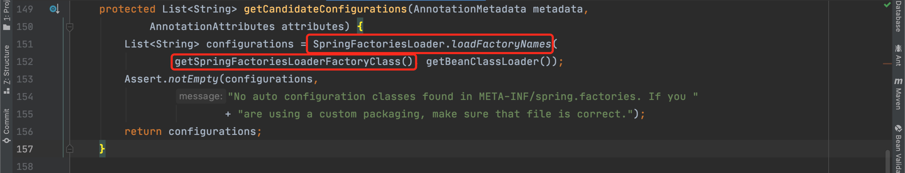
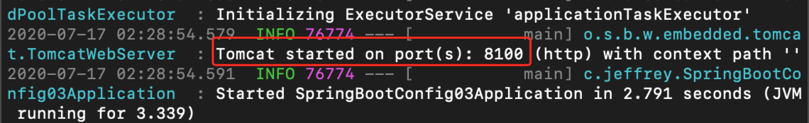
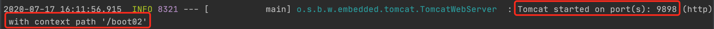
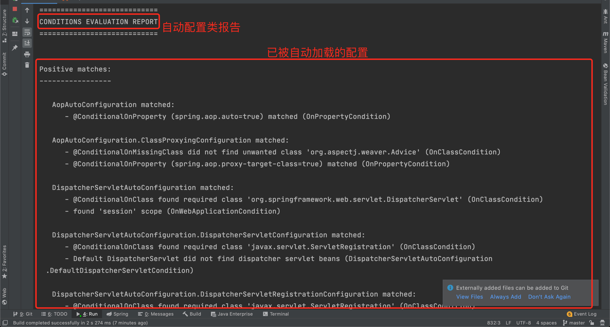
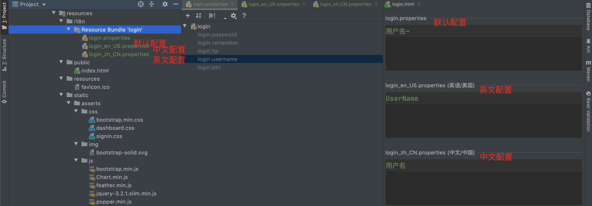
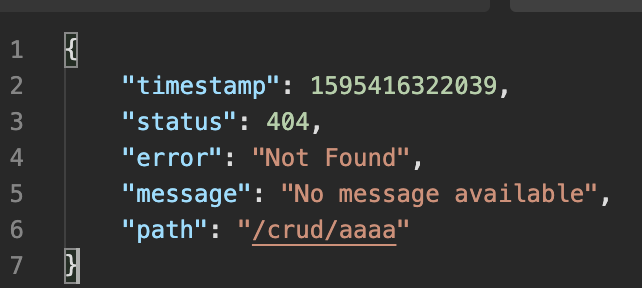
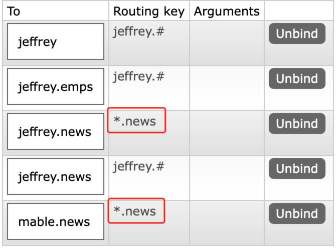
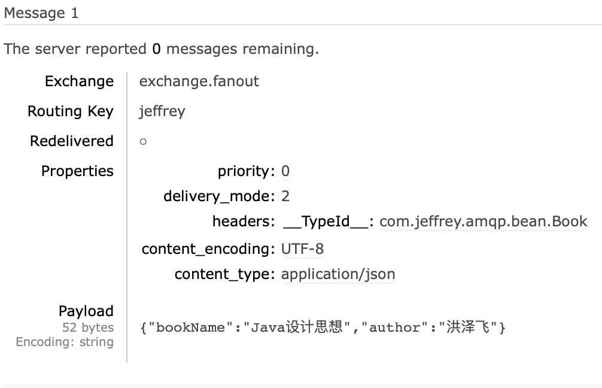
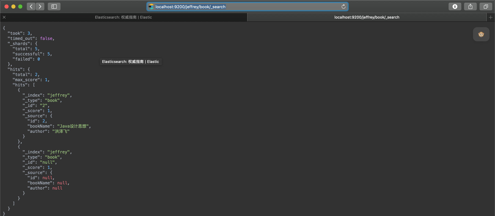
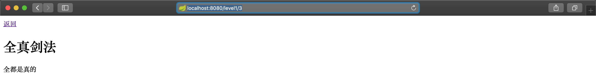

#  SpringBoot

Note For Jeffrey

## 1、HelloWorld

### 一、SpringBoot简介

> - 简化Spring引用开发的一个框架，属于Spring下的框架
>
> - 是整个Spring技术栈的一个大整合
>
> - J2EE开发的一站式解决方案

### 2、微服务

> - 2014年，Martin fowler 发表了关于微服务的博客
>
> - 微服务是一种架构风格，一个应用应该是一组小型服务，且可以通过http的方式进行互通
>
> - 微服务：每一个功能元素最终都是一个可独立替换和独立升级的软件单元
>
> - 单体应用：ALL IN ONE
>
> - 优点：各服务独立，不会牵一发而动全身，可实现大型的分布式的应用需求，也是Spring对大型应用分布式的解决方案
>
> - [微服务文档](https://www.martinfowler.com)

### 3、环境约束

>- JDK1.8以上
>- SpringBoot 1.5 或 2.0 以上
>- maven3.x或以上：maven3.3以上
>- idea 2020
>- SpringBoot1.5.9 RELEASE / SpringBoot2.3.2 RELEASE

### 4、MAVEN设置

> - 设置settings.xml，给profiles标签添加
>
>   - ```xml
>     <profiles>
>       <profile>
>         <id>jdk1.8</id>
>         <activation>
>           <activeByDefault>true</activeByDefault>
>           <jdk>1.8</jdk>
>         </activation>
>       </profile>
>       <properties>
>         <maven.compiler.source>1.8</maven.compiler.source>
>         <maven.compiler.target>1.8</maven.compiler.target>
>         <maven.compiler.compilerVersion>1.8</maven.compiler.compilerVersion>
>       </properties>
>     </profiles>     
>     ```
>
> - ideaMaven设置
>
>   - 修改 Build,Execution,Deployment -> Build Tools -> Maven 下的四个配置
>     - Maven home directory：maven目录
>     - User settings file：maven目录下conf下的settings文件
>     - Local repository：maven本地仓库地址
>     - Maven -> Runner -> VM Options
>       - -DarchetypeCatalog=internal

## 二、SpringBoot HelloWorld

一个功能：浏览器发送hello请求，服务器接收并处理，响应HelloWorld字符串

### 1、创建一个maven工程

### 2、导入Spring Boot相关依赖

```xml
<parent>
  <groupId>org.springframework.boot</groupId>
  <artifactId>spring-boot-starter-parent</artifactId>
  <version>1.5.9.RELEASE</version>
</parent>
<dependencies>
  <dependency>
    <groupId>org.springframework.boot</groupId>
    <artifactId>spring-boot-starter-web</artifactId>
  </dependency>
</dependencies>
```

### 3、编写一个主程序，启动SpringBoot应用

```java
/**
 * @SpringBootApplication 来标注一个主程序类，说明这是一个SpringBoot应用
 */
@SpringBootApplication
public class HelloWorldApplication {
    public static void main(String[] args) {
        
        // Spring应用启动
        SpringApplication.run(HelloWorldApplication.class, args);
    }
}

```


### 4、编写相关Controller、Service

```java
@Controller
public class HelloController {
    
    @ResponseBody
    @RequestMapping("/hello")
    public String hello(){
        return "Hello World!";
    }
}
```


### 5、运行主程序测试

### 6、简化部署

```xml
    <!--spring-boot-maven-plugin插件可以将应用打包成为可执行jar包-->
    <build>
        <plugins>
            <plugin>
                <groupId>org.springframework.boot</groupId>
                <artifactId>spring-boot-maven-plugin</artifactId>
                <executions>
                    <execution>
                        <goals>
                            <goal>repackage</goal>
                        </goals>
                    </execution>
                </executions>
            </plugin>
        </plugins>
    </build>
```

将这个应用package打包成为jar包，可直接使用 ```java -jar``` 的命令直接运行服务器，不需要另外安装tomcat服务器

## 5、深入HelloWorld

### 1、POM文件

#### 1、父项目，SpringBoot版本的仲裁中心，导入依赖不需要填写版本信息

```xml
<parent>
    <groupId>org.springframework.boot</groupId>
    <artifactId>spring-boot-starter-parent</artifactId>
    <version>1.5.9.RELEASE</version>
</parent>

它的父项目是

<parent>
    <groupId>org.springframework.boot</groupId>
    <artifactId>spring-boot-dependencies</artifactId>
    <version>1.5.9.RELEASE</version>
    <relativePath>../../spring-boot-dependencies</relativePath>
</parent>

它是真正管理SpringBoot应用里面所有的依赖版本(没有在dependencies里面管理的依赖需要手动填写版本)
```

### 2、导入的依赖

```xml
<dependencies>
    <dependency>
      <groupId>org.springframework.boot</groupId>
      <artifactId>spring-boot-starter-web</artifactId>
    </dependency>
</dependencies>
```

**Spring-boot-starter**-**web**：

- Spring-boot-starter：springboot场景启动器，它导入了web模块正常运行所依赖的组件

SpringBoot将所有的功能场景都抽取了出来，做成了一个个的starters(启动器)，只需要在项目里引入这些starters相关场景的所有依赖都会被导入进来。要用什么功能就导入什么场景启动器

### 2、主程序类(主入口类)

```java
/**
 * @SpringBootApplication 来标注一个主程序类，说明这是一个SpringBoot应用
 */
 @SpringBootApplication
public class HelloWorldApplication {
    public static void main(String[] args) {

        // Spring应用启动
        SpringApplication.run(HelloWorldApplication.class, args);
    }
}
```

- **@SpringBootApplication**
  - SpringBoot应用标注在某一个类上，说明这个类是SpringBoot的主配置类，SpringBoot就应该运行这个类的main方法来启动SpringBoot应用

```java
@Target({ElementType.TYPE})
@Retention(RetentionPolicy.RUNTIME)
@Documented
@Inherited
@SpringBootConfiguration
@EnableAutoConfiguration
@ComponentScan(
    excludeFilters = {@Filter(
    type = FilterType.CUSTOM,
    classes = {TypeExcludeFilter.class}
), @Filter(
    type = FilterType.CUSTOM,
    classes = {AutoConfigurationExcludeFilter.class}
)}
)
public @interface SpringBootApplication {...}
```

- **@SpringBootConfiguration**
  - SpringBoot的配置类，这个注解被标注在某个类上，表示这是一个SpringBoot的配置类
  - **@Configuration**
    - 配置类上标注这个注解。配置类 == 配置文件，配置类也是容器中的一个组件，@**Component**
- **@EnableAutoConfiguration**
  - 开启自动配置功能，SpringBoot自动配置，**@EnableAutoConfiguration**告诉SpringBoot开启自动配置功能，加了这个注解之后才能自动配置

```java
@AutoConfigurationPackage
@Import({EnableAutoConfigurationImportSelector.class})
public @interface EnableAutoConfiguration {...}
```

- **@AutoConfigurationPackage**

  - 自动配置包
    - **@Import({Registrar.class})**(在 SpringBoot 1.5.9.RELEASE：1.5.9 该注解名为**@Import(AutoConfigurationPackages.Registrar.class)**)
    - 这是Spring的底层注解@Import，给容器中倒入一个组件由AutoConfigurationPackages.Register.class将主配置类（**@SpringBootApplication标注的类**）的所在包以及下面所有子包里面所有的组件扫描到Spring容器
    - 

- **@Import(EnableAutoConfigurationImportSelector.class)**
- 给容器中倒入组件
  
- EnableAutoConfigurationImportSelector：导入哪些组件的选择器，将所有需要导入的组件以全类名的方式返回，这些组件就会被添加到容器中，会给容器中导入非常多的自动配置类(xxxAutoConfiguration)，作用就是给容器中导入这个场景所需要的所有组件并配置这些组件，有了自动配置类则免去了手动编写配置注入功能组件的工作
  
- 
  
- **SpringFactoriesLoader.loadFactoryNames(EnableAutoConfiguration.class, classLoader)**
  
  - **SpringBoot在启动的时候从类路径下的META-INF/spring.factories中获取EnableAutoConfiguration指定的值，将这些值作为自动配置类导入到容器中，自动配置类就生效，进行配置工作，需注意的是Spring所需的组件一个都不能少，只是SpringBoot的自动配置类已经在底层实现**
    - 
  
  - 
  
- 图片里面包含了SpringBoot对整个J2EE的所有整合解决方案和自动配置，其路径在spring-boot-autoconfigure-1.5.9.RELEASE.jar内
    - 

## 6、使用Spring Initializer快速创建SpringBoot项目

大部分IDE都支持在创建SpringBoot项目时使用向导实现快速创建项目，需联网

### 1、快速创建

- 

### 2、设置相关属性

- 

- 

### 3、完成创建

- 


## 7、Spring Initializer HelloWorld

- 细节
  - 主程序已自动生成，只需要编写业务逻辑
  - 配置文件夹resources中，目录结构为
    - static：保存所有的静态资源(js/css/images)
    - templates：保存所有的模版页面(SpringBoot默认为jar包，使用嵌套式Tomcat，不支持JSP页面)，可使用模版引擎(freemarker, thymeleaf)
    - Application.properties：SpringBoot应用的配置文件，尽管SpringBoot已经默认配置设置，但是还可通过这个文件二次修改
      - 例如：server.prot=8081
    - 
  - 在Spring4.2之后新加入了**@RestController**注解，需写在类上，同时具有**@Controller**和**@RequestBody**的功能
  - 
  - 

# 三、配置文件

## 1、配置文件

- 作用：由于SpringBoot在底层已经把配置默认配置好了，所以可使用配置文件修改SpringBoot自动配置的默认值

- SpringBoot可选一个配置文件供全局使用，配置文件的名称是固定的

  - application.properties

  - Application.yml （yml是YMAL Ain't Markup Luanguage）

    - YAML ：A Markup Language 是一个标记语言
    - YAML：isn't Markuo Language 不是一个标记语言

  - 标记语言

    - 在没有使用SpringBoot框架之前，大多数的配置文件以 xxx.xml 配置。而YAML是以数据为中心，比json、xml等更适合做配置文件

  - YAML

    - ```yaml
      # 配置启动端口为8090
      server:
        prot:8090
      ```

  - XML

    - ```xml
      <!--配置启动端口为8090-->
      <server>
      	<prot>8090</prot>
      </server>
      ```

## 2、YAML语法

### 1、基本语法

- k: v表示一对简直对(需注意要加空格)

- 如有层级关系，则需要以空格的缩进来控制，空多少格没有明确要求，但是需要左对齐。只要是左对齐的一列数据，则都是同一层级

- 属性和值是大小写敏感的

  - ```yaml
    server:
    	prot: 8090
    	path: /hello
    ```

### 2、值的写法

#### 字面量：普通的值（数字，字符串，布尔）

- k: v 字面直接写即可，字符串默认不用加上单双引号

- "" 双引号，不会转义字符串内的特殊字符，特殊字符会作为本身需要表达的意思

  输入：```name: "mable \n jeffrey"``` 输出：```mable 换行 jeffrey```

- '' 单引号，会转义特殊字符，特殊字符串最终只是一个普通的字符串数据

  输入：```name: "mable \n jeffrey"``` 输出：```mable \n jeffrey```

#### 对象：属性和值（键值对）

- k: v 对象还是 k: v 的方式，在下一行写对象和属性的关系，需注意锁进

  ```yaml
  friends:
  	lastName: mable
  	age: 20
  ```

- 行内写法

  ```yaml
  friends: {lastName: mable, age: 20}
  ```

  

#### 数组：List、Set

- 用- 值表示数组中的一个元素

  ```yaml
  pets:
  	- cat
  	- dog
  	- pig
  ```

- 行内写法

  - ```yaml
    pets: [cat, dog, pig]
    ```

### 3、获取配置值注入

#### 1、配置文件

```yaml
person:
  lastName: mable
  age: 20
  boss: true
  birthday: 2001/7/5
  maps: {k1: v1, k2: v2}
  lists:
    - lisi
    - zhaoliu
  dog:
    name: ww
    age: 2
```

#### 2、配置JavaBean

```java
/**
 * 将配置文件中配置的每一个属性的值，映射到这个组件中
 * @ConfigurationProperties：告诉SpringBoot将本类中的所有属性和配置文件中相关的配置绑定
 *      prefix = "person"：配置文件中哪个下面的所有属性进行一一映射
 * 只有这个组件是容器中的组件，才能使用容器中提供的@ConfigurationProperties功能，所以需要导入@Component
 */

@Component
@ConfigurationProperties(prefix = "person")
public class Person {
    private String lastName;
    private Integer age;
    private Boolean boss;
    private Date birthday;

    private Map<String,Object> maps;
    private List<Object> lists;
    private Dog dog;
```

#### 3、导入配置文件处理器，编写配置时提供相对应的提示

- 

- 在pom.xml文件中导入坐标

  - ```xml
    <!--导入配置文件处理器，配置文件进行绑定会有相对应的提示-->
    <dependency>
        <groupId>org.springframework.boot</groupId>
        <artifactId>spring-boot-configuration-processor</artifactId>
        <optional>true</optional>
    </dependency>
    ```

#### 4、properties配置文件编码问题

- 在不修改idea编码配置时会出现以下问题
  - 
  - 

- 解决方案
  - Preferences | Editor | File Encodings -> 勾选 Transparent native-to-ascii conversion
  - 
  - 参考文档：https://blog.csdn.net/qq_41594146/article/details/85286264

#### 5、@Value和@ConfigurationProperties获取值比较

|                      | @ConfigurationProperties                         | @Value       |
| -------------------- | ------------------------------------------------ | ------------ |
| 功能                 | 批量注入配置文件中的属性，只需指定prefix前缀即可 | 需一个个指定 |
| 松散绑定（松散语法） | 支持                                             | 不支持       |
| SpEL表达式           | 不支持                                           | 支持         |
| JSR303数据校验       | 支持                                             | 不支持       |
| 复杂类型封装         | 支持                                             | 不支持       |

- 总结：配置文件不管是yml还是properties，它们都可以获取到值。如果只是在某个业务逻辑中需要获取一下配置文件中的某项值，这时可以使用**@Value**。如果专门编写了一个javaBean来和配置文件进行映射，这时需要使用**@ConfigurationProperties注解**

- ```java
  // 使用@Value
  @Controller
  public class HelloController {
  
      @ResponseBody
      @RequestMapping("/hello")
      public String hello(){
          return "Hello World!";
      }
  }
  
  ```

#### 6、配置文件注入值数据校验


#### 7、@PropertySource和@ImportResource

@PropertySource：加载指定的配置文件，这样做的好处是让主配置文件更为简洁且减少了大小

```java
// 告诉SpringBoot加载类路径下的person.properties配置文件
@PropertySource(value = {"classpath:person.properties"})
@Component
@ConfigurationProperties(prefix = "person")
public class Person {...}
```

@ ImportResource：导入Spring的配置文件，让配置文件的内容生效。SpringBoot中没有Spring的配置文件，就算自己编写配置文件SpringBoot也不能自动识别，如想让Spring的配置文件加载生效，可以将**@ImportResource**标注在配置类上，**但这并不是SpringBoot所推荐的方式。**

```java
@SpringBootApplication
@ImportResource(locations = {"classpath:beans.xml"})
public class SpringBootConfig03Application {

    public static void main(String[] args) {
        SpringApplication.run(SpringBootConfig03Application.class, args);
    }

}

```

#### 7.1、SpringBoot推荐给容器中添加组件的方式

这是Spring的配置文件

```xml
<!--Spring的配置文件，SpringBoot不推荐-->
<?xml version="1.0" encoding="UTF-8"?>
<beans xmlns="http://www.springframework.org/schema/beans"
       xmlns:xsi="http://www.w3.org/2001/XMLSchema-instance"
       xsi:schemaLocation="http://www.springframework.org/schema/beans http://www.springframework.org/schema/beans/spring-beans.xsd">

    <bean id="helloService" class="com.jeffrey.user.service.HelloService">

    </bean>
</beans>
```

这是SpringBoot推荐的方式，使用全注解开发方式，而配置类就相当于Spring的配置文件，也都是Spring底层

使用@Bean

```java
/**
 * 使用SpringBoot推荐的方式
 * @Configuration：指明当前类是一个配置类，而这个配置类替代了Spring的配置文件，二者功能一致
 * 在Spring配置文件中使用<bean></bean>标签添加组件
 * 在配置类中使用@Bean注解添加组件
 */

@Configuration
public class MyAppConfig {

    // 将方法的返回值添加到容器中，容器中这个组件默认的id就是方法名
    @Bean
    public HelloService helloService(){
        System.out.println("配置类@Bean给容器中添加组件了");
        return new HelloService();
    }
}
```

### 4、配置文件的占位符

#### 1、随机数

```java
${random.value}、${random.int}、${random.long}、${random.int(10)}、${random.int[1024,65536]}
```

#### 2、占位符获取之间配置的值，如果没有可以使用冒号:指定默认值

```java
person.last-name=张三${random.uuid}
person.age=${random.int}
person.birthday=2001/7/15
person.boss=true
person.maps.k1=v1
person.maps.k2=v2
person.lists=a,b,c,d,e
person.dog.name=${person.name:hello}_dog
person.dog.age=2
```

### 5、Profile

#### 1、多Profile文件

- 在编写主配置文件编写的时候，文件名可以是 application-{profile}.properties / yml / ymal
- 默认SpringBoot使用applicatio.properties的配置

#### 2、yml支持多文档块方式

```yaml

server:
  port: 8080
spring:
  profiles:
    active: product
    
---
server:
  port: 8090
spring:
  profiles: dev
  
---
server:
  port: 8100
spring:
  profiles: product # 指定属于哪个环境
---
```


#### 3、激活指定profile

##### 1、在配置文件中指定激活环境：spring.profiles.active=dev

- 配置命令方式，以这种方式运行时，将以命令行方式运行，不会配置文件中指定的环境
  - --spring,profiles.active=dev/product
  - 

##### 2、命令行/终端配置方式，在将项目工程打包为jar包之后可使用这种方式

- java -jar spring-boot-config-03-0.0.1-SNAPSHOT.jar **--spring.profiles.active=product**


​											- 



##### 3、虚拟机参数配置方式


### 6、配置文件加载位置

SpringBoot启动会扫描以下四个位置的 application.properties或application.yml/yaml 配置文件并作为SpringBoot的默认配置文件

- file:./config/
- file:./
- classpath:/config/
- classpath:/

以上优先级由高到低，高优先级的配置会覆盖低优先级的配置，SpringBoot会从这四个位置加载主配置文件（如果有的话），这将会形成**互补配置**

还可以通过spring.config.location来改变默认的配置文件位置。在项目打包好之后，可使用命令行参数的形式来启动项目配置文件的新位置，指定的配置文件和默认加载的配置文件会一起起作用，形成互补配置


#### 细节1：idea springboot多module 找不到配置文件问题

在idea的项目的配置中的Working directory命令行参数内填入 $MOUDLE_DIR$


#### 细节2：spring-boot配置文件中server.context-path不起作用问题

相比于SpringBoot2.x之前的版本有不少的细节配置改动，只需添加servlet参数即可


### 7、外部配置加载顺序

SpringBoot也可以从以下位置加载配置，以下顺序优先级从高到低。同样高优先级的配置会覆盖低优先级的配置，但如果有不同的内容所有的配置会形成互补配置。多个配置可使用空格分开 --配置项=值

- **命令行参数**
  - 输入：在命令行直接指定运行端口号
  - 
  - 输出：在不修改配置文件中的其他内容修改端口号
  - 
- 来自javaComp/env的JNDI属性
- java系统属性(System.getProperties())
- 操作系统环境变量
- RandomValuePropertySource配置的random.*属性值


- **总结：都是由jar包外向jar包内进行寻找**

  - **优先加载带profile**
    - jar包外部的application-{profile}.properties或application.yml / yaml（带Spring.profile）配置文件
      - 
      - 
      - 
    - jar包内部的application-{profile}.properties或application.yml / yaml（带Spring.profile）配置文件
  - **再加载不带profile**
    - jar包外部的application.properties或application.yml / yaml（不带Spring.profile）配置文件
    - jar包内部的application.properties或application.yml / yaml（不带Spring.profile）配置文件

  

- @Configuation注解类上的@PropertySource

- 通过SpringAp

- application.setDefaultProperties指定的默认属性

### 8、自动配置原理

配置文件能写什么东西？怎么写？自动配置的原理

[配置文件能配置的属性参照官方文档](https://docs.spring.io/spring-boot/docs/2.0.0.RELEASE/reference/html/appendix.html)


#### 1、 自动配置原理

- 1、SpringBoot启动的时候还在主配置类并开启了自动配置功能 

- 2、@EnableAutoConfiguration**作用

  - 利用EnableAutoConfigurationImportSelector给容器中导入一些组件
  - 可以查看selectImports()方法的内容

  - List<String> configurations = getCandidateConfigurations(annotationMetadata, attributes);获取候选的配置

  - ```java
    	SpringFactoriesLoader.loadFactoryNames()
      扫描所有jar包类路径下  META-INF/spring.factories
      把扫描到的这些文件的内容包装成properties对象
      从properties中获取到EnableAutoConfiguration.class类（类名）对应的值，然后把他们添加在容器中
    ```

  - **总结：将类路径下 META-INF/spring.factories里面配置的所有EnableAutoConfiguration的值加入到了容器中**，每一个这样的 xxxAutoConfiguration类都是容器中的一个组件，都会被加入到容器中，用于做自动配置

    - ```properties
      # Auto Configure
      org.springframework.boot.autoconfigure.EnableAutoConfiguration=\
      org.springframework.boot.autoconfigure.admin.SpringApplicationAdminJmxAutoConfiguration,\
      org.springframework.boot.autoconfigure.aop.AopAutoConfiguration,\
      org.springframework.boot.autoconfigure.amqp.RabbitAutoConfiguration,\
      org.springframework.boot.autoconfigure.batch.BatchAutoConfiguration,\
      org.springframework.boot.autoconfigure.cache.CacheAutoConfiguration,\
      org.springframework.boot.autoconfigure.cassandra.CassandraAutoConfiguration,\
      org.springframework.boot.autoconfigure.context.ConfigurationPropertiesAutoConfiguration,\
      org.springframework.boot.autoconfigure.context.LifecycleAutoConfiguration,\
      org.springframework.boot.autoconfigure.context.MessageSourceAutoConfiguration,\
      org.springframework.boot.autoconfigure.context.PropertyPlaceholderAutoConfiguration,\
      org.springframework.boot.autoconfigure.couchbase.CouchbaseAutoConfiguration,\
      org.springframework.boot.autoconfigure.dao.PersistenceExceptionTranslationAutoConfiguration,\
      org.springframework.boot.autoconfigure.data.cassandra.CassandraDataAutoConfiguration,\
      org.springframework.boot.autoconfigure.data.cassandra.CassandraReactiveDataAutoConfiguration,\
      org.springframework.boot.autoconfigure.data.cassandra.CassandraReactiveRepositoriesAutoConfiguration,\
      org.springframework.boot.autoconfigure.data.cassandra.CassandraRepositoriesAutoConfiguration,\
      org.springframework.boot.autoconfigure.data.couchbase.CouchbaseDataAutoConfiguration,\
      org.springframework.boot.autoconfigure.data.couchbase.CouchbaseReactiveDataAutoConfiguration,\
      org.springframework.boot.autoconfigure.data.couchbase.CouchbaseReactiveRepositoriesAutoConfiguration,\
      org.springframework.boot.autoconfigure.data.couchbase.CouchbaseRepositoriesAutoConfiguration,\
      org.springframework.boot.autoconfigure.data.elasticsearch.ElasticsearchDataAutoConfiguration,\
      org.springframework.boot.autoconfigure.data.elasticsearch.ElasticsearchRepositoriesAutoConfiguration,\
      org.springframework.boot.autoconfigure.data.elasticsearch.ReactiveElasticsearchRepositoriesAutoConfiguration,\
      org.springframework.boot.autoconfigure.data.elasticsearch.ReactiveElasticsearchRestClientAutoConfiguration,\
      org.springframework.boot.autoconfigure.data.jdbc.JdbcRepositoriesAutoConfiguration,\
      org.springframework.boot.autoconfigure.data.jpa.JpaRepositoriesAutoConfiguration,\
      org.springframework.boot.autoconfigure.data.ldap.LdapRepositoriesAutoConfiguration,\
      org.springframework.boot.autoconfigure.data.mongo.MongoDataAutoConfiguration,\
      org.springframework.boot.autoconfigure.data.mongo.MongoReactiveDataAutoConfiguration,\
      org.springframework.boot.autoconfigure.data.mongo.MongoReactiveRepositoriesAutoConfiguration,\
      org.springframework.boot.autoconfigure.data.mongo.MongoRepositoriesAutoConfiguration,\
      org.springframework.boot.autoconfigure.data.neo4j.Neo4jDataAutoConfiguration,\
      org.springframework.boot.autoconfigure.data.neo4j.Neo4jRepositoriesAutoConfiguration,\
      org.springframework.boot.autoconfigure.data.solr.SolrRepositoriesAutoConfiguration,\
      org.springframework.boot.autoconfigure.data.r2dbc.R2dbcDataAutoConfiguration,\
      org.springframework.boot.autoconfigure.data.r2dbc.R2dbcRepositoriesAutoConfiguration,\
      org.springframework.boot.autoconfigure.data.r2dbc.R2dbcTransactionManagerAutoConfiguration,\
      org.springframework.boot.autoconfigure.data.redis.RedisAutoConfiguration,\
      org.springframework.boot.autoconfigure.data.redis.RedisReactiveAutoConfiguration,\
      org.springframework.boot.autoconfigure.data.redis.RedisRepositoriesAutoConfiguration,\
      org.springframework.boot.autoconfigure.data.rest.RepositoryRestMvcAutoConfiguration,\
      org.springframework.boot.autoconfigure.data.web.SpringDataWebAutoConfiguration,\
      org.springframework.boot.autoconfigure.elasticsearch.ElasticsearchRestClientAutoConfiguration,\
      org.springframework.boot.autoconfigure.flyway.FlywayAutoConfiguration,\
      org.springframework.boot.autoconfigure.freemarker.FreeMarkerAutoConfiguration,\
      org.springframework.boot.autoconfigure.groovy.template.GroovyTemplateAutoConfiguration,\
      org.springframework.boot.autoconfigure.gson.GsonAutoConfiguration,\
      org.springframework.boot.autoconfigure.h2.H2ConsoleAutoConfiguration,\
      org.springframework.boot.autoconfigure.hateoas.HypermediaAutoConfiguration,\
      org.springframework.boot.autoconfigure.hazelcast.HazelcastAutoConfiguration,\
      org.springframework.boot.autoconfigure.hazelcast.HazelcastJpaDependencyAutoConfiguration,\
      org.springframework.boot.autoconfigure.http.HttpMessageConvertersAutoConfiguration,\
      org.springframework.boot.autoconfigure.http.codec.CodecsAutoConfiguration,\
      org.springframework.boot.autoconfigure.influx.InfluxDbAutoConfiguration,\
      org.springframework.boot.autoconfigure.info.ProjectInfoAutoConfiguration,\
      org.springframework.boot.autoconfigure.integration.IntegrationAutoConfiguration,\
      org.springframework.boot.autoconfigure.jackson.JacksonAutoConfiguration,\
      org.springframework.boot.autoconfigure.jdbc.DataSourceAutoConfiguration,\
      org.springframework.boot.autoconfigure.jdbc.JdbcTemplateAutoConfiguration,\
      org.springframework.boot.autoconfigure.jdbc.JndiDataSourceAutoConfiguration,\
      org.springframework.boot.autoconfigure.jdbc.XADataSourceAutoConfiguration,\
      org.springframework.boot.autoconfigure.jdbc.DataSourceTransactionManagerAutoConfiguration,\
      org.springframework.boot.autoconfigure.jms.JmsAutoConfiguration,\
      org.springframework.boot.autoconfigure.jmx.JmxAutoConfiguration,\
      org.springframework.boot.autoconfigure.jms.JndiConnectionFactoryAutoConfiguration,\
      org.springframework.boot.autoconfigure.jms.activemq.ActiveMQAutoConfiguration,\
      org.springframework.boot.autoconfigure.jms.artemis.ArtemisAutoConfiguration,\
      org.springframework.boot.autoconfigure.jersey.JerseyAutoConfiguration,\
      org.springframework.boot.autoconfigure.jooq.JooqAutoConfiguration,\
      org.springframework.boot.autoconfigure.jsonb.JsonbAutoConfiguration,\
      org.springframework.boot.autoconfigure.kafka.KafkaAutoConfiguration,\
      org.springframework.boot.autoconfigure.availability.ApplicationAvailabilityAutoConfiguration,\
      org.springframework.boot.autoconfigure.ldap.embedded.EmbeddedLdapAutoConfiguration,\
      org.springframework.boot.autoconfigure.ldap.LdapAutoConfiguration,\
      org.springframework.boot.autoconfigure.liquibase.LiquibaseAutoConfiguration,\
      org.springframework.boot.autoconfigure.mail.MailSenderAutoConfiguration,\
      org.springframework.boot.autoconfigure.mail.MailSenderValidatorAutoConfiguration,\
      org.springframework.boot.autoconfigure.mongo.embedded.EmbeddedMongoAutoConfiguration,\
      org.springframework.boot.autoconfigure.mongo.MongoAutoConfiguration,\
      org.springframework.boot.autoconfigure.mongo.MongoReactiveAutoConfiguration,\
      org.springframework.boot.autoconfigure.mustache.MustacheAutoConfiguration,\
      org.springframework.boot.autoconfigure.orm.jpa.HibernateJpaAutoConfiguration,\
      org.springframework.boot.autoconfigure.quartz.QuartzAutoConfiguration,\
      org.springframework.boot.autoconfigure.r2dbc.R2dbcAutoConfiguration,\
      org.springframework.boot.autoconfigure.rsocket.RSocketMessagingAutoConfiguration,\
      org.springframework.boot.autoconfigure.rsocket.RSocketRequesterAutoConfiguration,\
      org.springframework.boot.autoconfigure.rsocket.RSocketServerAutoConfiguration,\
      org.springframework.boot.autoconfigure.rsocket.RSocketStrategiesAutoConfiguration,\
      org.springframework.boot.autoconfigure.security.servlet.SecurityAutoConfiguration,\
      org.springframework.boot.autoconfigure.security.servlet.UserDetailsServiceAutoConfiguration,\
      org.springframework.boot.autoconfigure.security.servlet.SecurityFilterAutoConfiguration,\
      org.springframework.boot.autoconfigure.security.reactive.ReactiveSecurityAutoConfiguration,\
      org.springframework.boot.autoconfigure.security.reactive.ReactiveUserDetailsServiceAutoConfiguration,\
      org.springframework.boot.autoconfigure.security.rsocket.RSocketSecurityAutoConfiguration,\
      org.springframework.boot.autoconfigure.security.saml2.Saml2RelyingPartyAutoConfiguration,\
      org.springframework.boot.autoconfigure.sendgrid.SendGridAutoConfiguration,\
      org.springframework.boot.autoconfigure.session.SessionAutoConfiguration,\
      org.springframework.boot.autoconfigure.security.oauth2.client.servlet.OAuth2ClientAutoConfiguration,\
      org.springframework.boot.autoconfigure.security.oauth2.client.reactive.ReactiveOAuth2ClientAutoConfiguration,\
      org.springframework.boot.autoconfigure.security.oauth2.resource.servlet.OAuth2ResourceServerAutoConfiguration,\
      org.springframework.boot.autoconfigure.security.oauth2.resource.reactive.ReactiveOAuth2ResourceServerAutoConfiguration,\
      org.springframework.boot.autoconfigure.solr.SolrAutoConfiguration,\
      org.springframework.boot.autoconfigure.task.TaskExecutionAutoConfiguration,\
      org.springframework.boot.autoconfigure.task.TaskSchedulingAutoConfiguration,\
      org.springframework.boot.autoconfigure.thymeleaf.ThymeleafAutoConfiguration,\
      org.springframework.boot.autoconfigure.transaction.TransactionAutoConfiguration,\
      org.springframework.boot.autoconfigure.transaction.jta.JtaAutoConfiguration,\
      org.springframework.boot.autoconfigure.validation.ValidationAutoConfiguration,\
      org.springframework.boot.autoconfigure.web.client.RestTemplateAutoConfiguration,\
      org.springframework.boot.autoconfigure.web.embedded.EmbeddedWebServerFactoryCustomizerAutoConfiguration,\
      org.springframework.boot.autoconfigure.web.reactive.HttpHandlerAutoConfiguration,\
      org.springframework.boot.autoconfigure.web.reactive.ReactiveWebServerFactoryAutoConfiguration,\
      org.springframework.boot.autoconfigure.web.reactive.WebFluxAutoConfiguration,\
      org.springframework.boot.autoconfigure.web.reactive.error.ErrorWebFluxAutoConfiguration,\
      org.springframework.boot.autoconfigure.web.reactive.function.client.ClientHttpConnectorAutoConfiguration,\
      org.springframework.boot.autoconfigure.web.reactive.function.client.WebClientAutoConfiguration,\
      org.springframework.boot.autoconfigure.web.servlet.DispatcherServletAutoConfiguration,\
      org.springframework.boot.autoconfigure.web.servlet.ServletWebServerFactoryAutoConfiguration,\
      org.springframework.boot.autoconfigure.web.servlet.error.ErrorMvcAutoConfiguration,\
      org.springframework.boot.autoconfigure.web.servlet.HttpEncodingAutoConfiguration,\
      org.springframework.boot.autoconfigure.web.servlet.MultipartAutoConfiguration,\
      org.springframework.boot.autoconfigure.web.servlet.WebMvcAutoConfiguration,\
      org.springframework.boot.autoconfigure.websocket.reactive.WebSocketReactiveAutoConfiguration,\
      org.springframework.boot.autoconfigure.websocket.servlet.WebSocketServletAutoConfiguration,\
      org.springframework.boot.autoconfigure.websocket.servlet.WebSocketMessagingAutoConfiguration,\
      org.springframework.boot.autoconfigure.webservices.WebServicesAutoConfiguration,\
      org.springframework.boot.autoconfigure.webservices.client.WebServiceTemplateAutoConfiguration
      
      ```

- 3、每一个自动配置类进行自动配置功能

- 4、以**@HttpEncodingAutoConfiguration(Http编码自动配置)**为例解释自动配置原理

  - ```java
    @Configuration( // 表示这是一个配置类，类似Spring中的陪你文件爱你，也可以给容器中添加组件
        proxyBeanMethods = false
    )
    @EnableConfigurationProperties({ServerProperties.class}) // 启用指定类ConfigurationProperties功能，将配置文件中对应的值和HttpEncodingProperties绑定，并把HttpEncodingProperties加入到ioc容器中
    @ConditionalOnWebApplication( // Spring底层的@Conditional注解，根据不同的条件，如果满足指定的条件，整个配置类里买呢配置才会生效。判断当前应用是否为Web应用，如果是，当前配置类生效，否则不生效
        type = Type.SERVLET
    )
    @ConditionalOnClass({CharacterEncodingFilter.class}) // 判断当前项目有没有这个类，CharacterEncodingFilter是SpringMVC中处理乱码的过滤器，配置在web.xml中
    @ConditionalOnProperty( // ConditionalOnProperty判断当前配置文件中是否存在某个配置 spring.http.encoding.emabled，如果不存在，判断也是成立的
      // 即使配置文件中不配置spring.http.encoding.emabled=true，也是默认生效的
        prefix = "server.servlet.encoding",
        value = {"enabled"},
        matchIfMissing = true
    )
    public class HttpEncodingAutoConfiguration {
    
      	// 它已经和SpringBoot配置文件映射了
      	private final Encoding properties;
      
      	// 只有一个有参构造器的情况下，参数的值就会从容器中拿
        public HttpEncodingAutoConfiguration(ServerProperties properties) {
          this.properties = properties.getServlet().getEncoding();
        }
    
      
      @Bean // 如果条件成立，则给容器中添加一个组件，这个组件的某些值需要从properties中获取
    	@ConditionalOnMissingBean // 判断容器中没有这个组件，如果成立将会执行下面的代码
    	public CharacterEncodingFilter characterEncodingFilter() {
    		CharacterEncodingFilter filter = new OrderedCharacterEncodingFilter();
    		filter.setEncoding(this.properties.getCharset().name());
    		filter.setForceRequestEncoding(this.properties.shouldForce(Encoding.Type.REQUEST));
    		filter.setForceResponseEncoding(this.properties.shouldForce(Encoding.Type.RESPONSE));
    		return filter;
    	}
      
    }
    ```

  - 总结：根据当前不同的条件判断，决定这个配置类是否生效，一旦这个类生效，这个配置类就会给容器中添加各种组件，这些组件的属性是从对应的properties类中获取的，这些类里面的每一个属性又是和配置文件绑定的

- 5、所有在配置文件中能配置的属性都是在xxxxProperties类中封装着，配置文件能配置什么就可以参照某个功能能对应的这个属性类

  - ```java
    @ConfigurationProperties(prefix = "spring.http.encoding")  //从配置文件中获取指定的值和bean的属性进行绑定
    public class HttpEncodingProperties {
    
       public static final Charset DEFAULT_CHARSET = Charset.forName("UTF-8");
    ```


#### 2、SpringBoot的精髓

- SpringBoot启动会加载大量的自动配置类
- 在使用需要的功能看SpringBoot默认写好的自动配置类
  - 如果有再看这个自动配置类中到底配置了哪些组件（需要使用的组件如果有则不需要再次配置）
  - 如果没有则需要自己配置
- 给容器中自动配置类添加组件的时候，会从properties类中获取某些属性，而这些属性可以在配置文件中指定这些属性的值
- SpringBoot中有非常多类似的模式
  - xxxxAutoConfiguration：自动配置的类，给容器中添加组件
  - xxxxProperties：封装配置文件中相关的属性
  - 在SpringBoot中也会有很多的xxxCustomizer，都是帮助定制配置

#### 3、细节

##### 1、@Conditional派生(Spring注解版原生的@Conditional作用)

作用：必须是@Conditional指定的条件成立，才给容器中添加组件，配置类里面的所有内容才生效

| @Conditional                    | 作用(判断是否满足当前指定的条件)                   |
| ------------------------------- | -------------------------------------------------- |
| @ConditionalOnJava              | 系统的java版本是否符合要求                         |
| @ConditionalOnBean              | 容器中存在指定的Bean                               |
| @ConditionalOnMissingBean       | 容器中不存在指定的Bean                             |
| @ConditionalOnClass             | 系统中有指定的类                                   |
| @ConditionalOnMissingClass      | 系统中不存在指定的类                               |
| @ConditionalOnSingleCandidate   | 容器中只有一个指定的Bean，或者这个Bean是首选的Bean |
| @ConditionalOnProperty          | 系统中指定的属性是否有指定的值                     |
| @ConditionalOnResource          | 类路径下是否存在指定的资源文件                     |
| @ConditionalOnWebApplication    | 当前是Web环境                                      |
| @ConditionalOnNotWebApplication | 当前不是Web环境                                    |
| @ConditionalOnJndi              | JNDI存在指定项                                     |

**自动配置类必须在一定的条件下才能生效**

怎么才能知道哪些自动配置类生效

可以application.properties或application.yml / yaml 配置文件设置 debug=true 属性，让控制台打印自动配置报告，这样就可以很方便的知道哪些自动配置类生效



      

## 四、日志

### 1、市面上常见的日志框架

JUL、JCL、Jboss-logging、logback、log4j、log4j2、slf4j... ...

| 日志门面（日志的抽象层）                                     | 日志实现                                     |
| ------------------------------------------------------------ | -------------------------------------------- |
| ~~JCL（Jakarta Commons Logging）~~SLF4j（Simple Logging Facade for Java）~~jboss-kigging~~ | Log4j JUL（java.util.logging）Log4j2 Logback |

左边选一个门边（抽象层、接口），右边选择实现

日志门面选择：SLF4J

日志实现：Logback

SpringBoot：底层是Spring框架，Spring框架默认使用的是JCL，**SpringBoot选用的SLF4j和logback**

### 2、SLF4j

#### 1、如何在系统中使用SLF4J

在开发的时候，日志记录方法的调用不应该直接调用日志的实现类，而是应该调用日志门面（日志抽象层内的方法）

给系统中导入slf4j的jar包盒logback的实现jar

```java
import org.slf4j.Logger;
import org.slf4j.LoggerFactory;

public class HelloWorld {
  public static void main(String[] args) {
    Logger logger = LoggerFactory.getLogger(HelloWorld.class);
    logger.info("Hello World");
  }
}
```

图示


每一个日志实现框架都有自己的配置文件。使用slf4j之后，**配置文件还是做成日志实现框架的配置文件**

#### 2、遗留问题

a(slf4j+logback)：Spring（commons-logging）、Hibernate（jobs-logging）、MyBatis、xxx

**统一记录日志，即使是别的框架一起统一使用sfl4j进行输出**


- **让系统中所有的日志都统一到slf4j的方式**
  - 将系统中其他日志框架先排除，这时的Spring框架是无法运行的
  - 使用中间包替换原有的日志框架
  - 导入slf4j其他的实现

### 3、SpringBoot日志关系

```xml
dependency>
  <groupId>org.springframework.boot</groupId>
  <artifactId>spring-boot-starter</artifactId>
  <version>2.3.1.RELEASE</version>
  <scope>compile</scope>
</dependency>
```

SpringBoot使用它来做日志功能

```xml
<dependency>
    <groupId>org.springframework.boot</groupId>
    <artifactId>spring-boot-starter-logging</artifactId>
    <version>2.3.1.RELEASE</version>
    <scope>compile</scope>
</dependency>
```

底层依赖关系


- 总结

  - **SpringBoot是将其他日志框架转为slf4j然后用logback方式进行实现**

  - SpringBoot底层也是使用slf4j+logback的方式进行日志记录

  - SpringBoot将其他的日志替换成了slf4j

  - 中间替换包的部分源码

    - ```java
      public abstract class LogFactory {
      
          static String UNSUPPORTED_OPERATION_IN_JCL_OVER_SLF4J = 		"http://www.slf4j.org/codes.html#unsupported_operation_in_jcl_over_slf4j";
      
          static LogFactory logFactory = new SLF4JLogFactory();
      
      ```

  - 中间包转换，包名并没有发生变化，而里面具体的实现最终都是slf4j，SpringBoot已经实现了这一功能

    - 

  - 如果引入了其他框架，一定需要把这个框架的默认日志依赖移除

    - **SpringBoot能自动适配所有的日志，而且底层使用slf4j+logback的方式记录日志，只需引入其他框架的时候只需要把这个框架依赖的日志框架所移除**

    - ```xml
      <dependency>
        <groupId>org.springframework</groupId> 
        <artifactId>spring‐core</artifactId> <
        exclusions>
        <exclusion>
          <groupId>commons‐logging</groupId> 
          <artifactId>commons‐logging</artifactId>
        </exclusion>
        </exclusions>
      </dependency>
      ```

### 4、日志使用

#### 1、默认配置

SpringBoot默认配置好了日志，直接使用即可

```java
@SpringBootTest
class SpringBootLogging06ApplicationTests {

    // 日志记录器
    Logger logger = LoggerFactory.getLogger(getClass());

    @Test
    void contextLoads() {
        // 常用的记录方法

        // 日志的级别，由低到高：trace < debug < info < warn < error
        // 好处：可以调整需要输出的级别，如设置日志将会在这个级别以后的高级别生效
        logger.trace("只是trace日志。。。");
        logger.debug("这是debug日志。。。");
        logger.info("这是info日志。。。");
        // SpringBoot默认使用的是info级别的日志，所以只会输出info级别以后的内容，没有指定级别的就默认使用SpringBoot的默认级别，root级别
        logger.warn("这是warn日志");
        logger.error("这是error日志");

    }
}
```

#### 2、SpringBoot修改日志的默认配置

```properties
# 生成Springboot.log日志文件，如果没有指定具体位置，则在当前项目下创建
#logging.file=springboot.log

# 在当前磁盘的跟路径下创建spring和log文件夹，默认使用Spring.log作为文件名称
logging.path=/spring/log

# 在控制台输出日志的格式
logging.pattern.console=%d{yyyy-MM-} [%thread] %-5level %-logger{50} -%msg%n

# 指定文件中日志输出的格式
logging.pattern.file=%d{yyyy-MM-dd} === [%thread] === %-5level === %-logger{50} === -%msg%n
```

#### 3、默认输出格式

- %d 表示日期时间
- %thread 表示线程名称
- %-5level 表示从左显示5个字符宽度
- %logger{50} 表示logger名称最长50个字符串，否则按照句点分割
- %msg 日志消息
- %n 换行符

`````
%d{yyyy-MM-dd HH:mm:ss.SSS} --- [%thread] %-5level %logger{50} -%msg%n
[日志时间] [日志级别] [日志线程] --- [线程名称] [全限定类名]：[日志消息]
`````

| Logging.file | logging.path | Example  | Description                      |
| ------------ | ------------ | -------- | -------------------------------- |
| (none)       | (none)       |          | 只在控制台输出                   |
| 指定文件名   | (none)       | My.log   | 输出日志到My.log文件             |
| (none)       | 指定目录     | /var/log | 输出到指定目录的spring.log文件中 |

#### 4、指定配置

给类路径下每个日志框架自己的配置文件即可，SpringBoot就不会使用自己的默认位置

| Logging System         | Customization                                                |
| ---------------------- | ------------------------------------------------------------ |
| Logback                | logback-spring.xml、Logback-spring.groovy、logback.xml、logback.groovy |
| Log4j2                 | log4j2-spring.xml、log4j2.xml                                |
| JDK(Java Util Logging) | logging.properties                                           |

**细节**

配置文件添加扩展名和不添加扩展名

logback.xml：直接被日志框架所识别

logbook-spring.xml：日志框架不直接加载日志的配置项，而是由SpringBoot解析日志配置，可以使用SpringBoot的高级Profile功能，

```xml
<springProfile name="staging">
	<!-- configuration to be enabled when the "staging" profile is active -->
  <!--可以指定某段配置只在某个环境下生效-->
</springProfile>
```

否则

```
no application action for [springProfile]
```

##### 1、logback-spring.xml

```xml
<?xml version="1.0" encoding="UTF-8"?>
<!--
scan：当此属性设置为true时，配置文件如果发生改变，将会被重新加载，默认值为true。
scanPeriod：设置监测配置文件是否有修改的时间间隔，如果没有给出时间单位，默认单位是毫秒当scan为true时，此属性生效。默认的时间间隔为1分钟。
debug：当此属性设置为true时，将打印出logback内部日志信息，实时查看logback运行状态。默认值为false。
-->
<configuration scan="false" scanPeriod="60 seconds" debug="false">
    <!-- 定义日志的根目录 -->
    <property name="LOG_HOME" value="/app/log" />
    <!-- 定义日志文件名称 -->
    <property name="appName" value="atguigu-springboot"></property>
    <!-- ch.qos.logback.core.ConsoleAppender 表示控制台输出 -->
    <appender name="stdout" class="ch.qos.logback.core.ConsoleAppender">
        <!--
        日志输出格式：
			%d表示日期时间，
			%thread表示线程名，
			%-5level：级别从左显示5个字符宽度
			%logger{50} 表示logger名字最长50个字符，否则按照句点分割。 
			%msg：日志消息，
			%n是换行符
        -->
        <layout class="ch.qos.logback.classic.PatternLayout">
            <springProfile name="dev">
                <pattern>%d{yyyy-MM-dd HH:mm:ss.SSS} ----> [%thread] ---> %-5level %logger{50} - %msg%n</pattern>
            </springProfile>
            <springProfile name="!dev">
                <pattern>%d{yyyy-MM-dd HH:mm:ss.SSS} ==== [%thread] ==== %-5level %logger{50} - %msg%n</pattern>
            </springProfile>
        </layout>
    </appender>

    <!-- 滚动记录文件，先将日志记录到指定文件，当符合某个条件时，将日志记录到其他文件 -->  
    <appender name="appLogAppender" class="ch.qos.logback.core.rolling.RollingFileAppender">
        <!-- 指定日志文件的名称 -->
        <file>${LOG_HOME}/${appName}.log</file>
        <!--
        当发生滚动时，决定 RollingFileAppender 的行为，涉及文件移动和重命名
        TimeBasedRollingPolicy： 最常用的滚动策略，它根据时间来制定滚动策略，既负责滚动也负责出发滚动。
        -->
        <rollingPolicy class="ch.qos.logback.core.rolling.TimeBasedRollingPolicy">
            <!--
            滚动时产生的文件的存放位置及文件名称 %d{yyyy-MM-dd}：按天进行日志滚动 
            %i：当文件大小超过maxFileSize时，按照i进行文件滚动
            -->
            <fileNamePattern>${LOG_HOME}/${appName}-%d{yyyy-MM-dd}-%i.log</fileNamePattern>
            <!-- 
            可选节点，控制保留的归档文件的最大数量，超出数量就删除旧文件。假设设置每天滚动，
            且maxHistory是365，则只保存最近365天的文件，删除之前的旧文件。注意，删除旧文件是，
            那些为了归档而创建的目录也会被删除。
            -->
            <MaxHistory>365</MaxHistory>
            <!-- 
            当日志文件超过maxFileSize指定的大小是，根据上面提到的%i进行日志文件滚动 注意此处配置SizeBasedTriggeringPolicy是无法实现按文件大小进行滚动的，必须配置timeBasedFileNamingAndTriggeringPolicy
            -->
            <timeBasedFileNamingAndTriggeringPolicy class="ch.qos.logback.core.rolling.SizeAndTimeBasedFNATP">
                <maxFileSize>100MB</maxFileSize>
            </timeBasedFileNamingAndTriggeringPolicy>
        </rollingPolicy>
        <!-- 日志输出格式： -->     
        <layout class="ch.qos.logback.classic.PatternLayout">
            <pattern>%d{yyyy-MM-dd HH:mm:ss.SSS} [ %thread ] - [ %-5level ] [ %logger{50} : %line ] - %msg%n</pattern>
        </layout>
    </appender>

    <!-- 
		logger主要用于存放日志对象，也可以定义日志类型、级别
		name：表示匹配的logger类型前缀，也就是包的前半部分
		level：要记录的日志级别，包括 TRACE < DEBUG < INFO < WARN < ERROR
		additivity：作用在于children-logger是否使用 rootLogger配置的appender进行输出，
		false：表示只用当前logger的appender-ref，true：
		表示当前logger的appender-ref和rootLogger的appender-ref都有效
    -->
    <!-- hibernate logger -->
    <logger name="com.atguigu" level="debug" />
    <!-- Spring framework logger -->
    <logger name="org.springframework" level="debug" additivity="false"></logger>


    <!-- 
    root与logger是父子关系，没有特别定义则默认为root，任何一个类只会和一个logger对应，
    要么是定义的logger，要么是root，判断的关键在于找到这个logger，然后判断这个logger的appender和level。 
    -->
    <root level="info">
        <appender-ref ref="stdout" />
        <appender-ref ref="appLogAppender" />
    </root>
</configuration> 
```

#### 5、切换日志框架

可以按照slf4j的日志适配图，进行相关的切换

slf4j + log4j 的方式

```xml
<dependencies>
  <dependency>
    <groupId>org.springframework.boot</groupId>
    <artifactId>spring-boot-starter-web</artifactId>
    <exclusions>
      <exclusion>
        <artifactId>spring-boot-starter-logging</artifactId>
        <groupId>org.springframework.boot</groupId>
      </exclusion>
    </exclusions>
  </dependency>
  <dependency>
    <groupId>org.springframework.boot</groupId>
    <artifactId>spring-boot-starter-test</artifactId>
    <scope>test</scope>
  </dependency>

  <dependency>
    <groupId>org.slf4j</groupId>
    <artifactId>slf4j-log4j12</artifactId>
  </dependency>
</dependencies>
```

切换为log4j2

```xml
<dependencies>
  <dependency>
    <groupId>org.springframework.boot</groupId>
    <artifactId>spring-boot-starter-web</artifactId>
    <exclusions>
      <exclusion>
        <artifactId>spring-boot-starter-logging</artifactId>
        <groupId>org.springframework.boot</groupId>
      </exclusion>
    </exclusions>
  </dependency>

  <dependency>
    <groupId>org.springframework.boot</groupId>
    <artifactId>spring-boot-starter-test</artifactId>
    <scope>test</scope>
  </dependency>

  <!--<dependency>
        <groupId>org.slf4j</groupId>
        <artifactId>slf4j-log4j12</artifactId>
  </dependency>-->

  <dependency>
    <groupId>org.springframework.boot</groupId>
    <artifactId>spring-boot-starter-log4j2</artifactId>
  </dependency>


</dependencies>
```

## 5、SpringBoot Web开发

#### 1、简介

**使用**SpringBoot

- 创建一个SpringBoot应用，选中需要使用的模块。SpringBoot默认将这些场景配置好了，只需要在配置文件中配置少量的配置即可运行
- 编写业务逻辑代码

**自动配置原理**

这个场景SpringBoot配置了什么？能不能修改这些配置？能修改那些配置？能否扩展？

```
xxxxAutoConfiguration：帮助给容器中自动配置组件
xxxxProperties：配置类用于封装文件的内容
```

#### 2、SpringBoot对静态资源的映射规则

- ```java
  @ConfigurationProperties(prefix = "spring.resources", ignoreUnknownFields = false)
  public class ResourceProperties implements ResourceLoaderAware {
    // 可以设置和静态资源有关的参数，缓存时间等
  }
  ```

- ```java
  // 配置请求路径
  @Override
  		public void addResourceHandlers(ResourceHandlerRegistry registry) {
  			if (!this.resourceProperties.isAddMappings()) {
  				logger.debug("Default resource handling disabled");
  				return;
  			}
  			Integer cachePeriod = this.resourceProperties.getCachePeriod();
  			if (!registry.hasMappingForPattern("/webjars/**")) {
  				customizeResourceHandlerRegistration(
  						registry.addResourceHandler("/webjars/**")
  								.addResourceLocations(
  										"classpath:/META-INF/resources/webjars/")
  						.setCachePeriod(cachePeriod));
  			}
  			String staticPathPattern = this.mvcProperties.getStaticPathPattern();
  			if (!registry.hasMappingForPattern(staticPathPattern)) {
  				customizeResourceHandlerRegistration(
  						registry.addResourceHandler(staticPathPattern)
  								.addResourceLocations(
  										this.resourceProperties.getStaticLocations())
  						.setCachePeriod(cachePeriod));
  			}
  		}
  ```

  ```java
  // 配置欢迎页映射
  @Bean
  public WelcomePageHandlerMapping welcomePageHandlerMapping(
        ResourceProperties resourceProperties) {
     return new WelcomePageHandlerMapping(resourceProperties.getWelcomePage(),
           this.mvcProperties.getStaticPathPattern());
  }
  ```

  ```java
  // 配置喜欢的图标
  @Configuration
  @ConditionalOnProperty(value = "spring.mvc.favicon.enabled", matchIfMissing = true)
  public static class FaviconConfiguration {
  
    private final ResourceProperties resourceProperties;
  
    public FaviconConfiguration(ResourceProperties resourceProperties) {
      this.resourceProperties = resourceProperties;
    }
  
    @Bean
    public SimpleUrlHandlerMapping faviconHandlerMapping() {
      SimpleUrlHandlerMapping mapping = new SimpleUrlHandlerMapping();
      mapping.setOrder(Ordered.HIGHEST_PRECEDENCE + 1);
      // 所有 **/favicon.ico 
      mapping.setUrlMap(Collections.singletonMap("**/favicon.ico",
                                                 faviconRequestHandler()));
      return mapping;
    }
  
    @Bean
    public ResourceHttpRequestHandler faviconRequestHandler() {
      ResourceHttpRequestHandler requestHandler = new ResourceHttpRequestHandler();
      requestHandler
        .setLocations(this.resourceProperties.getFaviconLocations());
      return requestHandler;
    }
  
  }
  ```

  

  - **所有 /webjars/** 下的请求都去 "classpath:/META-INF/resources/webjars/" 找资源**

    - webjars：以jar包的方式引入静态资源

      - [官方文档](https://www.webjars.org/)

      - ```xml
        <!--引入jQuery-webjar，在访问时只需要写webjars下面的资源即可-->
        <dependency>
          <groupId>org.webjars</groupId>
          <artifactId>jquery</artifactId>
          <version>3.3.1</version>
        </dependency>
        ```

        

      - 

      - 访问：localhost:8080/webjars/jquery/3.3.1/jquery.js

        - 

  - **"/**" 访问当前项目的任何资源**

    - ```java
      private static final String[] CLASSPATH_RESOURCE_LOCATIONS = {
      			"classpath:/META-INF/resources/", 
        		"classpath:/resources/",
      			"classpath:/static/", 
        		"classpath:/public/",
      			"/" }; // 当前项目的根路径下
      ```

    - **相当于访问 localhost:8080/abc ，如果 /abc 没有被处理，则默认去 classpath:/static 静态文件夹内寻找 /abc**

  - 欢迎页，静态资源文件夹下的所有index.html页面，被"/**"所映射

    - 例如访问 localhost:8080/ 将会直接跳转到index.html

  - 所有的 **/favicon.ico 都是在静态文件夹中查找
  
- 改变静态文件路径，可用填写多个地址，

  - ```properties
    spring.resources.static-locations=classpath:/hello/, classpath:/jeffrey/
    ```

#### 3、模板引擎

JSP、Velocity、Freemarker、Thymeleaf


SpringBoot推荐的Thymeleaf，它的语法更简单，功能更强大

##### 1、引入thymeleaf

```xml
<!--引入thymeleaf-->
<dependency>
  <groupId>org.thymeleaf</groupId>
  <artifactId>thymeleaf</artifactId>
</dependency>

<!--切换thymeleaf版本-->
<properties>
  <java.version>1.8</java.version>
  <thymeleaf.version>3.0.9.RELEASE</thymeleaf.version>
  <!--布局功能的支持程序 thymeleaf3主程序 layout2以上版本-->
  <!--thymeleaf2 layout1-->
  <thymeleaf-layout-dialect.version>2.2.2</thymeleaf-layout-dialect.version>
</properties>
```

##### 2、Thymeleaf的使用

默认规则

```java
@ConfigurationProperties(prefix = "spring.thymeleaf")
public class ThymeleafProperties {

	private static final Charset DEFAULT_ENCODING = Charset.forName("UTF-8");

	private static final MimeType DEFAULT_CONTENT_TYPE = MimeType.valueOf("text/html");

	public static final String DEFAULT_PREFIX = "classpath:/templates/";

	public static final String DEFAULT_SUFFIX = ".html";
```

只需要把HTML页面放在类路径下的templates内，thymeleaf就能自动渲染

**使用步骤**

1、导入thymeleaf的名称空间，作用就是提示thymeleaf的一些相关语法

```html
<html lang=en xmlns:th="http://www.thymeleaf.org">
```

##### 3、语法规则

- **1、语法**

  - th:text：用于改变当前元素内的文本内容

  - th: 可用html属性替换任意原生属性的值


- **2、表达式**

```properties
Simple expressions:（表达式语法）
    Variable Expressions: ${...}：获取变量值；OGNL；
    		1）、获取对象的属性、调用方法
    		2）、使用内置的基本对象：
    			#ctx : the context object.
    			#vars: the context variables.
                #locale : the context locale.
                #request : (only in Web Contexts) the HttpServletRequest object.
                #response : (only in Web Contexts) the HttpServletResponse object.
                #session : (only in Web Contexts) the HttpSession object.
                #servletContext : (only in Web Contexts) the ServletContext object.
                ${session.foo}
          3）、内置的一些工具对象：
                #execInfo : information about the template being processed.
                #messages : methods for obtaining externalized messages inside variables expressions, in the same way as they would be obtained using #{…} syntax.
                #uris : methods for escaping parts of URLs/URIs
                #conversions : methods for executing the configured conversion service (if any).
                #dates : methods for java.util.Date objects: formatting, component extraction, etc.
                #calendars : analogous to #dates , but for java.util.Calendar objects.
                #numbers : methods for formatting numeric objects.
                #strings : methods for String objects: contains, startsWith, prepending/appending, etc.
                #objects : methods for objects in general.
                #bools : methods for boolean evaluation.
                #arrays : methods for arrays.
                #lists : methods for lists.
                #sets : methods for sets.
                #maps : methods for maps.
                #aggregates : methods for creating aggregates on arrays or collections.
                #ids : methods for dealing with id attributes that might be repeated (for example, as a result of an iteration).

    Selection Variable Expressions: *{...}：选择表达式：和${}在功能上是一样；
    	补充：配合 th:object="${session.user}：
    	
   	<div th:object="${session.user}">
        <p>Name: <span th:text="*{firstName}">Sebastian</span>.</p>
        <p>Surname: <span th:text="*{lastName}">Pepper</span>.</p>
        <p>Nationality: <span th:text="*{nationality}">Saturn</span>.</p>
    </div>
    
    Message Expressions: #{...}：获取国际化内容
    Link URL Expressions: @{...}：定义URL；
    @{/order/process(execId=${execId},execType='FAST')}
    Fragment Expressions: ~{...}：片段引用表达式
    		<div th:insert="~{commons :: main}">...</div>
    		
Literals（字面量）
      Text literals: 'one text' , 'Another one!' ,…
      Number literals: 0 , 34 , 3.0 , 12.3 ,…
      Boolean literals: true , false
      Null literal: null
      Literal tokens: one , sometext , main ,…
Text operations:（文本操作）
    	String concatenation: +
    	Literal substitutions: |The name is ${name}|
Arithmetic operations:（数学运算）
    	Binary operators: + , - , * , / , %
    	Minus sign (unary operator): -
Boolean operations:（布尔运算）
    	Binary operators: and , or
    	Boolean negation (unary operator): ! , not
Comparisons and equality:（比较运算）
    	Comparators: > , < , >= , <= ( gt , lt , ge , le )
    	Equality operators: == , != ( eq , ne )
Conditional operators:条件运算（三元运算符）
    	If-then: (if) ? (then)
    	If-then-else: (if) ? (then) : (else)
    	Default: (value) ?: (defaultvalue)
Special tokens:
    	5No-Operation: _
```

```html
<!DOCTYPE html>
<html lang="zh" xmlns:th="http://www.thymeleaf.org">
  <head>
    <meta charset="UTF-8">
    <title>Title</title>
  </head>
  <body>
    <div>
      <h1>成功啦</h1>
      <!--th:text 将div中的文本内容设置为-->
      <div id="div-01" class="myDiv" th:id="${hello}" th:class="${hello}" th:text="${hello}">显示欢迎信息</div>
      <hr>
      <div th:text="${hello}"></div>
      <div th:utext="${hello}"></div>
      <hr>
    </div>

    <!--th:each每次遍历都会生成这个当前的标签，也就是3个h4-->
    <h4 th:text="${user}" th:each="user:${users}"></h4>
    <hr>

    <h4>
      <span th:each="user:${users}">[[${user}]]</span>
    </h4>
  </body>
</html>

```

### 4、SpringMVC的自动配置

[官方文档参考](https://docs.spring.io/spring-boot/docs/1.5.17.RELEASE/reference/htmlsingle/#boot-features-spring-mvc)

#### 1、27.1.1 Spring MVC auto-configuration

Spring Boot 自动配置好了MVC

以下是SpringBoot自动配置好了的SpringMVC:

- Inclusion of `ContentNegotiatingViewResolver` and `BeanNameViewResolver` beans.

  - 自动配置了ViewResolver（视图解析器：根据方法的返回值得到试图对象View，试图对象决定如何渲染，例如转发、重定向等）
  - ContentNegotiatingViewResolver：组合所有视图解析器的
  - 可以自己给容器中添加一个视图解析器，ContentNegotiatingViewResolver就会自动的将其组合进来

- Support for serving static resources, including support for WebJars (see below).（静态资源文件夹路径）

- Static `index.html` support.（静态首页访问）

- Custom `Favicon` support (see below).（favicon.ico）

- （自动注册了：）Automatic registration of `Converter`, `GenericConverter`, `Formatter` beans.

  - Converter：转换器，用于类型转换

    - ```java
      text -> public String hello(User user)
      ```

  - Formatter：格式化器，例如页面中传递过来一个 xxxx-xx-xx 格式的日期字符串，这时需要将它转换成为Date类型的日期格式

    - 类型转换

    - 格式转换

    - ````java
      // 在文件中配置日期格式化的规则
      @Bean
      @ConditionalOnProperty(
        prefix = "spring.mvc",
        name = {"date-format"}
      )
      public Formatter<Date> dateFormatter() {
        return new DateFormatter(this.mvcProperties.getDateFormat()); // 日期格式化组件
      }
      
      ````

    - **自己添加的格式化转换器，只需要放在容器中即可**

- Support for `HttpMessageConverters` (see below).

  - HttpMessageConverters：SpringMVC用来转换HTTP请求和响应的，例如 User --> json

  - MessageConverters是从容器中确定的，获取所有HttpMessageConverters

  - 自己给容器中添加HttpMessageConverters，只需要将自己的组件注册容器中（@Bean、@Component）

    - ```java
      @Bean
      public HttpMessageConverters customConverters() {
        HttpMessageConverter<?> additional = ...
          HttpMessageConverter<?> another = ...
          return new HttpMessageConverters(additional, another);
      }
      ```

- Automatic registration of `MessageCodesResolver` (see below).定义错误代码生成规则

- Automatic use of a `ConfigurableWebBindingInitializer` bean (see below).

  - **可配置一个ConfigurableWebBindingInitializer来替换默认的**

    - org.springframework.boot.autoconfiguration.web：web的所有自动配置场景

    - ```	text
      初始化WebDataBinder
        请求数据 -> JavaBean;
      ```

    - 

If you want to keep Spring Boot MVC features, and you just want to add additional [MVC configuration](https://docs.spring.io/spring/docs/4.3.20.RELEASE/spring-framework-reference/htmlsingle#mvc) (interceptors, formatters, view controllers etc.) you can add your own `@Configuration` class of type `WebMvcConfigurerAdapter`, but **without** `@EnableWebMvc`. If you wish to provide custom instances of `RequestMappingHandlerMapping`, `RequestMappingHandlerAdapter` or `ExceptionHandlerExceptionResolver` you can declare a `WebMvcRegistrationsAdapter` instance providing such components.

If you want to take complete control of Spring MVC, you can add your own `@Configuration` annotated with `@EnableWebMvc`.（如果你想完全掌控SpringMVC，你需要给你的配置类上再添加一个@EnableWebMvc）

#### 2、扩展SpringMVC

```xml
<?xml version="1.0" encoding="UTF-8"?>
<beans xmlns="http://www.springframework.org/schema/beans"
       xmlns:xsi="http://www.w3.org/2001/XMLSchema-instance" xmlns:mvc="http://www.springframework.org/schema/mvc"
       xsi:schemaLocation="http://www.springframework.org/schema/beans http://www.springframework.org/schema/beans/spring-beans.xsd http://www.springframework.org/schema/mvc http://www.springframework.org/schema/mvc/spring-mvc.xsd">
  <mvc:view-controller path="/hello" view-name="success"/>
  <mvc:interceptors>
    <mvc:interceptor>
      <mvc:mapping path="/hello"/>
      <bean> </bean>
    </mvc:interceptor>
  </mvc:interceptors>
</beans>
```

**编写一个配置类（@Configuration），相当于WebMVCConfigurationAdapter类型，不能标注@EnableWebMVC**

```java

/**
 * 使用WebMvcConfigurerAdapter可以扩展SpringMVC的功能
 */

@Configuration
public class MyMvcConfig extends WebMvcConfigurerAdapter {
  @Override
  public void addViewControllers(ViewControllerRegistry registry) {
    // 浏览器发送 "/jeffrey" 请求来到 success页面
    registry.addViewController("/jeffrey").setViewName("success");
  }
}
// 以上代码既保留了自动配置，也能使用自己的扩展的配置
```

- 原理

  - WebMVCAutoConfiguration时SpringMVC的自动配置类

  - 在做其他自动配置时会自动导入：**@Import(EnableWebMvcConfiguration.class)**

  - ```java
    @Configuration
    public static class EnableWebMvcConfiguration extends DelegatingWebMvcConfiguration {
      private final WebMvcConfigurerComposite configurers = new WebMvcConfigurerComposite();
    
      public DelegatingWebMvcConfiguration() {
      }
    
      // 从容器中获取所有的WebMvcConfigurer
      @Autowired(
        required = false
      )
      public void setConfigurers(List<WebMvcConfigurer> configurers) {
        if (!CollectionUtils.isEmpty(configurers)) {
          this.configurers.addWebMvcConfigurers(configurers);
          // 一个参考实现，将所有的WebMVCConfig相关的配置都一起调用
          // public void addViewControllers(ViewControllerRegistry registry) {
          // Iterator var2 = this.delegates.iterator();
    
           // while(var2.hasNext()) {
              // WebMvcConfigurer delegate = (WebMvcConfigurer)var2.next();
              // delegate.addViewControllers(registry);
            // }
    
          }
        }
    }
    ```

  - 容器中所有的WebMvcConfigurer都会一起起作用
  - 自己配置的类也会被调用
  - 效果：SpringMVC的自动配置和自己的自动配置都会起作用

#### 3、全面接管SpringMvcEnableWebMvc

忽略SpringBoot对SpringMVC的自动配置需要，所有的配置都由自己配置，只需在自己的配置类中要添加@EnableWebMvc，这回引发SpringMVC自动配置的相关功能失效（webajrs，静态资源等）

**添加@EnableWebMvc自动配置失效的原因**

- EnableWebMvc的核心

  - ```java
    @Import({DelegatingWebMvcConfiguration.class})
    public @interface EnableWebMvc {
    }
    ```

- @EnableWebMvc将WebMvcConfigurationSupport组件导入进容器了，而导入的WebMvcConfigurationSupport只是SpringMvc最基本的功能

  - ```java
    @Configuration
    @ConditionalOnWebApplication
    @ConditionalOnClass({ Servlet.class, DispatcherServlet.class,
    		WebMvcConfigurerAdapter.class })
    // 判断容器中没有这个组件的时候，这个自动配置类才生效
    @ConditionalOnMissingBean(WebMvcConfigurationSupport.class)
    @AutoConfigureOrder(Ordered.HIGHEST_PRECEDENCE + 10)
    @AutoConfigureAfter({ DispatcherServletAutoConfiguration.class,
    		ValidationAutoConfiguration.class })
    public class WebMvcAutoConfiguration {
    ```


### 5、修改SpringBoot的默认配置

模式

- 1、SpringBoot在自动配置很多组件的时候，会先看容器中有没有用户自己配置的（@Bean、@Component），如有有则用用户配置的，如果没有才使用SpringBoot自动配置。如果这些组件有多个（ViewResolver）则将用户配置的和SpringBoot自己配置的相结合
- 2、在SpringBoot中会有非常多的xxxConfiguration帮助扩展配置

### 6、RestfulCRUD

#### 1、默认访问首页

#### 2、国际化

- 1、编写国际化配置文件
- 2、使用ResourceBundleMessageSource管理国际化资源文件
- 3、在页面中使用fmt:message取出国际化内容

- **步骤**

  - 1、编写国际化配置文件，抽取页面需要显示的国际化消息

    - 

  - 2、SpringBoot自动配置好了管理国际化资源文件的组件

    - ```java
      @ConfigurationProperties(prefix = "spring.messages")
      public class MessageSourceAutoConfiguration {
        /**
      	 * Comma-separated list of basenames, each following the ResourceBundle convention.
      	 * Essentially a fully-qualified classpath location. If it doesn't contain a package
      	 * qualifier (such as "org.mypackage"), it will be resolved from the classpath root.
      	 */
      	private String basename = "messages"; // 配置文件可以直接放在类路径下，默认叫messages.properties
        
        @Bean
      	public MessageSource messageSource() {
      		ResourceBundleMessageSource messageSource = new ResourceBundleMessageSource();
      		if (StringUtils.hasText(this.basename)) {
            // 设置国际化资源文件的基础明（去掉语言国家代码，例如login_zh_CN.properties -> login.properties）
      			messageSource.setBasenames(StringUtils.commaDelimitedListToStringArray(
      					StringUtils.trimAllWhitespace(this.basename)));
      		}
      		if (this.encoding != null) {
      			messageSource.setDefaultEncoding(this.encoding.name());
      		}
      		messageSource.setFallbackToSystemLocale(this.fallbackToSystemLocale);
      		messageSource.setCacheSeconds(this.cacheSeconds);
      		messageSource.setAlwaysUseMessageFormat(this.alwaysUseMessageFormat);
      		return messageSource;
      	}
        
      }
      ```

  - 3、使用 thymeleaf 在页面获取国际化的值，具体使用的语言以浏览器使用的语言为准

    - ```html
      <!DOCTYPE html>
      <html lang="en" xmlns:th="http://www.thymeleaf.org">
        <head>
          <meta http-equiv="Content-Type" content="text/html; charset=UTF-8">
          <meta name="viewport" content="width=device-width, initial-scale=1, shrink-to-fit=no">
          <meta name="description" content="">
          <meta name="author" content="">
          <title>Signin Template for Bootstrap</title>
          <!-- Bootstrap core CSS -->
          <link href="asserts/css/bootstrap.min.css" th:href="@{/webjars/bootstrap/4.0.0/css/bootstrap.css}" rel="stylesheet">
          <!-- Custom styles for this template -->
          <link href="asserts/css/signin.css" th:href="@{/asserts/css/signin.css}" rel="stylesheet">
        </head>
      
        <body class="text-center">
          <form class="form-signin" action="dashboard.html">
            
            <h1 class="h3 mb-3 font-weight-normal" th:text="#{login.tip}">Please sign in</h1>
            <label class="sr-only" th:text="#{login.username}">Username</label>
            <input type="text" class="form-control" placeholder="Username" th:placeholder="#{login.username}" required="" autofocus="">
            <label class="sr-only" th:text="#{login.password}">Password</label>
            <input type="password" class="form-control" placeholder="Password" th:placeholder="#{login.password}" required="">
            <div class="checkbox mb-3">
              <label>
                <input type="checkbox" value="remember-me"/> [[#{login.remember}]]
              </label>
            </div>
            <button class="btn btn-lg btn-primary btn-block" type="submit" th:text="#{login.btn}">Sign in</button>
            <p class="mt-5 mb-3 text-muted">© 2017-2018</p>
            <a class="btn btn-sm">中文</a>
            <a class="btn btn-sm">English</a>
          </form>
      
        </body>
      
      </html>
      ```

  - 4、原理

    - 国际化Locale（区域信息对象），LocaleResolver（获取区域信息对象）

      - ```java
        @Bean
        		@ConditionalOnMissingBean
        		@ConditionalOnProperty(prefix = "spring.mvc", name = "locale")
        		public LocaleResolver localeResolver() {
        			if (this.mvcProperties
        					.getLocaleResolver() == WebMvcProperties.LocaleResolver.FIXED) {
        				return new FixedLocaleResolver(this.mvcProperties.getLocale());
        			}
        			AcceptHeaderLocaleResolver localeResolver = new AcceptHeaderLocaleResolver();
        			localeResolver.setDefaultLocale(this.mvcProperties.getLocale());
        			return localeResolver;
        		}
        // 默认的区域信息解析器就是根据请求头带来的区域信息获取Locale进行国际化
        ```

    - 5、编写点击链接切换国际化

      - ```java
        /**
         * 可以在链接上携带区域信息
         * component.MyLocaleResolver
         */
        public class MyLocaleResolver implements LocaleResolver {
        
            @Override
            public Locale resolveLocale(HttpServletRequest request) {
                String lang = request.getParameter("lang");
                Locale locale = Locale.getDefault();
                if(!StringUtils.isEmpty(lang)){
                    String[] split = lang.split("_");
                    locale = new Locale(split[0], split[1]);
                }
                return locale;
            }
        
            @Override
            public void setLocale(HttpServletRequest httpServletRequest, HttpServletResponse httpServletResponse, Locale locale) {
        
            }
        }
        ```

      - ```java
        /**
         * 注册区域信息添加到容器中
         * config.MyMvcConfig
         * @return
         */
        @Bean
        public LocaleResolver localeResolver(){
          return new MyLocaleResolver();
        }
        ```

#### 3、登录功能

##### 1、禁用模板引擎缓存

- 开发期间模板引擎页面修改以后，如需实时生效，则需要做两件事情**

  - **1、警用模板引擎缓存**

    - ```properties
      #禁用thymeleaf模板引擎缓存
      spring.thymeleaf.cache=false
      ```

  - **2、页面修完成之后，使用idea工具在macOS系统下按command + F9，在Windows系统下按Ctrl + F9**

##### 2、登录错误的消息提示

- 图示，显示错误信息
  
- 
  
- ```html
  <!--判断-->
  <p style="color: red" th:text="${message}" th:if="${not #strings.isEmpty(message)}"></p>
  ```

##### 3、解决表单重复提交

- 由于是请求转发而不是重定向，在等登录后的页面上重新发送请求会造成表单重复提交的问题

- 解决方案

  - ```java
    // config.MyMvcConfig
    // 所有的WebMvcConfigurationAdapter组件都会在一起起作用
        @Bean // 将主键注册在容器中
        public WebMvcConfigurerAdapter webMvcConfigurerAdapter() {
            return new WebMvcConfigurerAdapter() {
                @Override
                public void addViewControllers(ViewControllerRegistry registry) {
                    registry.addViewController("/index").setViewName("login");
                    registry.addViewController("/index.html").setViewName("login");
                    registry.addViewController("/").setViewName("login");
                    registry.addViewController("/login").setViewName("login");
                    registry.addViewController("/login.html").setViewName("login");
                    registry.addViewController("/main.html").setViewName("dashboard"); // 重定向请求
                }
            };
        }
    ```

  - ```java
    // controller.LoginController
    @Controller
    public class LoginController {
    
         // @PostMapping("/user/login")
         // @GetMapping
         // @PutMapping
         // @DeleteMapping
         @RequestMapping(value = "/user/login", method = RequestMethod.POST)
    
         public String login(
                @RequestParam("username") String username,
                @RequestParam("password") String password,
                Map<String, Object> maps) {
            if (!StringUtils.isEmpty(username) && "664490254".equals(password)){
                // 登陆成功，为了防止表单重复提交，可重定向到主页
                return "redirect:/main.html";
            }else{
                // 登录失败
                maps.put("message", "用户名或密码错误！");
                return "login";
            }
        }
    }
    
    ```

#### 4、拦截器进行登录检查

- 由于解决了以上防止表单重复提交的问题，引发了一个可以绕过登录直接访问到后台页面的漏洞 localhost:8080/crud/index.html

- 解决方案

  - ```java
    // controller.LoginHandlerInterceptor
    /**
     * 登录检查，没有登录的用户不能直接访问后台页面
     */
    public class LoginHandlerInterceptor implements HandlerInterceptor {
    
        // 方法执行之前
        @Override
        public boolean preHandle(HttpServletRequest httpServletRequest, HttpServletResponse httpServletResponse, Object o) throws Exception {
            Object user = httpServletRequest.getSession().getAttribute("loginUser");
            if (user == null){
                // 用户未登录，返回登录页面
                httpServletRequest.setAttribute("message", "请先登录！");
                httpServletRequest.getRequestDispatcher("/index.html").forward(httpServletRequest, httpServletResponse);
                return false;
            }else{
                // 用户已登录，放行请求
                return true;
            }
        }
    
        @Override
        public void postHandle(HttpServletRequest httpServletRequest, HttpServletResponse httpServletResponse, Object o, ModelAndView modelAndView) throws Exception {
    
        }
    
        @Override
        public void afterCompletion(HttpServletRequest httpServletRequest, HttpServletResponse httpServletResponse, Object o, Exception e) throws Exception {
    
        }
    }
    ```

  - ```java
    // config.MyMvcConfig
    // 注册拦截器
    @Override
    public void addInterceptors(InterceptorRegistry registry) {
      // super.addInterceptors(registry);
      // 由于SpringBoot已经实现了静态资源的映射，所以拦截器可以不需要处理静态资源
      registry.addInterceptor(new LoginHandlerInterceptor()).addPathPatterns("/**").
        excludePathPatterns("/index.html", "/", "/login", "login.html", "/user/login", "index");
    
    }
    ```

#### 5、CRUD员工列表

##### 功能要求

###### 1、使用 RESTFUL 风格实现 CRUD

- URI：/资源名称/资源标识 HTTP请求方式区分对资源的CRUD操作

|      | 普通CRUD（使用URI区分操作） | RestfulCRUD          |
| ---- | --------------------------- | -------------------- |
| 查询 | getEmp                      | emp ---> GET         |
| 添加 | addEmp?xxx=xxx&xxx=xxx      | emp ---> POST        |
| 修改 | updateEmp?id=xxx&xxx=xxx    | emp/{id} ---> PUT    |
| 删除 | deleteEmp?id=xxx            | emp/{id} ---> DELETE |

###### 2、请求的架构

|                                    | 请求URI  | 请求方式 |
| ---------------------------------- | -------- | -------- |
| 查询所有员工                       | emps     | GET      |
| 查询某个员工（来到修改页面）       | emp/{id} | GET      |
| 来到添加页面                       | emp      | GET      |
| 添加员工                           | emp      | POST     |
| 来到修改页面（查出员工信息并回显） | emp/{id} | GET      |
| 修改员工                           | emp      | PUT      |
| 删除员工                           | emp/{id} | DELETE   |

###### 3、员工列表

**1、thymeleaf公共页面元素抽取**

```html
<!--抽取公共片段-->
<!DOCTYPE html>
<html xmlns:th="http://www.thymeleaf.org"> <body>
<div th:fragment="copy">
&copy; 2011 The Good Thymes Virtual Grocery
    </div>
  </body>
</html>

<!--引入公共片段-->
<body> ...
<div th:insert="~{footer :: copy}"></div> </body>
<!--
~{templatename::selector} 模板名 :: 选择器
~{templatename::fragmentname} 模板名 :: 片段名

<!--
默认效果:
	insert的功能片段会在div标签中
	如果使用 th:insert 等属性进行引入，可以不用写~{}
	如果是行内写法可以加上 [[~{}]]、[(~{})]
-->
```

```html
<!--抽取公共代码的另外一种方式，使用选择器抽取-->
<!--给div添加一个id属性-->
...
<div id="copy-section">
  &copy; 2011 The Good Thymes Virtual Grocery
</div> ...

<!--通过id选择器引入公共代码-->
<body> ...
  <div th:insert="~{footer :: #copy-section}"></div> 
</body>

<!--默认效果-->
<div id="copy-section">
  &copy; 2011 The Good Thymes Virtual Grocery
</div>
```


**2、三种引入公共片段的th属性**

**th:insert**：将公共代码片段整个插入到声明引入的元素中

**th:replace**：将声明引入的元素替换为公共片段

**th:include**：将被引入的片段的内容包含进这个标签中

```html
<!--footer.html-->
<footer th:fragment="copy">
&copy; 2011 The Good Thymes Virtual Grocery
</footer>
```

```html
<!--引入方式-->
<body> ...
  <div th:insert="footer :: copy"></div>
  <div th:replace="footer :: copy"></div> 
  <div th:include="footer :: copy"></div>
</body>
```

```html
<!--引入效果-->
<body> ...
  
  <div>
    <footer>
      &copy; 2011 The Good Thymes Virtual Grocery 
    </footer>
  </div>
  
  <footer>
    &copy; 2011 The Good Thymes Virtual Grocery
  </footer>
  
  <div>
    &copy; 2011 The Good Thymes Virtual Grocery
  </div>
  
</body>
```

引入片段的时候传入参数： 

```html

<nav class="col-md-2 d-none d-md-block bg-light sidebar" id="sidebar">
  <div class="sidebar-sticky">
    <ul class="nav flex-column">
      <li class="nav-item">
        <a class="nav-link active"
           th:class="${activeUri=='main.html'?'nav-link active':'nav-link'}"
           href="#" th:href="@{/main.html}">
          <svg xmlns="http://www.w3.org/2000/svg" width="24" height="24" viewBox="0 0 24 24" fill="none" stroke="currentColor" stroke-width="2" stroke-linecap="round" stroke-linejoin="round" class="feather feather-home">
            <path d="M3 9l9-7 9 7v11a2 2 0 0 1-2 2H5a2 2 0 0 1-2-2z"></path>
            <polyline points="9 22 9 12 15 12 15 22"></polyline>
          </svg>
          Dashboard <span class="sr-only">(current)</span>
        </a>
      </li>

      <!--引入侧边栏;传入参数-->
      <div th:replace="commons/bar::#sidebar(activeUri='emps')"></div>
```

###### 4、员工添加

```html
<!--添加页面-->
<form>
  <div class="form-group">
    <label>LastName</label>
    <input type="text" class="form-control" placeholder="zhangsan">
  </div>
  <div class="form-group">
    <label>Email</label>
    <input type="email" class="form-control" placeholder="zhangsan@atguigu.com">
  </div>
  <div class="form-group">
    <label>Gender</label><br/>
    <div class="form-check form-check-inline">
      <input class="form-check-input" type="radio" name="gender"  value="1">
      <label class="form-check-label">男</label>
    </div>
    <div class="form-check form-check-inline">
      <input class="form-check-input" type="radio" name="gender"  value="0">
      <label class="form-check-label">女</label>
    </div>
  </div>
  <div class="form-group">
    <label>department</label>
    <select class="form-control">
      <option>1</option>
      <option>2</option>
      <option>3</option>
      <option>4</option>
      <option>5</option>
    </select>
  </div>
  <div class="form-group">
    <label>Birth</label>
    <input type="text" class="form-control" placeholder="zhangsan">
  </div>
  <button type="submit" class="btn btn-primary">添加</button>
</form>
```

提交的数据格式不对，例如生日 2000/12/12 2000-12-12 2000.12.12

日期的格式化，SpringMVC将页面提交的值转换为指定类型的值

2020-12-12 ---> Date 类型转换，格式化，默认日期是按照 / 的方式

###### 5、员工修改

```html
<!--需要区分是员工修改还是添加；-->
<form th:action="@{/emp}" method="post">
    <!--发送put请求修改员工数据-->
    <!--
1、SpringMVC中配置HiddenHttpMethodFilter;（SpringBoot自动配置好的）
2、页面创建一个post表单
3、创建一个input项，name="_method";值就是我们指定的请求方式
-->
    <input type="hidden" name="_method" value="put" th:if="${emp!=null}"/>
    <input type="hidden" name="id" th:if="${emp!=null}" th:value="${emp.id}">
    <div class="form-group">
        <label>LastName</label>
        <input name="lastName" type="text" class="form-control" placeholder="zhangsan" th:value="${emp!=null}?${emp.lastName}">
    </div>
    <div class="form-group">
        <label>Email</label>
        <input name="email" type="email" class="form-control" placeholder="zhangsan@atguigu.com" th:value="${emp!=null}?${emp.email}">
    </div>
    <div class="form-group">
        <label>Gender</label><br/>
        <div class="form-check form-check-inline">
            <input class="form-check-input" type="radio" name="gender" value="1" th:checked="${emp!=null}?${emp.gender==1}">
            <label class="form-check-label">男</label>
        </div>
        <div class="form-check form-check-inline">
            <input class="form-check-input" type="radio" name="gender" value="0" th:checked="${emp!=null}?${emp.gender==0}">
            <label class="form-check-label">女</label>
        </div>
    </div>
    <div class="form-group">
        <label>department</label>
        <!--提交的是部门的id-->
        <select class="form-control" name="department.id">
            <option th:selected="${emp!=null}?${dept.id == emp.department.id}" th:value="${dept.id}" th:each="dept:${depts}" th:text="${dept.departmentName}">1</option>
        </select>
    </div>
    <div class="form-group">
        <label>Birth</label>
        <input name="birth" type="text" class="form-control" placeholder="zhangsan" th:value="${emp!=null}?${#dates.format(emp.birth, 'yyyy-MM-dd HH:mm')}">
    </div>
    <button type="submit" class="btn btn-primary" th:text="${emp!=null}?'修改':'添加'">添加</button>
</form>
```

###### 6、员工删除

```html
<tr th:each="emp:${emps}">
    <td th:text="${emp.id}"></td>
    <td>[[${emp.lastName}]]</td>
    <td th:text="${emp.email}"></td>
    <td th:text="${emp.gender}==0?'女':'男'"></td>
    <td th:text="${emp.department.departmentName}"></td>
    <td th:text="${#dates.format(emp.birth, 'yyyy-MM-dd HH:mm')}"></td>
    <td>
        <a class="btn btn-sm btn-primary" th:href="@{/emp/}+${emp.id}">编辑</a>
        <button th:attr="del_uri=@{/emp/}+${emp.id}" class="btn btn-sm btn-danger deleteBtn">删除</button>
    </td>
</tr>


<script>
    $(".deleteBtn").click(function(){
        //删除当前员工的
        $("#deleteEmpForm").attr("action",$(this).attr("del_uri")).submit();
        return false;
    });
</script>
```

#### 6、错误处理机制

##### 1、SpringBoot默认错误处理机制

- **默认效果**

  - 浏览器，返回一个默认的错误页面
    - 

  - 其他客户端，默认响应json数据
    - 

- **原理**

  - SpringBoot区分浏览器和其他客户端的原理

    - 浏览器发送的请求头

      - 

    - 其他浏览器的请求头

      - 

      

  - ErrorMvcAutoConfiguration：错误处理的自动配置类

  - ErrorMvcAutoConfiguration给容器中添加了以下一些比较重要的组件

    - 1、DefaultErrorAttributes：帮助在页面共享信息

      - ```java
        @Override
        public Map<String, Object> getErrorAttributes(RequestAttributes requestAttributes,
                                                      boolean includeStackTrace) {
          Map<String, Object> errorAttributes = new LinkedHashMap<String, Object>();
          errorAttributes.put("timestamp", new Date());
          addStatus(errorAttributes, requestAttributes);
          addErrorDetails(errorAttributes, requestAttributes, includeStackTrace);
          addPath(errorAttributes, requestAttributes);
          return errorAttributes;
        }
        ```

    - 2、BasicErrorController：处理默认 /error 请求

      - ```java
        @Controller
        @RequestMapping("${server.error.path:${error.path:/error}}")
        public class BasicErrorController extends AbstractErrorController {
          
          // 第一重处理方式
          @RequestMapping(produces = "text/html") // 将会产生html类型的数据，浏览器发送的请求到达这里处理
          public ModelAndView errorHtml(HttpServletRequest request,
                                        HttpServletResponse response) {
            HttpStatus status = getStatus(request);
            Map<String, Object> model = Collections.unmodifiableMap(getErrorAttributes(
              request, isIncludeStackTrace(request, MediaType.TEXT_HTML)));
            response.setStatus(status.value());
            
            // 去哪个页面作为错误页面，包含页面地址和页面内容
            ModelAndView modelAndView = resolveErrorView(request, response, status, model);
            return (modelAndView == null ? new ModelAndView("error", model) : modelAndView);
          }
        
          // 第二种处理方式
          @RequestMapping
          @ResponseBody // 将会产生json数据格式的数据类型，其他客户端来到这个处理
          public ResponseEntity<Map<String, Object>> error(HttpServletRequest request) {
            Map<String, Object> body = getErrorAttributes(request,
                                                          isIncludeStackTrace(request, MediaType.ALL));
            HttpStatus status = getStatus(request);
            return new ResponseEntity<Map<String, Object>>(body, status);
          }
        }
        ```

    - 3、ErrorPageCustomizer：系统出现错误之后，将来到 /error 请求进行处理（类似web.xml 注册的错误页面规则）

      - ```java
        	/**
          	 * Path of the error controller.
          	 */
          	@Value("${error.path:/error}")
          	private String path = "/error";
        ```

    - 4、DefaultErrorViewResolver

      - ```java
        @Override
        public ModelAndView resolveErrorView(HttpServletRequest request, HttpStatus status,
                                             Map<String, Object> model) {
          ModelAndView modelAndView = resolve(String.valueOf(status), model);
          if (modelAndView == null && SERIES_VIEWS.containsKey(status.series())) {
            modelAndView = resolve(SERIES_VIEWS.get(status.series()), model);
          }
          return modelAndView;
        }
        
        private ModelAndView resolve(String viewName, Map<String, Object> model) {
          // SpringBoot默认可以去找到一个页面，error/404
          String errorViewName = "error/" + viewName;
          // 模板引擎可以解析这个页面地址就用模板引擎解析
          TemplateAvailabilityProvider provider = this.templateAvailabilityProviders
            .getProvider(errorViewName, this.applicationContext);
          if (provider != null) {
            // 模板引擎可用的情况下返回到errorViewName指定的视图地址
            return new ModelAndView(errorViewName, model);
          }
          // 模板引擎不可用，就在静态资源文件夹下找errorViewName对应的页面 error/404，如何没有返回null
          return resolveResource(errorViewName, model);
        }
        ```

      - 

  - **步骤**

    - 一旦系统中出现 4xx 或者 5xx 之类的错误代码，ErrorMvcAutoConfiguration就会生效（定制错误的响应规则），将会来到 /error 请求，这个请求将会被 BasicErrorController 处理

    - 响应页面，去哪个页面是由 **DefaultErrorViewResolver** 解析得到的

      - ```java
        protected ModelAndView resolveErrorView(HttpServletRequest request,
                                                HttpServletResponse response, HttpStatus status, Map<String, Object> model) {
          // 所有的ErrorViewResolver得到ModelAndView
          for (ErrorViewResolver resolver : this.errorViewResolvers) {
            ModelAndView modelAndView = resolver.resolveErrorView(request, status, model);
            if (modelAndView != null) {
              return modelAndView;
            }
          }
          return null;
        }
        ```

      - 

- **定制错误响应**

  - 定制错误的页面

    - 1、**有模板引擎的情况下**，error/状态码。**将错误页面命名为错误状态码.html并放在模板引擎下的 error 文件夹下，发生此状态码的错误就会来到对应状态码的页面**

      - 可使用 4xx 或 5xx 作为错误页面的文件名来匹配这种类型的所有错误，优先查找精确状态码的html文件。
      - 页面能获取的信息
        - timestamp：时间戳
        - status：状态码
        - error：错误提示
        - exception：异常对象
        - message：异常消息
        - errors：JSR303数据校验的错误

    - 2、**没有模板引擎的情况下（模板引擎找不到这个错误页面）**，在静态资源文件夹下查找

    - 3、**模板引擎和静态资源下都没有的情况下**，将默认SpringBoot默认的错误提示页面

      - ```java
        @Configuration
        @ConditionalOnProperty(prefix = "server.error.whitelabel", name = "enabled", matchIfMissing = true)
        @Conditional(ErrorTemplateMissingCondition.class)
        protected static class WhitelabelErrorViewConfiguration {
        
          private final SpelView defaultErrorView = new SpelView(
            "<html><body><h1>Whitelabel Error Page</h1>"
            + "<p>This application has no explicit mapping for /error, so you are seeing this as a fallback.</p>"
            + "<div id='created'>${timestamp}</div>"
            + "<div>There was an unexpected error (type=${error}, status=${status}).</div>"
            + "<div>${message}</div></body></html>");
        
          @Bean(name = "error")
          @ConditionalOnMissingBean(name = "error")
          public View defaultErrorView() {
            return this.defaultErrorView;
          }
        
          // If the user adds @EnableWebMvc then the bean name view resolver from
          // WebMvcAutoConfiguration disappears, so add it back in to avoid disappointment.
        ```

  - 其他客户端响应的json数据

    - 1、自定义异常处理&返回定制数据

      - ```java
        @ControllerAdvice
        public class MyExceptionHandler {
        
          @ResponseBody
          @ExceptionHandler(UserNotExistException.class)
          public Map<String, Object> handlerException(Exception e){
            Map<String, Object> map = new HashMap<>();
            map.put("code", "user.notExist");
            map.put("message", e.getMessage());
            return map;
        
          }
        }
        
        // 没有自适应效果，浏览器返回的还是json数据
        ```

    - 2、转发到 /error 进行自适应效果处理

      - ```java
        @ExceptionHandler(UserNotExistException.class)
        public String handlerException(Exception e, HttpServletRequest request){
          Map<String, Object> map = new HashMap<>();
          // 传入自己的错误状态码（4xx或5xx），否则将不会进入错误页面的解析流程，报200
          /*
                Integer statusCode = (Integer) request
                    .getAttribute("javax.servlet.error.status_code");*/
        
          request.setAttribute("javax.servlet.error.status_code", 500);
          map.put("code", "user.notExist");
          map.put("message", e.getMessage());
          // 转发到 /error
          return "forward:/error";
        }
        ```

    - 3、**将定制的数据携带出去**，出现错误以后回来到 /error请求，将会被BasicErrorConotroller处理，响应出去的数据可以获取的数据是由getErrorAttribute得到的（由AbstractErrorController（ErrorController）规定的方法）

      - 第一种方法：编写ErrorController实现类或编写继承自AbstractErrorController的子类，并放在容器中

      - 第二种方法：页面上能用的数据或者json返回能用的数据都是通过errorAttributes.getErrorAttributes得到的，容器中DefaultErrorAttributes默认进行数据处理

      - 自定义ErrorAttribute

        - ```java
          /**
           * 给容器中加入自己定义的错误属性
           */
          @Component
          public class MyErrorAttribute extends DefaultErrorAttributes {
            @Override
            public Map<String, Object> getErrorAttributes(RequestAttributes requestAttributes, boolean includeStackTrace) {
              Map<String, Object> map = super.getErrorAttributes(requestAttributes, includeStackTrace);
              // 添加自己信息
              map.put("company", "jeffrey");
              return map;
            }
          }
          ```

      - 最终效果：响应是自适应的，可以通过定义ErrorAttribute改变需要返回的内容

### 7、配置嵌入式Servlet容器

#### 1、定制和修改Servlet容器的相关配置

SpringBoot默认使用Tomcat作为嵌入式的Servlet容器


- **问题**

  - 1、如何定制和修改Servlet容器的相关配置

    - 修改和server有关的配置的两种方式

      - 1、修改application.properties文件（ServerProperties）

        - ```properties
          server.port=8090
          server.context-path=/crud
          server.tomcat.uri-encoding=UTF-8
          
          // 通用的Servlet服务器设置
          server.xxx
          
          // Tomcat的设置
          server.tomcat.xxx
          ```

      - 2、编写一个EmbeddedServletContainerCustomizer：嵌入式的Servlet容器的定制器，通过这种模式修改Servlet容器的配置

        - ```java
          @Bean
              public EmbeddedServletContainerCustomizer embeddedServletContainerCustomizer(){
                  return new EmbeddedServletContainerCustomizer() {
                      /**
                       * 定制嵌入式的Servlet容器相关的规则
                       * @param container
                       */
                      @Override
                      public void customize(ConfigurableEmbeddedServletContainer container) {
                                container.setPort(8100);
                      }
                  };
              }
          ```

  **总结：不管是配置文件方式还是写代码方式实现功能，其实底层都是同一个原理，实现EmbeddedServletContainerCustomizer**

#### 2、注册Servlet的三大组件，Servlet、Filter、Listener

由于SpringBoot默认是以jar包的方式启动嵌入式的Servlet容器来启动SpringBoot的Web应用，没有web.xml文件，所以注册三大组件可以使用以下三种方式

- 1、ServletRegistrationBean

  - ```java
        @Bean
        public ServletRegistrationBean myServlet(){
            ServletRegistrationBean registrationBean = new ServletRegistrationBean(new MyServlet(), "/myServlet");
            return registrationBean;
        }
    ```

- 2、FilterRegistrationBean

  - ```java
    @Bean
        public FilterRegistrationBean myFilter(){
            FilterRegistrationBean registrationBean = new FilterRegistrationBean();
            registrationBean.setFilter(new MyFilter());
            registrationBean.setUrlPatterns(Arrays.asList("/hello", "/myServlet"));
            return registrationBean;
        }
    ```

- 3、ServletListenerRegistrationBean

  - ```java
    @Bean
        public ServletListenerRegistrationBean myListener(){
            ServletListenerRegistrationBean<MyListener> registrationBean = new ServletListenerRegistrationBean<>(new MyListener());
            return registrationBean;
        }
    ```

- **SpringBoot自动配置SpringMVC的时候，自动的注册了SpringMVC的前端控制器（DispatcherServlet）**

  - ```java
    @Bean(name = DEFAULT_DISPATCHER_SERVLET_REGISTRATION_BEAN_NAME)
    @ConditionalOnBean(value = DispatcherServlet.class, name = DEFAULT_DISPATCHER_SERVLET_BEAN_NAME)
    public ServletRegistrationBean dispatcherServletRegistration(
          DispatcherServlet dispatcherServlet) {
       ServletRegistrationBean registration = new ServletRegistrationBean(
             dispatcherServlet, this.serverProperties.getServletMapping());
      
      // 默认拦截：/所有请求，包括静态资源，但是不拦截jsp请求。/*会拦截jsp
      // 可以通过server.servletPath来修改SpringMVC前端控制器拦截的请求路径
       registration.setName(DEFAULT_DISPATCHER_SERVLET_BEAN_NAME);
       registration.setLoadOnStartup(
             this.webMvcProperties.getServlet().getLoadOnStartup());
       if (this.multipartConfig != null) {
          registration.setMultipartConfig(this.multipartConfig);
       }
       return registration;
    }
    ```

#### 3、替换为其他的嵌入式Servlet容器


- **默认支持**

  - Tomcat（默认）

    - ```xml
      <!--引入web模块默认就是使用Tomcat作为Servlet容器的
      <dependency>
      			<groupId>org.springframework.boot</groupId>
      			<artifactId>spring-boot-starter-web</artifactId>
      </dependency>
      ```

    - 

  - Jetty

    - ```xml
      <!-- 引入web模块 -->
      		<dependency>
      			<groupId>org.springframework.boot</groupId>
      			<artifactId>spring-boot-starter-web</artifactId>
      			<exclusions>
      				<exclusion>
      					<artifactId>spring-boot-starter-tomcat</artifactId>
      					<groupId>org.springframework.boot</groupId>
      				</exclusion>
      			</exclusions>
      
      		</dependency>
      
      		<!--引入其他的Servlet容器-->
      		<dependency>
      			<artifactId>spring-boot-starter-jetty</artifactId>
      			<groupId>org.springframework.boot</groupId>
      		</dependency>
      
      		<dependency>
      			<groupId>org.springframework.boot</groupId>
      			<artifactId>spring-boot-starter-thymeleaf</artifactId>
      		</dependency>
      ```

  - Undertow

    - ```xml
      <!-- 引入web模块 -->
      		<dependency>
      			<groupId>org.springframework.boot</groupId>
      			<artifactId>spring-boot-starter-web</artifactId>
      			<exclusions>
      				<exclusion>
      					<artifactId>spring-boot-starter-tomcat</artifactId>
      					<groupId>org.springframework.boot</groupId>
      				</exclusion>
      			</exclusions>
      
      		</dependency>
      
      		<!--引入其他的Servlet容器-->
      		<dependency>
      			<artifactId>spring-boot-starter-undertow</artifactId>
      			<groupId>org.springframework.boot</groupId>
      		</dependency>
      
      		<dependency>
      			<groupId>org.springframework.boot</groupId>
      			<artifactId>spring-boot-starter-thymeleaf</artifactId>
      		</dependency>
      ```

#### 4、嵌入式Servlet容器自动配置原理

**EmbeddedServletContainerAutoConfiguration：嵌入式的自动配置原理**

```java
@AutoConfigureOrder(Ordered.HIGHEST_PRECEDENCE)
@Configuration
@ConditionalOnWebApplication
// 导入了BeanPostProcessorsRegistrar：Spring注解版，给容器中导入一些组件
// 导入了EmbeddedServletContainerCustomizerBeanPostProcessor
// 后置处理器，bean初始化前后（创建完对象，还没有赋值）执行初始化工作
@Import(BeanPostProcessorsRegistrar.class)
public class EmbeddedServletContainerAutoConfiguration {
  @Configuration
	@ConditionalOnClass({ Servlet.class, Tomcat.class }) // 判断当前是否引入了Tomcat依赖
	@ConditionalOnMissingBean(value = EmbeddedServletContainerFactory.class, search = 
    SearchStrategy.CURRENT) // 判断当前容器中没有用户自己定义的EmbeddedServletContainerFactory：嵌入式的Servlet容器工厂，作用就是创建嵌入式的Servlet容器
	public static class EmbeddedTomcat {

		@Bean
		public TomcatEmbeddedServletContainerFactory tomcatEmbeddedServletContainerFactory() {
			return new TomcatEmbeddedServletContainerFactory();
		}

	}
  
  /**
	 * Nested configuration if Tomcat is being used. Tomcat的配置
	 */
	@Configuration
	@ConditionalOnClass({ Servlet.class, Tomcat.class })
	@ConditionalOnMissingBean(value = EmbeddedServletContainerFactory.class, search = SearchStrategy.CURRENT)
	public static class EmbeddedTomcat {

		@Bean
		public TomcatEmbeddedServletContainerFactory tomcatEmbeddedServletContainerFactory() {
			return new TomcatEmbeddedServletContainerFactory();
		}

	}

	/**
	 * Nested configuration if Jetty is being used. Jetty的配置
	 */
	@Configuration
	@ConditionalOnClass({ Servlet.class, Server.class, Loader.class,
			WebAppContext.class })
	@ConditionalOnMissingBean(value = EmbeddedServletContainerFactory.class, search = SearchStrategy.CURRENT)
	public static class EmbeddedJetty {

		@Bean
		public JettyEmbeddedServletContainerFactory jettyEmbeddedServletContainerFactory() {
			return new JettyEmbeddedServletContainerFactory();
		}

	}

	/**
	 * Nested configuration if Undertow is being used. Undertow的配置
	 */
	@Configuration
	@ConditionalOnClass({ Servlet.class, Undertow.class, SslClientAuthMode.class })
	@ConditionalOnMissingBean(value = EmbeddedServletContainerFactory.class, search = SearchStrategy.CURRENT)
	public static class EmbeddedUndertow {

		@Bean
		public UndertowEmbeddedServletContainerFactory undertowEmbeddedServletContainerFactory() {
			return new UndertowEmbeddedServletContainerFactory();
		}

	}
```

- 1、EmbeddedServletContainerFactory（嵌入式Servlet容器工厂）

  - ```java
    public interface EmbeddedServletContainerFactory {
    	// 获取嵌入式的Servlet容器
    	EmbeddedServletContainer getEmbeddedServletContainer(
    			ServletContextInitializer... initializers);
    ```

    

- 2、EmbeddedServletContainer（嵌入式的Servlet容器）

  - 

- 3、以**TomcatEmbeddedServletContainerFactory**为例

  - ```java
    @Override
    public EmbeddedServletContainer getEmbeddedServletContainer(
          ServletContextInitializer... initializers) {
      // 创建一个Tomcat
       Tomcat tomcat = new Tomcat();
      // 配置Tomcat的基本环境
       File baseDir = (this.baseDirectory != null ? this.baseDirectory
             : createTempDir("tomcat"));
       tomcat.setBaseDir(baseDir.getAbsolutePath());
       Connector connector = new Connector(this.protocol);
       tomcat.getService().addConnector(connector);
       customizeConnector(connector);
       tomcat.setConnector(connector);
       tomcat.getHost().setAutoDeploy(false);
       configureEngine(tomcat.getEngine());
       for (Connector additionalConnector : this.additionalTomcatConnectors) {
          tomcat.getService().addConnector(additionalConnector);
       }
       prepareContext(tomcat.getHost(), initializers);
      
      // 将配置好的Tomcat传入进去，返回一个EmbeddedServletContainer，并启动Tomcat服务器
       return getTomcatEmbeddedServletContainer(tomcat);
    }
    ```

- 4、嵌入式容器的配置生效
  - ServerProperties
  - EmbeddedServletContainerCustomizer

**EmbeddedServletContainerCustomizer**：定制器帮助修改Servlet容器的配置

- 修改的原理

  - 容器中导入了**EmbeddedServletContainerCustomizerBeanPostProcessor**

  - ```java
    // 初始化之前
    @Override
    	public Object postProcessBeforeInitialization(Object bean, String beanName)
    			throws BeansException {
        // 如果当前初始化的是一个ConfigurableEmbeddedServletContainer类型的组件
    		if (bean instanceof ConfigurableEmbeddedServletContainer) {
    			postProcessBeforeInitialization((ConfigurableEmbeddedServletContainer) bean);
    		}
    		return bean;
    	}
    
    private void postProcessBeforeInitialization(
    			ConfigurableEmbeddedServletContainer bean) {
      // 获取所有的定制器，调用每一个定制器的customize方法来给Servlet容器进行属性赋值
    		for (EmbeddedServletContainerCustomizer customizer : getCustomizers()) {
    			customizer.customize(bean);
    		}
    	}
    
    private Collection<EmbeddedServletContainerCustomizer> getCustomizers() {
    		if (this.customizers == null) {
    			// Look up does not include the parent context
    			this.customizers = new ArrayList<EmbeddedServletContainerCustomizer>(
    					this.beanFactory
            	// 从容其中获取所有这个类型的组件
            	// 定制Servlet容器，给容器中可以添加一个EmbeddedServletContainerCustomizer类型的组件
    							.getBeansOfType(EmbeddedServletContainerCustomizer.class,
    									false, false)
    							.values());
    			Collections.sort(this.customizers, AnnotationAwareOrderComparator.INSTANCE);
    			this.customizers = Collections.unmodifiableList(this.customizers);
    		}
    		return this.customizers;
    	}
    ```

  - ServerProperties也是定制器

- 步骤
  - 1、SpringBoot根据导入的依赖情况给容器中添加相应的嵌入式容器工厂，例如TomcatEmbeddedServletContainerFactory等
  - 2、容器中某个组件要创建对象就会经过后置处理器EmbeddedServletContainerCustomizerBeanProcessor，只要是嵌入式的Servlet容器工厂，后置处理器就会工作
  - 3、后置处理器，从容器中获取所有的定制器**EmbeddedServletContainerCusto**，调用定制器的定制方法


#### 5、嵌入式Servlet容器启动原理

- 什么时候创建嵌入式的Servlet容器工厂和什么时候获取嵌入式的Servlet容器并启动Tomcat

- 获取嵌入式的Servlet容器工厂

  - 1、SpringBoot应用启动运行run方法

  - 2、refreshContext(context)：SpringBoot刷新IOC容器【创建IOC容器对象，并初始化容器，创建容器中的每一个组件】，如果是Web应用创建的是**AnnotationConfigEmbeddedWebApplicationContext**，否则则创建默认的IOC容器**AnnotationConfigApplicationContext**

  - 3、refresh(context)：刷新刚才创建好的IOC容器

    - ```java
      public void refresh() throws BeansException, IllegalStateException {
              synchronized(this.startupShutdownMonitor) {
                  this.prepareRefresh();
                  ConfigurableListableBeanFactory beanFactory = this.obtainFreshBeanFactory();
                  this.prepareBeanFactory(beanFactory);
      
                  try {
                      this.postProcessBeanFactory(beanFactory);
                      this.invokeBeanFactoryPostProcessors(beanFactory);
                      this.registerBeanPostProcessors(beanFactory);
                      this.initMessageSource();
                      this.initApplicationEventMulticaster();
                      this.onRefresh(); // 刷新IOC容器
                      this.registerListeners();
                      this.finishBeanFactoryInitialization(beanFactory);
                      this.finishRefresh();
                  } catch (BeansException var9) {
                      if (this.logger.isWarnEnabled()) {
                          this.logger.warn("Exception encountered during context initialization - cancelling refresh attempt: " + var9);
                      }
      
                      this.destroyBeans();
                      this.cancelRefresh(var9);
                      throw var9;
                  } finally {
                      this.resetCommonCaches();
                  }
      
              }
          }
      ```

  - 4、onRefresh()：web的IOC容器重写了onRefresh方法

  - 5、web的IOC容器会创建嵌入式的Servlet容器：**createEmbeddedServletContainer**

  - 6、**获取嵌入式的Servlet容器工厂**：EmbeddedServletContainerFactory containerFactory = getEmbeddedServletContainerFactory();从IOC容器中获取EmbeddedServletContainerFactory组件，**TomcatEmbeddedServletContainerFactory**，后置处理器发现是这个对象之后就会获取所有的定制器来先定制Servlet容器的相关配置

  - 7、**使用容器工厂获取嵌入式的Servlet容器**：this.embeddedServletContainer = containerFactory.getEmbeddedServletContainer(getSelfInitializer());

  - 8、嵌入式的Servlet容器创建对象并启动Servlet容器，

  - **先启动嵌入式的Servlet容器，再将IOC容器中其他剩下没有被创建出来的对象或取出来**

  - **IOC容器启动创建嵌入的Servlet容器**

### 8、使用外置的Servlet容器

#### 1、优缺点

- 嵌入式的Servlet容器，应用打成可执行的jar包
  - 优点：简单、便捷，在外部不需要自己配置Tomcat等服务器
  - 缺点：默认不支持JSP页面、优化和定制比较复杂（使用定制器【ServerProperties】、自定义定制器【EmbeddedServletContainerCustomizer】,自己编写嵌入式Servlet容器的创建工厂【EmbeddedServletContainerFactory】）
  - 外置的Servlet容器，外部安装Tomcat，应用以war包方式打包

#### 2、使用外置Servlet容器的步骤

- 1、本地需先提前安装好Tomcat服务器
- 2、必须创建一个war项目（利用idea创建好目录结构）
- 3、将嵌入式的Tomcat服务器指定为provided

- ```xml
  <dependency>
      <groupId>org.springframework.boot</groupId>
      <artifactId>spring-boot-starter-tomcat</artifactId>
      <scope>provided</scope>
  </dependency>
  ```

- 4、必须编写一个SpringBootServletInitializer的子类，子类的类名可以自定义，并调用configure方法

  - ```java
    public class ServletInitializer extends SpringBootServletInitializer {
    
        @Override
        protected SpringApplicationBuilder configure(SpringApplicationBuilder application) {
          	// 需要传入SpringBoot应用的主程序
            return application.sources(SpringBootWebJsp08Application.class);
        }
    
    }
    ```

- 5、启动服务器即可

#### 3、原理

jar包：执行SpringBoot主类的main方法，启动ioc容器，创建嵌入式的Servlet容器

war包：启动服务器，**服务器帮助启动SpringBoot应用【SpringBootServletInitializer】**，启动IOC容器

Servlet3.0（Spring注解版）

**8.2.4 Shared libraries / runtimes pluggability**

- 规则

  - 1、服务器启动（web应用启动）会创建当前web应用里面每一个jar包里面ServletContainerInitializer的实现类的实例
  - 2、ServletContainerInitializer的实现放在jar包的META-INF/services 文件夹下，有一个名为javax.servlet.ServletContainerInitializer的文件，内容就是ServletContainerInitializer的实现类的全类名
  - 3、还可以使用 @HandlesTypes，在应用启动的时候加载感兴趣的的类

- 流程

  - 1、启动Tomcat服务器

  - 2、org/springframework/spring-web/4.3.13.RELEASE/spring-web-4.3.13.RELEASE.jar!/META-INF/services/javax.servlet.ServletContainerInitializer，Spring的Web模块中有这个文件：**org.springframework.web.SpringServletContainerInitializer**

  - 3、SpringServletContainerInitializer将@HandlesTypes(WebApplicationInitializer.class)标注的所有这个类型的类都传入到onStartup的Set集合中，为这些WebApplicationInitializer类型的类创建实例

  - 4、每一个WebApplication都调用自己的onStartup

    - 

  - 5、相当于SpringBootServletInitializer的类会被创建对象并执行onStartup方法

  - 6、SpringBootServletInitializer执行onstartup的时候会创建createRootApplicationContext，创建容器

    - ```java
      protected WebApplicationContext createRootApplicationContext(
            ServletContext servletContext) {
        // 创建SpringBootApplicationBuilder
         SpringApplicationBuilder builder = createSpringApplicationBuilder();
         StandardServletEnvironment environment = new StandardServletEnvironment();
         environment.initPropertySources(servletContext, null);
         builder.environment(environment);
         builder.main(getClass());
         ApplicationContext parent = getExistingRootWebApplicationContext(servletContext);
         if (parent != null) {
            this.logger.info("Root context already created (using as parent).");
            servletContext.setAttribute(
                  WebApplicationContext.ROOT_WEB_APPLICATION_CONTEXT_ATTRIBUTE, null);
            builder.initializers(new ParentContextApplicationContextInitializer(parent));
         }
         builder.initializers(
               new ServletContextApplicationContextInitializer(servletContext));
         builder.contextClass(AnnotationConfigEmbeddedWebApplicationContext.class);
        // 调用configure方法，子类重写了这个方法，将SpringBoot的主程序类传入了进来
         builder = configure(builder);
        // 使用builder创建一个Spring应用
         SpringApplication application = builder.build();
         if (application.getSources().isEmpty() && AnnotationUtils
               .findAnnotation(getClass(), Configuration.class) != null) {
            application.getSources().add(getClass());
         }
         Assert.state(!application.getSources().isEmpty(),
               "No SpringApplication sources have been defined. Either override the "
                     + "configure method or add an @Configuration annotation");
         // Ensure error pages are registered
         if (this.registerErrorPageFilter) {
            application.getSources().add(ErrorPageFilterConfiguration.class);
         }
        
        // 启动Spring应用
         return run(application);
      }
      ```

    - 7、Spring的应用启动并且创建IOC容器

      - ```java
        public ConfigurableApplicationContext run(String... args) {
        		StopWatch stopWatch = new StopWatch();
        		stopWatch.start();
        		ConfigurableApplicationContext context = null;
        		FailureAnalyzers analyzers = null;
        		configureHeadlessProperty();
        		SpringApplicationRunListeners listeners = getRunListeners(args);
        		listeners.starting();
        		try {
        			ApplicationArguments applicationArguments = new DefaultApplicationArguments(
        					args);
        			ConfigurableEnvironment environment = prepareEnvironment(listeners,
        					applicationArguments);
        			Banner printedBanner = printBanner(environment);
        			context = createApplicationContext();
        			analyzers = new FailureAnalyzers(context);
        			prepareContext(context, environment, listeners, applicationArguments,
        					printedBanner);
              // 刷新IOC容器
        			refreshContext(context);
        			afterRefresh(context, applicationArguments);
        			listeners.finished(context, null);
        			stopWatch.stop();
        			if (this.logStartupInfo) {
        				new StartupInfoLogger(this.mainApplicationClass)
        						.logStarted(getApplicationLog(), stopWatch);
        			}
        			return context;
        		}
        		catch (Throwable ex) {
        			handleRunFailure(context, listeners, analyzers, ex);
        			throw new IllegalStateException(ex);
        		}
        	}
        ```

        启动Servlet，再启动SpringBoot应用

## 五、Docker

### 1、简介

**Docker**是一个开源的应用容器引擎，它支持将软件编译成一个镜像，然后在镜像中各种软件做好相对应的配置，再将镜像发布出去，其他使用者可以直接使用这个镜像。运行中的镜像被称之为容器，容器的启动是十分快速的

### 2、核心概念

- Docker主机（Host）：安装了Docker程序的机器（Docker直接安装在操作系统之上）
- Docker客户端（Client）：链接Docker主机进行操作
- Docker仓库（Registry）：用来保存各种打包好的软件镜像
- Docker镜像（Images）：软件打包好的镜像，放在Docker仓库中
- Docker容器（Container）：镜像启动后的实例成为一个容器，容器是独立运行的一个或一组应用

### 3、使用Docker的步骤

- 1、安装Docker
- 2、去Docker仓库找到这个软件对应的镜像
- 3、使用Docker运行这个镜像，这个镜像就会生成一个Docker容器
- 4、对容器的启动停止就是对软件的启动停止

### 4、安装Docker

#### 1、虚拟机及Linux系统安装

- 1、安装Linux虚拟机
- 2、重量级虚拟机VMWare（安装）
- 3、导入虚拟机文件 ubuntu18.04
- 4、启动
- 安装openssh-server服务
  
  - sudo apt-get install openssh-server
- 5、使用客户端对Linux[进行操作](// 指定这是一个操作数据库的mapper
  @Mapper
  public interface DepartmentMapper {
  
      @Select("select * from department where id=#{id}")
      public Department getDeptById(Integer id);
      
      @Delete("delete from department where id=#{id}")
      public int deleteDept(Integer id);
      
      @Options(useGeneratedKeys = true, keyProperty = "id")
      @Insert("insert into department(departmentName)value(#{departmentName})")
      public int insertDept(Department department);
      
      @Update("update department set departmentName=#{departmentName} where id=#{id}")
      public int updateDept(Department department);
  
  }
  )
- 6、设置虚拟机网络

#### 2、在macOS以及Ubuntu上安志刚Docker

- **步骤**
  - 1、使用 uname -r 命令检查系统内核版本，必须在3.10或以上
  - 2、安装Docker
    - macOS
      - brew install docker
    - ubuntu
      - sudo apt-get install docker.io
  - 3、centos7 设置开启启动Docker
    - systemctl enable docker
  - 4、关闭、开机以及查看Docker状态
    - Ubuntu系统中关闭：service docker stop
    - Ubuntu系统中开启：service docker start
    - Ubuntu系统中查看Docker运行状态：service docker status

#### 3、Docker常用命令和操作

##### 1、镜像操作

| 操作           | 命令                                                         | 说明                                                         |
| -------------- | ------------------------------------------------------------ | ------------------------------------------------------------ |
| 检索           | docker search 关键字 eg:docker search reids                  | 可在docker hub 官网上检索镜像的详细信息，例如镜像的TAG       |
| 拉取           | docker pull 镜像名:tag                                       | :tag为可选参数，tag表示标签，一般为软件的版本，如果不填则默认是latest最新版 |
| 列表           | docker images                                                | 查看所有的本地镜像                                           |
| 删除           | docker rmi image-id                                          | 删除指定的本地镜像，如删除失败可先删除镜像名称再删除镜像id   |
| 启动所有容器   | docker start $(docker ps -a \| awk '{ print $1}' \| tail -n +2) | 启动 Docker 中所有的容器                                     |
| 关闭所有的容器 | docker stop $(docker ps -a \| awk '{ print $1}' \| tail -n +2) | 关闭 Docker 中所有的容器                                     |
| 删除所有的容器 | docker rm $(docker ps -a \| awk '{ print $1}' \| tail -n +2) | 删除 Docker 中所有的容器                                     |
| 删除所有的镜像 | docker rmi $(docker images \| awk '{print $3}' \|tail -n +2) | 删除 Docker 中所有的镜像                                     |

**镜像官网 https://hub.docker.com/**

##### 2、容器操作

软件镜像（例如微信）--->运行镜像--->产生一个容器（正在运行的软件，运行的微信）

- **步骤**
  - 1、搜索镜像：docker search tomcat
  - 2、拉取镜像：docker pull tomcat
  - 3、根据**镜像**启动容器：docker --name 【自定义名字】 -d 【要运行的镜像:tag】
  - 4、查看正在运行中的容器：docker ps
  - 5、关闭正在启动中的docker容器：docker stop 容器的ID或自定义的名称
  - 6、查看所有的容器（包括运行中的和已退出的容器）：docker ps -a
  - 7、启动docker容器：docker start 容器id
  - 8、删除一个**容器**（前提是容器没有正在运行）：docker rm 容器id或自定义的名称
  - 9、端口映射：docker run -d **-p 8080:8080 tomcat**
    - -d：后台运行
    - -p：将主机的端口映射到容器的端口
    - --name：自定义容器名称，可以不指定
  - 10、查看容器日志：docker logs 容器id名称或自定义名称
  - 注意事项：Linux系统需要先关闭Linux防火墙或配置端口才能正常映射
  - 命令官方文档：https://docs.docker.com/engine/reference/commandline/docker/

#### 4、解决Docker查找下载慢的问题

- 解决方案：更换阿里云镜像

  - 1、[访问阿里云镜像并获取加速地址](https://cr.console.aliyun.com/cn-shanghai/instances/mirrors)

    - ```shell
      sudo mkdir -p /etc/docker
      sudo tee /etc/docker/daemon.json <<-'EOF'
      {
        "registry-mirrors": ["获取到的加速镜像地址"]
      }
      EOF
      sudo systemctl daemon-reload
      sudo systemctl restart docker
      ```

### 5、环境搭建

1、安装MySQL

- 搜索并安装

  - ```shell
    docker search mysql
    docker pull mysql
    ```

- 错误的启动方式

  - ```shell
    root@jeffrey:~# docker run --name mysql01 -d mysql
    41f72d8874611adda4bee39764eae24cbff32b2d00a020c4fa68fb00aa8396a4
    root@jeffrey:~# docker ps
    CONTAINER ID        IMAGE               COMMAND             CREATED             STATUS              PORTS               NAMES
    mysql 推出了
    root@jeffrey:~# docker ps -a
    CONTAINER ID        IMAGE               COMMAND                  CREATED             STATUS                     PORTS               NAMES
    41f72d887461        mysql               "docker-entrypoint.s…"   6 minutes ago       Exited (1) 6 minutes ago                       mysql01
    
    # 错误日志
    root@jeffrey:~# docker logs 41f72d887461
    2020-07-25 12:58:28+00:00 [Note] [Entrypoint]: Entrypoint script for MySQL Server 8.0.21-1debian10 started.
    2020-07-25 12:58:28+00:00 [Note] [Entrypoint]: Switching to dedicated user 'mysql'
    2020-07-25 12:58:28+00:00 [Note] [Entrypoint]: Entrypoint script for MySQL Server 8.0.21-1debian10 started.
    2020-07-25 12:58:28+00:00 [ERROR] [Entrypoint]: Database is uninitialized and password option is not specified
            You need to specify one of MYSQL_ROOT_PASSWORD, MYSQL_ALLOW_EMPTY_PASSWORD and MYSQL_RANDOM_ROOT_PASSWORD(这个三个参数必须制定一个)
    ```

- 正确的启动方式

  - ```shell
    root@jeffrey:~# docker run -p 3306:3306 --name test-mysql -e MYSQL_ROOT_PASSWORD=123123 -d mysql
    23ab38dbc83fa6c6508a18627a06710f5b71b19cb535c5417baa51f4948e6623
    root@jeffrey:~# docker ps
    CONTAINER ID        IMAGE               COMMAND                  CREATED             STATUS              PORTS                               NAMES
    7de83a3b3a2b        mysql               "docker-entrypoint.s…"   4 minutes ago       Up 4 minutes        0.0.0.0:3306->3306/tcp, 33060/tcp   test-mysql
    root@jeffrey:~# docker ps -a
    CONTAINER ID        IMAGE               COMMAND                  CREATED             STATUS              PORTS                               NAMES
    7de83a3b3a2b        mysql               "docker-entrypoint.s…"   4 minutes ago       Up 4 minutes        0.0.0.0:3306->3306/tcp, 33060/tcp   test-mysql
    ```

- 几个其他的高级操作

  - ```shell
    $ docker run --name mysql-test -v /conf/mysql:/etc/mysql/conf.d -e MYSQL_ROOT_PASSWORD=my-secret-pw -d mysql:tag
    
    :<<'BLOCK
    	-v：把主机的/my/custom文件夹挂载到 MySQL Docker容器的 /etc/mysql/conf.d 这样操作的好处是修改mysql的配置文件就只需要把mysql配置文件放在 /conf/mysql 下
    BLOCK'
    ```

  - ```shell
    $ docker run --name mysql-test -e MYSQL_ROOT_PASSWORD=my-secret-pw -d mysql:tag --character-set-server=utf8mb4 --collation-server=utf8mb4_unicode_ci
    
    :<<'BLOCK
    	-- 后面指定MySQL的一些参数
    '
    ```
  
- 在终端操作 Docker 中的 MySQL

  - ```shell
    docker exec -it mysql-test bash
    ```

2、安装Redis

3、安装rabbitmq

4、安装elasticsearch

## 六、SpringBoot与数据间的交互

### 1、JDBC

pom文件设置

```xml

<dependency>
  <groupId>org.springframework.boot</groupId>
  <artifactId>spring-boot-starter-jdbc</artifactId>
</dependency>
<dependency>
  <groupId>mysql</groupId>
  <artifactId>mysql-connector-java</artifactId>
  <scope>runtime</scope>
</dependency>
```

application.yml文件设置

```yml
spring:
  datasource:
    username: root
    password: 123123
    url: jdbc:mysql://192.168.100.4:3306/jdbc
    driver-class-name: com.mysql.cj.jdbc.Driver
```

- 效果
  
  - 在SpringBoot2.3.2.RELEASE版本使用的是class com.zaxxer.hikari.HikariDataSource作为数据源
  - 在SpringBoot1.5.10RELEASE版本使用的是class org.apache.tomcat.jdbc.pool.DataSource作为数据源
  - SpringBoot1.5.10RELEASE数据源使用相关的配置都在DataSourceProperties中
  
- 自动配置原理

  - org/springframework/boot/autoconfigure/jdbc/DataSourceAutoConfiguration

  - 1、参考DataSourceConfiguration，根据配置创建数据源，默认使用Tomcat连接池，可以spring.datasource.type指定的自定义的数据源类型

  - 2、springboot默认支持的数据源

    - org.apache.tomcat.jdbc.pool.DataSource

    - HikariDataSource

    - org.apache.commons.dbcp.BasicDataSource

    - org.apache.commons.dbcp2.BasicDataSource

    - 自定义的数据源类型

      - ```java
        /**
         * Generic DataSource configuration.
         */
        @ConditionalOnMissingBean(DataSource.class)
        @ConditionalOnProperty(name = "spring.datasource.type")
        static class Generic {
        
           @Bean
           public DataSource dataSource(DataSourceProperties properties) {
             // 使用DataSourceBuilder创建数据源，利用反射创建爱你响应type的数据源，并且绑定相关的属性
              return properties.initializeDataSourceBuilder().build();
           }
        
        }
        ```

    - 3、DataSourceInitializer：ApplicationListener

      - 作用

        - 1、runSchemaScripts(); 运行建表语句

        - 2、runDataScripts(); 运行插入数据的sql语句

        - 3、默认只需要将文件命名为

          - ```properties
            schema-*.sql
            data-*.sql
            # 默认规则：schema.sql 或 department.sql
            可以使用 
            schema:
            	- classpath:department.sql来指定位置
            ```

      - 4、操作数据库：自动配置了JdbcTemplate操作数据库

### 2、整合Druid数据源

```java
// 导入druid数据源

@Configuration
public class DruidConfig {

    @ConfigurationProperties(prefix = "spring.datasource")
    @Bean
    public DataSource druid(){
        return new DruidDataSource();
    }

    // 配置Druid的监控
    // 1、配置一个管理后台的Servlet
    @Bean
    public ServletRegistrationBean statViewFilter(){
        ServletRegistrationBean bean = new ServletRegistrationBean(new StatViewServlet(), "/druid/*");
        Map<String, String > initParams = new HashMap<>();
        initParams.put("loginUsername", "admin");
        initParams.put("loginPassword", "664490254");
        // initParams.put("allow", "localhost"); // 默认允许所有
        initParams.put("deny", "192.168.100.4");
        bean.setInitParameters(initParams);
        return bean;
    }
    // 2、配置一个监控的Filter
    @Bean
    public FilterRegistrationBean WebStatFilter(){
        FilterRegistrationBean bean = new FilterRegistrationBean();
        bean.setFilter(new WebStatFilter());

        Map<String, String> map = new HashMap<>();
        map.put("exclusions", "*.js,*.css,/druid/*");
        bean.setInitParameters(map);
        bean.setUrlPatterns(Arrays.asList("/*"));
        return bean;
    }
}
```

### 3、整合MyBatista

```xml
<dependency>
	<groupId>org.mybatis.spring.boot</groupId>
	<artifactId>mybatis-spring-boot-starter</artifactId>
	<version>2.1.3</version>
</dependency>
```


#### 1、步骤

1、配置数据源相关属性

2、给数据库建表

3、创建对应的JavaBean

#### 2、注解方式实现

```java
// 指定这是一个操作数据库的mapper
@Mapper
public interface DepartmentMapper {

    @Select("select * from department where id=#{id}")
    public Department getDeptById(Integer id);

    @Delete("delete from department where id=#{id}")
    public int deleteDept(Integer id);

    @Options(useGeneratedKeys = true, keyProperty = "id")
    @Insert("insert into department(departmentName)value(#{departmentName})")
    public int insertDept(Department department);

    @Update("update department set departmentName=#{departmentName} where id=#{id}")
    public int updateDept(Department department);

}
```

##### 1、问题

- 1、默认不开启驼峰式命名规则，需自定义MyBatista的配置规则，给容器中添加一个ConfigurationCustomizer

  - 结局方法

    - 

    ```java
    public class MyBatisConfig {
        public ConfigurationCustomizer configurationCustomizer(){
            return new ConfigurationCustomizer(){
                @Override
                public void customize(Configuration configuration) {
                    configuration.setMapUnderscoreToCamelCase(true);
                }
            };
        }
    }
    ```

- 使用MapperScan批量扫描Mapper注解

  - ```java
    @MapperScan(value = "com.jeffrey.mapper") // mapper包下的所有类都会被自动添加@mapper注解
    ```

#### 3、配置文件方式实现

```xml
# mybatis-config.xml
<?xml version="1.0" encoding="UTF-8" ?>
<!DOCTYPE configuration
        PUBLIC "-//mybatis.org//DTD Config 3.0//EN"
        "http://mybatis.org/dtd/mybatis-3-config.dtd">
<configuration>
    <settings>
        <setting name="mapUnderscoreToCamelCase" value="true"/>
    </settings>

</configuration>
```

``` xml
# EmployeeMapper
<?xml version="1.0" encoding="UTF-8" ?>
<!DOCTYPE mapper
        PUBLIC "-//mybatis.org//DTD Mapper 3.0//EN"
        "http://mybatis.org/dtd/mybatis-3-mapper.dtd">
<mapper namespace="com.jeffrey.mapper.EmployeeMapper">

    <select id="getEmpById" resultType="com.jeffrey.bean.Employee">
        select * from employee where id=#{id}
    </select>

    <insert id="insertEmp">
        insert into employee(lastName, email, gender, d_id)values(#{lastName}, #{email}, #{gender}, #{d_id})
    </insert>

</mapper>
```

```yml
# application.yml
mybatis:
  # 指定全局配置文件位置
  config-location: classpath:mybatis/mybatis-config.xml
  # 指定sql映射文件位置
  mapper-locations: classpath:mybatis/mapper/*.xml
```

### 4、整合SpringData JPA

JPA：ORM（Object Relational Mapping）

1、编写一个实体类（Bean）和数据表进行映射并且配置好映射关系

```java
// 使用JPA注解配置映射关系
@Entity // 告诉JPA这是一个实体类（和数据表映射的类）
@Table(name = "tb1_user") // @Table制定和哪个数据表进行对应，如果省略默认表名就是类名小写

public class User {

    @Id // 标注这是一个组件
    @GeneratedValue(strategy = GenerationType.IDENTITY)
    private Integer id;

    @Column(name = "last_name", length = 50) // 标注这是和数据表对应的一个列
    private String lastName;

    @Column // 省略默认为列明就是属性名
    private String email;
}

```

2、编写Dao接口来操作实体类对应的数据表（Repository）

```java
// 集成JPARepository来完成对数据库的操作
public interface UserRepository extends JpaRepository<User,Integer > {
    
}
```

3、基本的配置

```yml
spring:
  # 配置数据源
  datasource:
    url: jdbc:mysql://192.168.100.4:3306/jpa
    username: root
    data-password: Aa664490254
    driver-class-name: com.mysql.cj.jdbc.Driver
  jpa:
    hibernate:
      # 更新或常见数据表结构
      ddl-auto: update
      # 在控制台中显示SQL语句
    show-sql: true

```

4、测试

```java
@RestController
public class UserController {

    @Autowired
    UserRepository userRepository;

  	// 查找
    @GetMapping("/user/{id}")
    public Object getUser(@PathVariable("id") Integer id){
        User one = this.userRepository.findOne(id);
        if(one == null){
            return "没有找到任何数据！";
        }
        return one;
    }

  	// 保存
    @GetMapping("/user")
    public User insertUser(User user){
        User save = userRepository.save(user);
        return save;

    }
}
```

## 七、启动配置原理

### 1、几个重要的事件回调机制

配置在 META-INF/spring.factories 中

**ApplicationContextInitializer**

**SpringApplicationRunListener**

**只需要放在IOC容器中**

ApplicationRunner

CommandLineRunner

### 2、启动流程

#### 1、创建SpringApplication对象

```java
initialize(sources);
private void initialize(Object[] sources) {
  	// 保存主配置类
		if (sources != null && sources.length > 0) {
			this.sources.addAll(Arrays.asList(sources));
		}
  	// 判断当前是否是一个web应用
		this.webEnvironment = deduceWebEnvironment();
  	// 从类路径下找到 META-INF/spring.factories 配置所有 ApplicationContextInitializer 然后将它们保存起来
		setInitializers((Collection) getSpringFactoriesInstances(
				ApplicationContextInitializer.class));
  	// 从类路径下找到 META-INF/spring.factories 配置的所有 ApplicationListener 
		setListeners((Collection) getSpringFactoriesInstances(ApplicationListener.class));
  	// 从多个配置类中找到有main方法的主配置类
		this.mainApplicationClass = deduceMainApplicationClass();
	}

```


**小结：主要是将 ApplicationContextInitializer 和 ApplicationListener 保存起来**

#### 2、运行run方法

```java
public ConfigurableApplicationContext run(String... args) {
  StopWatch stopWatch = new StopWatch();
  stopWatch.start();
  ConfigurableApplicationContext context = null;
  FailureAnalyzers analyzers = null;
  configureHeadlessProperty();
	// 从这里获取 SpringApplicationRunListeners，从类路径下的 META-INF/spring.factories 
  SpringApplicationRunListeners listeners = getRunListeners(args);
  // 回调所有的 SpringApplicationRunListeners.starting() 方法
  listeners.starting();
  try {
    // 封装命令行参数
    ApplicationArguments applicationArguments = new DefaultApplicationArguments(
      args);
    // 准备环境
    // 在其内部创建环境并配置完成后，回调 SpringApplicationRunListeners.environmentPrepared() 方法表示环境准备已经完成
    ConfigurableEnvironment environment = prepareEnvironment(listeners, 
        applicationArguments);
    
    // 打印Spring的图标
    Banner printedBanner = printBanner(environment);
    // 在这里判断并决定是创建web的ioc还是普通的ioc
    context = createApplicationContext();
    // 在这里分析处理异常报告
    analyzers = new FailureAnalyzers(context);
    // 在这里开始准备上下文，传入了ioc容器，刚才创建好的环境，监听器等
    // 将 environment 保存到ioc容器中，且applyInitializers()
    // applyInitializers()：回调之前保存的所有的 ApplicationContextInitializer 的 initialize 方法
    // 回调所有的 SpringApplicationRunListener 的 contextPrepared() 方法
    prepareContext(context, environment, listeners, applicationArguments,
    printedBanner); // prepareContext 运行完成之后回调所有的 SpringApplicationRunListener 的 contextLoaded() 方法
    // 刷新容器，IOC容器初始化，如果是web应用会创建嵌入式的 Tomcat 
    // 扫描，创建，加载所有组件的地方（配置类，组件，自动配置等等）
    refreshContext(context);
    // 从 ioc 容器中获取所有的 ApplicationRunner 和 CommandLineRunner 进行回调
    // 这里存在一个优先级，ApplicationRunner 会被先执行，其次才是 CommandLineRunner
    afterRefresh(context, applicationArguments);
    // 所有的 SpringApplicationRunListener 都会回调 finished() 方法
    listeners.finished(context, null);
    stopWatch.stop();
    if (this.logStartupInfo) {
      new StartupInfoLogger(this.mainApplicationClass)
        .logStarted(getApplicationLog(), stopWatch);
    }
    // 整个SpringBoot应用启动完成以后返回启动的 IOC 容器，在这个容器中有所有需要用到的组件
    return context;
  }
  // 处理日志信息
  catch (Throwable ex) {
    handleRunFailure(context, listeners, analyzers, ex);
    throw new IllegalStateException(ex);
  }
}
```

#### 3、事件监听机制

配置在META-INF/spring.factories

**ApplicationContextInitializer**

**SpringApplicationRunListener**

只需要放在IOC容器中

**ApplicationRunner**

**CommandLineRunner**

## 八、SpringBoot自定义starters

### 1、编写自定义 Starter

- 1、这个场景需要使用到的依赖是什么？

- 2、如何编写自动配置

  - ```java
    @Configuration // 制定这个类是一个配置类
    @ConditionalOnXXX // 在指定条件成立的情况下，自动配置类才会生效
    @AutoConfigureOrder // 指定自动配置类的顺序
    @Bean //给容器中添加组件
    @ConfigurationProperties // 结合相关的xxxProperties类来绑定相关的配置
    @EnableConfigurationProperties // 让xxxProperties类生效并且加入到容器中
    // 如想要自动配置类加载，必须将自动配置类放在 classpath下META-INF/spring.factories 文件中
    ```

  - ```properties
    # spring.factories
    # Auto Configure
    org.springframework.boot.autoconfigure.EnableAutoConfiguration=\
    org.springframework.boot.autoconfigure.admin.SpringApplicationAdminJmxAutoConfiguration,\
    org.springframework.boot.autoconfigure.aop.AopAutoConfiguration,\
    ```

- 3、模式

  - 启动器只用于做依赖导入，专门写一个自动配置模块，启动器依赖于自动配置。这样的好处是只需要引入启动器（starter）
  - 如不是官方的启动器自己编写启动器最好命名为：xxxx-spring-boot-starter

### 2、步骤

- 1、编写启动器模块

  - ```xml
    <?xml version="1.0" encoding="UTF-8"?>
    <project xmlns="http://maven.apache.org/POM/4.0.0"
             xmlns:xsi="http://www.w3.org/2001/XMLSchema-instance"
             xsi:schemaLocation="http://maven.apache.org/POM/4.0.0 http://maven.apache.org/xsd/maven-4.0.0.xsd">
        <modelVersion>4.0.0</modelVersion>
    
        <groupId>org.example</groupId>
        <artifactId>jeffrey-spring-boot-starter</artifactId>
        <version>1.0-SNAPSHOT</version>
    
        <dependencies>
            <dependency>
                <groupId>com.jeffrey</groupId>
                <artifactId>jeffrey-spring-boot-starter-autoconfigurer</artifactId>
                <version>0.0.1-SNAPSHOT</version>
            </dependency>
        </dependencies>
    
    
    </project>
    ```

- 2、编写自动配置模块

  - ```xml
    <?xml version="1.0" encoding="UTF-8"?>
    <project xmlns="http://maven.apache.org/POM/4.0.0" xmlns:xsi="http://www.w3.org/2001/XMLSchema-instance"
    	xsi:schemaLocation="http://maven.apache.org/POM/4.0.0 https://maven.apache.org/xsd/maven-4.0.0.xsd">
    	<modelVersion>4.0.0</modelVersion>
    	<parent>
    		<groupId>org.springframework.boot</groupId>
    		<artifactId>spring-boot-starter-parent</artifactId>
    		<version>1.5.10.RELEASE</version>
    		<relativePath/> <!-- lookup parent from repository -->
    	</parent>
    	<groupId>com.jeffrey</groupId>
    	<artifactId>jeffrey-spring-boot-starter-autoconfigurer</artifactId>
    	<version>0.0.1-SNAPSHOT</version>
    	<name>jeffrey-spring-boot-starter-autoconfigurer</name>
    	<description>Demo project for Spring Boot</description>
    
    	<properties>
    		<java.version>1.8</java.version>
    	</properties>
    
    	<!--引入spring-boot-starter：所有starter的基本配置-->
    	<dependencies>
    		<dependency>
    			<groupId>org.springframework.boot</groupId>
    			<artifactId>spring-boot-starter</artifactId>
    		</dependency>
    
    	</dependencies>
    
    </project>
    
    ```

- 3、将它们打包后放在maven的本地仓库中

  - 


### 3、测试自定义starter

- pom.xml

  - ```xml
    <?xml version="1.0" encoding="UTF-8"?>
    <project xmlns="http://maven.apache.org/POM/4.0.0" xmlns:xsi="http://www.w3.org/2001/XMLSchema-instance"
             xsi:schemaLocation="http://maven.apache.org/POM/4.0.0 https://maven.apache.org/xsd/maven-4.0.0.xsd">
        <modelVersion>4.0.0</modelVersion>
        <parent>
            <groupId>org.springframework.boot</groupId>
            <artifactId>spring-boot-starter-parent</artifactId>
            <version>2.3.2.RELEASE</version>
            <relativePath/> <!-- lookup parent from repository -->
        </parent>
        <groupId>com.jeffrey</groupId>
        <artifactId>spring-boot-starter-test-14</artifactId>
        <version>0.0.1-SNAPSHOT</version>
        <name>spring-boot-starter-test-14</name>
        <description>Demo project for Spring Boot</description>
    
        <properties>
            <java.version>1.8</java.version>
        </properties>
    
        <dependencies>
            <dependency>
                <groupId>org.springframework.boot</groupId>
                <artifactId>spring-boot-starter-web</artifactId>
            </dependency>
    
            <dependency>
                <groupId>org.springframework.boot</groupId>
                <artifactId>spring-boot-starter-test</artifactId>
                <scope>test</scope>
                <exclusions>
                    <exclusion>
                        <groupId>org.junit.vintage</groupId>
                        <artifactId>junit-vintage-engine</artifactId>
                    </exclusion>
                </exclusions>
            </dependency>
    
            <!--引入自定义的starter-->
            <dependency>
                <groupId>org.example</groupId>
                <artifactId>jeffrey-spring-boot-starter</artifactId>
                <version>1.0-SNAPSHOT</version>
            </dependency>
        </dependencies>
    
        <build>
            <plugins>
                <plugin>
                    <groupId>org.springframework.boot</groupId>
                    <artifactId>spring-boot-maven-plugin</artifactId>
                </plugin>
            </plugins>
        </build>
    
    </project>
    
    ```

- application.yml

  - ```properties
    jeffrey.hello.prefix=jck
    jeffrey.hello.suffix=HelloWorld
    ```

- HelloController

  - ```java
    package com.jeffrey.controller;
    
    import com.jeffrey.starter.HelloService;
    import org.springframework.beans.factory.annotation.Autowired;
    import org.springframework.web.bind.annotation.GetMapping;
    import org.springframework.web.bind.annotation.RestController;
    
    @RestController
    public class HelloController {
    
        @Autowired
        HelloService helloService;
    
        @GetMapping("/hello")
        public String hello(){
            return helloService.sayHelloJeffrey("mable");
        }
    }
    
    ```

- 效果

  - 

## 九、SpringBoot 与缓存

### 1、JSR107

**Java Caching 定义了5个核心接口，分别是 CachingProvider，CacheManager，Cache，Entry，Expiry**

- CachingProvider：其中定义了创建、配置、获取、管理和控制多个CacheManager。一个应用可以再运行期访问多个CachingProvider

- CacheManager：定义了创建、配置、获取、管理和管理多个唯一命名的Cache，这些Cache存在于CacheManager的上下文中。

- Cache：类似一个Map数据结构并临时存储以Key为索引的值，一个Cache仅被一个CacheManager所拥有

- Entry：存储在Cache中的key-value对

- Expiry：每个存储在Cache中的条目都有一个定义的有效期，一旦超过这个时间，条目为过期状态，一旦过期，这个条目将不能被访问、删除或更新。缓存的有效期可以通过ExpiryPolicy设置

  

- 如需要使用JSR107则需要导入坐标

  - ```xml
    <dependency>
    	<groupId>javax.cache</groupId>
      <artifactId>cache-api</artifactId>
    </dependency>
    ```

### 2、Spring缓存抽象

- Spring从3.1版本开始定义了org.springframework.cache.**Cache** 和 org.springframework.cache.**CacheManager** 接口来统一不同的缓存技术并支持使用JCache（JSR-107）注解简化开发
  - Cache接口为缓存的组件规范定义，包含缓存的各种操作集合
  - Cache接口下Spring提供了各种 xxxCache 的实现，例如 RedisCache、EhCacheCache、ConcurrentMapCache 等
  - 每次调用需要缓存功能的方法时，Spring会检查指定的参数指定的方法是否已经被调用过
    - 被调用过：直接从缓存中获取方法调用过后的结果
    - 没调用过：调用方法并缓存将结果返回给用户，并在再次调用时直接从缓存中获取结果
  - **使用Spring缓存抽象时应该注意两点**
    - 确定方法需要被缓存以及它们的缓存策略
    - 从缓存中读取之前缓存存储的数据

### 3、几个重要的概念&缓存注解


| 概念及注解     | 作用                                                         |
| -------------- | ------------------------------------------------------------ |
| Cache          | 缓存接口，定义缓存操作。实现有：RedisCache、EnCacheCache、ConcurrentMapCache 等 |
| CacheManager   | 缓存管理器，管理各种缓存（Cache）组件                        |
| @Cacheable     | 主要针对方法配置，能够根据方法的请求参数对其结果进行缓存。例如，查询一个用户，如果这个用户没有被缓存，则将查询的结果放入缓存中并返回给用户，在下次查询则不会调用这个方法而是直接从缓存中获取数据返回 |
| @CacheEvict    | 清空缓存。例如，删除一个用户信息，那么相对应的缓存也应该被删除，可在方法上添加这个注解 |
| @CachePut      | 保证方法被调用，同时又希望结果被缓存。例如，更新一个用户，那么相对应的缓存也应该被更新，可在方法上添加这个注解 |
| @EnableCaching | 开启基于注解的缓存，在缓存过程中会牵扯到以下两个问题         |
| keyGenerator   | 缓存数据时key的生成策略                                      |
| serialize      | 缓存数据时value的序列化策略                                  |

### 4、环境搭建

#### 1、配置pom.xml文件

```xml
<?xml version="1.0" encoding="UTF-8"?>
<project xmlns="http://maven.apache.org/POM/4.0.0" xmlns:xsi="http://www.w3.org/2001/XMLSchema-instance"
         xsi:schemaLocation="http://maven.apache.org/POM/4.0.0 https://maven.apache.org/xsd/maven-4.0.0.xsd">
    <modelVersion>4.0.0</modelVersion>
    <parent>
        <groupId>org.springframework.boot</groupId>
        <artifactId>spring-boot-starter-parent</artifactId>
        <version>2.3.2.RELEASE</version>
        <relativePath/> <!-- lookup parent from repository -->
    </parent>
    <groupId>com.jeffrey</groupId>
    <artifactId>spring-boot-cache-01</artifactId>
    <version>0.0.1-SNAPSHOT</version>
    <name>spring-boot-cache-01</name>
    <description>Demo project for Spring Boot</description>

    <properties>
        <java.version>1.8</java.version>
    </properties>

    <dependencies>

        <!---->
        <dependency>
            <groupId>org.springframework.boot</groupId>
            <artifactId>spring-boot-starter-cache</artifactId>
        </dependency>

        <dependency>
            <groupId>org.springframework.boot</groupId>
            <artifactId>spring-boot-starter-web</artifactId>
        </dependency>
        <dependency>
            <groupId>org.mybatis.spring.boot</groupId>
            <artifactId>mybatis-spring-boot-starter</artifactId>
            <version>2.1.3</version>
        </dependency>

        <dependency>
            <groupId>mysql</groupId>
            <artifactId>mysql-connector-java</artifactId>
            <scope>runtime</scope>
        </dependency>
        <dependency>
            <groupId>org.springframework.boot</groupId>
            <artifactId>spring-boot-starter-test</artifactId>
            <scope>test</scope>
            <exclusions>
                <exclusion>
                    <groupId>org.junit.vintage</groupId>
                    <artifactId>junit-vintage-engine</artifactId>
                </exclusion>
            </exclusions>
        </dependency>
    </dependencies>

    <build>
        <plugins>
            <plugin>
                <groupId>org.springframework.boot</groupId>
                <artifactId>spring-boot-maven-plugin</artifactId>
            </plugin>
        </plugins>
    </build>

</project>

```

#### 2、创建数据库环境

**导入 employee员工表和department部门表**

```sql
SET FOREIGN_KEY_CHECKS=0;

-- ----------------------------
-- Table structure for department
-- ----------------------------
DROP TABLE IF EXISTS `department`;
CREATE TABLE `department` (
  `id` int(11) NOT NULL AUTO_INCREMENT,
  `departmentName` varchar(255) DEFAULT NULL,
  PRIMARY KEY (`id`)
) ENGINE=InnoDB DEFAULT CHARSET=utf8;

-- ----------------------------
-- Table structure for employee
-- ----------------------------
DROP TABLE IF EXISTS `employee`;
CREATE TABLE `employee` (
  `id` int(11) NOT NULL AUTO_INCREMENT,
  `lastName` varchar(255) DEFAULT NULL,
  `email` varchar(255) DEFAULT NULL,
  `gender` int(2) DEFAULT NULL,
  `d_id` int(11) DEFAULT NULL,
  PRIMARY KEY (`id`)
) ENGINE=InnoDB DEFAULT CHARSET=utf8;
```

#### 3、整合MyBatista操作数据库

##### 1、配置基本数据源信息

```properties
# 配置基本数据源
spring.datasource.url=jdbc:mysql:///springCache
spring.datasource.username=root
spring.datasource.password=Aa664490254
spring.datasource.driver-class-name=com.mysql.cj.jdbc.Driver

# 开启MyBatista驼峰命名规则
mybatis.configuration.map-underscore-to-camel-case=true
```

##### 2、配置 SpringBoot 主应用程序

```java
@MapperScan("com.jeffrey.cache.mapper") // 扫描 mapper 包下所有的接口
@SpringBootApplication
public class SpringBootCache01Application {

    public static void main(String[] args) {
        SpringApplication.run(SpringBootCache01Application.class, args);
    }

}
```

##### 3、编写 JavaBean 实体类

**Employee**

```java
package com.jeffrey.cache.bean;

public class Employee {
   
   private Integer id;
   private String lastName;
   private String email;
   private Integer gender; //性别 1男  0女
   private Integer dId;
   
   
   public Employee() {
      super();
   }

   
   public Employee(Integer id, String lastName, String email, Integer gender, Integer dId) {
      super();
      this.id = id;
      this.lastName = lastName;
      this.email = email;
      this.gender = gender;
      this.dId = dId;
   }
   
   public Integer getId() {
      return id;
   }
   public void setId(Integer id) {
      this.id = id;
   }
   public String getLastName() {
      return lastName;
   }
   public void setLastName(String lastName) {
      this.lastName = lastName;
   }
   public String getEmail() {
      return email;
   }
   public void setEmail(String email) {
      this.email = email;
   }
   public Integer getGender() {
      return gender;
   }
   public void setGender(Integer gender) {
      this.gender = gender;
   }
   public Integer getdId() {
      return dId;
   }
   public void setdId(Integer dId) {
      this.dId = dId;
   }
   @Override
   public String toString() {
      return "Employee [id=" + id + ", lastName=" + lastName + ", email=" + email + ", gender=" + gender + ", dId="
            + dId + "]";
   }
}
```

**department**

```java
package com.jeffrey.cache.bean;

public class Department {
   
   private Integer id;
   private String departmentName;
   
   
   public Department() {
      super();
      // TODO Auto-generated constructor stub
   }
   public Department(Integer id, String departmentName) {
      super();
      this.id = id;
      this.departmentName = departmentName;
   }
   public Integer getId() {
      return id;
   }
   public void setId(Integer id) {
      this.id = id;
   }
   public String getDepartmentName() {
      return departmentName;
   }
   public void setDepartmentName(String departmentName) {
      this.departmentName = departmentName;
   }
   @Override
   public String toString() {
      return "Department [id=" + id + ", departmentName=" + departmentName + "]";
   }
}
```

##### 4、编写 Service 层

```java
package com.jeffrey.cache.service;

import com.jeffrey.cache.bean.Employee;
import com.jeffrey.cache.mapper.EmployeeMapper;
import org.springframework.beans.factory.annotation.Autowired;
import org.springframework.stereotype.Service;

@Service
public class EmployeeService {

    @Autowired
    EmployeeMapper employeeMapper;

    public Employee getEmployee(Integer id){
        System.out.println("查询：" + id + "员工");
        return employeeMapper.getEmployeeById(id);
    }
}
```

##### 5、编写 Controller 层

```java
package com.jeffrey.cache.service;

import com.jeffrey.cache.bean.Employee;
import com.jeffrey.cache.mapper.EmployeeMapper;
import org.springframework.beans.factory.annotation.Autowired;
import org.springframework.stereotype.Service;

@Service
public class EmployeeService {

    @Autowired
    EmployeeMapper employeeMapper;

    public Employee getEmployee(Integer id){
        System.out.println("查询：" + id + "员工");
        return employeeMapper.getEmployeeById(id);
    }
}
```

### 5、缓存注解及原理

#### 1、不使用缓存测试

配置 application.properties

```properties
# 配置基本数据源
spring.datasource.url=jdbc:mysql:///springCache
spring.datasource.username=root
spring.datasource.password=Aa664490254
spring.datasource.driver-class-name=com.mysql.cj.jdbc.Driver

# 开启MyBatista驼峰命名规则
mybatis.configuration.map-underscore-to-camel-case=true

# 配置日志级别
logging.level.com.jeffrey.cache.mapper=debug
```

访问 localhost:8080/emp/1


**可以发现，每一次请求都会直接对数据库进行操作**

#### 2、使用缓存测试

只需要在对应的方法上添加 @Cacheable() 注解即可，例如 @Cacheable(cacheNames = "emp")

```java
package com.jeffrey.cache.service;

import com.jeffrey.cache.bean.Employee;
import com.jeffrey.cache.mapper.EmployeeMapper;
import org.springframework.beans.factory.annotation.Autowired;
import org.springframework.cache.annotation.Cacheable;
import org.springframework.stereotype.Service;

@Service
public class EmployeeService {

    @Autowired
    EmployeeMapper employeeMapper;

    /**
     * 一、搭建基本环境
     * 1、导入数据库文件 创建出department和employee表
     * 2、创建javaBean封装数据
     * 3、整合MyBatis操作数据库
     *        1.配置数据源信息
     *        2.使用注解版的MyBatis；
     *           1）、@MapperScan指定需要扫描的mapper接口所在的包
     * 二、快速体验缓存
     *        步骤：
     *           1、开启基于注解的缓存 @EnableCaching
     *           2、标注缓存注解即可
     *              @Cacheable
     *              @CacheEvict
     *              @CachePut
     * 默认使用的是ConcurrentMapCacheManager==ConcurrentMapCache；将数据保存在  ConcurrentMap<Object, Object>中
     * 开发中使用缓存中间件；redis、memcached、ehcache；
     * 三、整合redis作为缓存
     * Redis 是一个开源（BSD许可）的，内存中的数据结构存储系统，它可以用作数据库、缓存和消息中间件。
     *     1、安装redis：使用docker；
     *     2、引入redis的starter
     *     3、配置redis
     *     4、测试缓存
     *        原理：CacheManager===Cache 缓存组件来实际给缓存中存取数据
     *    1）、引入redis的starter，容器中保存的是 RedisCacheManager；
     *    2）、RedisCacheManager 帮我们创建 RedisCache 来作为缓存组件；RedisCache通过操作redis缓存数据的
     *    3）、默认保存数据 k-v 都是Object；利用序列化保存；如何保存为json
     *           1、引入了redis的starter，cacheManager变为 RedisCacheManager；
     *           2、默认创建的 RedisCacheManager 操作redis的时候使用的是 RedisTemplate<Object, Object>
     *           3、RedisTemplate<Object, Object> 是 默认使用jdk的序列化机制
     *      4）、自定义CacheManager；
     *
     */

    @Cacheable(cacheNames = "emp")
    public Employee getEmployee(Integer id){
        System.out.println("查询：" + id + "员工");
        return employeeMapper.getEmployeeById(id);
    }
}
```

同样访问 localhost:8080/emp/1 后的效果图：


无论请求的多少次，都只会执行一次SQL语句，应为查询出的结果已经被缓存，但访问其他没有被访问过的资源则会访问数据库并缓存。

#### 3、@Cacheable 中几个的属性

- @Cacheable

  - cacheNames/value：指定缓存组件的名字，将方法的返回结果放在哪个缓存中以数组的方式，可以指定多个缓存。**注意：key 和 keyGenerator 只能选取一个**

    - ```java
      @Cacheable(value = {"emp"}, key = "#root.methodName + '['+#id+']'")
      ```

  - key：缓存数据时使用的key，默认使用的是方法参数的值，例如以下方法传入了 1 那么这个key就是1，值就是方法的返回值

    - 可使用 SpEL 编写

      - #id：参数 id 的值 #a0 #p0 #root.args[0] 

      - | 名字          | 位置               | 描述                                                         | 实例                 |
        | ------------- | ------------------ | ------------------------------------------------------------ | -------------------- |
        | methodName    | root object        | 当前被调用的方法名                                           | #root.methodName     |
        | method        | root object        | 当前被调用的方法                                             | #root.method.name    |
        | target        | root object        | 当前被调用的目标对象                                         | #root.target         |
        | targetClass   | root object        | 当前被调用的目标对象类                                       | #root.targetClass    |
        | args          | root object        | 当前被调用的方法的参数列表                                   | #root.args[0]        |
        | caches        | root object        | 当前方法调用使用的缓存列表 如@Cacheable(value={"cache1", "cache2"})），则有两个cache | #root.caches[0].name |
        | argument name | evaluation context | 方法参数的名字. 可以直接 #参数名 ，也可以使用 #p0或#a0 的形式，0代表参数的索引 | #iban 、 #a0 、  #p0 |
        | result        | evaluation context | 方法执行后的返回值（仅当方法执行之后的判断有效，如‘unless’，’cache put’的表达式 ’cache evict’的表达式beforeInvocation=false） | #result              |

  - keyGenerator：key的生成器，可以自定义指定key的生成器的组件 id，**注意：key 和 keyGenerator 只能选取一个**

    - ```java
      package com.jeffrey.cache.config;
      
      import org.springframework.context.annotation.Bean;
      import org.springframework.context.annotation.Configuration;
      import org.springframework.cache.interceptor.KeyGenerator;
      import java.lang.reflect.Method;
      import java.util.Arrays;
      
      // 自定义一个 keyGenerator //
      
      @Configuration
      public class MyCacheConfig {
      
          @Bean("myKeyGenerator")
          public KeyGenerator keyGenerator(){
              return new KeyGenerator() {
                  @Override
                  public Object generate(Object target, Method method, Object... params) {
                      return method.getName() + "[" + Arrays.asList(params).toString() + "]";
                  }
              };
          }
      }
      
      ```

  - CacheManager：指定缓存管理器或使用 cacheResolver 指定缓存解析器

  - condition：指定符合条件的情况下才缓存，例如 @Cacheable(value = {"emp"}, keyGenerator = "myKeyGenerator", condition = "#a0 > 1")，当第一个参数的的值大于1时才进行缓存

    - ```java
      // 只有第一个参数的值大于 1 和 方法名字为 aaaa 才缓存 //
      @Cacheable(value = {"emp"}, keyGenerator = "myKeyGenerator", condition = "#a0 > 1 and #root.methodName eq 'aaaa'")
      ```

  - unless：否定缓存，当unless指定的条件为 true 方法的返回值就不会被缓存，和 condition 相反，可以获取到结果进行判断，例如 @Cacheable(cacheNames = "emp", condition = "#id > 0", unless = "#result == null")

    - ```java
      // 如果第一个参数的值为 2 ，结果为不缓存，相当于取反，如果为true则不缓存，如果为false则缓存 //
      @Cacheable(value = {"emp"}, keyGenerator = "myKeyGenerator", unless = "#id == 2")
      ```

  - sync：是否使用异步模式

#### 4、@Cacheable 原理

###### 1、自动配置原理

- 自动配置类：CacheAutoConfiguration

- 缓存的配置类：
  - 0 = "org.springframework.boot.autoconfigure.cache.GenericCacheConfiguration"
    1 = "org.springframework.boot.autoconfigure.cache.JCacheCacheConfiguration"
    2 = "org.springframework.boot.autoconfigure.cache.EhCacheCacheConfiguration"
    3 = "org.springframework.boot.autoconfigure.cache.HazelcastCacheConfiguration"
    4 = "org.springframework.boot.autoconfigure.cache.InfinispanCacheConfiguration"
    5 = "org.springframework.boot.autoconfigure.cache.CouchbaseCacheConfiguration"
    6 = "org.springframework.boot.autoconfigure.cache.RedisCacheConfiguration"
    7 = "org.springframework.boot.autoconfigure.cache.CaffeineCacheConfiguration"
    8 = "org.springframework.boot.autoconfigure.cache.SimpleCacheConfiguration" 【默认导入】
    9 = "org.springframework.boot.autoconfigure.cache.NoOpCacheConfiguration"
  - 
- 默认只有 SimpleCacheConfiguration 生效，它给容器中注册了一个CacheManager：ConcurrentMapCacheManager，他可以获取和创建 ConcurrentMapCacheManager 类型的缓存组件，他的作用是将数据保存在 ConcurrentMap 中

###### 2、运行流程

- @Cacheable

  - 1、在方法运行之前，先去查询Cache（缓存组件），按照CacheNames指定的名字获取。（CacheManager获取响应的缓存），第一次获取缓存如果没有Cache会自动创建

  - 2、去 Cache 中查找缓存的内容，使用一个 key ，默认就是方法的参数。key 是按照某种策略生成的，默认使用 SimpleKeyGenerator 生成的 key

    - SimpleKeyGenerator 生成策略 key 的默认策略

      - ```java
        public static Object generateKey(Object... params) {
          if (params.length == 0) { // 如果没有参数：key = new SimpleKey();
            return SimpleKey.EMPTY;
          }
          if (params.length == 1) { // 如果有一个参数：key = 参数的值
            Object param = params[0];
            if (param != null && !param.getClass().isArray()) { // 如果有多个参数：key=new SimpleKey(params);
              return param;
            }
          }
          return new SimpleKey(params);
        }
        ```

  - 3、没有查到缓存就调用目标方法

  - 4、将目标方法返回的结果放进缓存中

    - ```java
      public void put(Object key, @Nullable Object value) {
              this.store.put(key, this.toStoreValue(value));
          }
      ```

- **小结：被@Cacheable标注的方法执行之前，会先检查缓存中是否有这个方法的相关数据，默认按照参数的值作为 key 去查询缓存，如果没有则会运行方法并将结果存放到缓存中，以后再次调用就可以直接使用缓存中的数据**

- **核心**

  - **1、使用 CacheManger【ConcurrentMapCacheManager】 按照名字得到 Cache【ConcurrentHashMap】 组件**
  - **2、key 使用 KeyGenerator 生成的，默认是 SimpleKeyGenerator**
  - **3、有缓存调缓存没缓存调方法并把数据放入到缓存**

#### 5、@CachePut

概述：**@CachePut** 内部的属性和 **@Cacheable** 基本一致。@CachePut即调用了方法，同时又更新了缓存数据。例如修改了数据库中的某项数据，同时缓存中也应该对其进行更新。

- **运行时机**
  - 1、先调用目标方法
  - 2、将目标方法的结果缓存起来

- **测试步骤**
    - 1、查询一号员工，查到的数据会放到缓存中

      - ```json
        {
          "id": 1,
          "lastName": "mable",
          "email": "mable@mable.com",
          "gender": 1,
          "dId": null
        }
        ```

    - 2、之后查询的还是需要得到之前的结果

    - 3、更新一号员工

      - ```json
        {
          "id": 1,
          "lastName": "jeffrey",
          "email": "jeffrey@jeffrey.com",
          "gender": 2,
          "dId": null
        }
        ```

    - 4、再次查询一号员工

      - **问题**
        - 发现查询结果还是没有更新之前的结果，原因是缓存数据是根据 key 来进行缓存的，由于没有指定具体的 key ，默认使用的是方法的参数，所以这时的 key = 1 , value = mable ... 。而更新了员工调用了 @CachePut 的方法，@CachePut 注解的作用就是先调用方法再把数据的返回值放入缓存中，但由于之前没有具体指定 key 所以 默认的 key 还是方法的参数（1），也就是 被修改的员工没有在缓存中更新（实际上是更新了，只是用的 key 不一样）。
      - **解决方法**
        - 如要查出更新后的员工，则需要统一指定一个 key。例如 **@CachePut(value = "emp", key = "#employee.id")** 或 **@CachePut(value = "emp", key = "#result.id")**
      - **注意事项**
        - @Cacheable 注解的 key 是不能使用 #result 取出结果的，因为被它们的缓存顺序不一样。@Cacheable 先会按照一个 key 去检查缓存，这时的方法还没有执行，所以不能使用 @result，而 @CachePut 正好相反，它是执行后再往缓存中放值，这时的 #result 已经有结果了。

#### 6、@CacheEvict

概述：和 @Cacheable 和 @CachePut 注解两个注解相比，@CacheEvict 多了 allEntries 和 beforeInvocation 两个属性，它注解的作用就是清除缓存中的数据，可以根据 key 删除指定的数据，也可以使用 allEntries 清除所有的数据

- 几个重要的属性
  - key：指定要清楚的数据
  - allEntries = false：指定清除这个缓存中所有的数据，默认为 false
  - beforeInvocation  = false：清除缓存是否在方法之前执行，默认为false，也就是默认代表在方法执行之后执行，如果被标注的方法在期间出现了任何异常，那么缓存将不会删除。如果指定为 true 那么清除缓存的操作将会在被标注的方法前执行，在这期间方法无论是否出现异常，缓存依旧会被删除。

```java
// 在整个 emp 缓存中，删除指定 key 的值 //
@CacheEvict(value = "emp", key = "#id")
```

```java
// 直接清除整个 emp 缓存，如果这个缓存中有多个数据也将同时被清除 //
@CacheEvict(value = "emp", allEntries = true)
```

```java
// 只要方法中途出现任何异常，默认缓存都不会被清除
@CacheEvict(value = "emp", allEntries = false)
```

```java
// 不论方法中途是否出错，缓存都会被清除，需将默认值改为 true
@CacheEvict(value = "emp", allEntries = 默认)
```

**SpringBoot与数据库的交互**


#### 7、@Caching

概述：@Caching 注解用于缓存条件较为复杂的场景，其内部包含了 Cacheable、CachePut 和 evict 三个属性

```java
@Caching(
        cacheable = {
                @Cacheable(value = "emp", key = "#lastName")
        },
        put = {
                @CachePut(value = "emp", key = "#result.id"),
                @CachePut(value = "emp", key = "#result.email")
        }

)
```

#### 8、@CacheConfig

概述：被 @CacheConfig 注解标注过的类可以抽取公共的 @Cacheable、@CachePut 和 @CacheEvict 配置

```java
@CacheConfig(cacheNames = "emp") // 在这里配置了公共配置后，所以需要用到 emp 的 key 就可以省略
@Service
public class EmployeeService {

    @Autowired
    EmployeeMapper employeeMapper;

    @Cacheable(value = {"emp"}/*, keyGenerator = "myKeyGenerator"*/)
    public Employee getEmployee(Integer id) {
        System.out.println("查询：" + id + "员工");
        return employeeMapper.getEmployeeById(id);
    }

    @CachePut(/*value = "emp", */key = "#result.id")
    public Employee updateEmployee(Employee employee) {
        employeeMapper.updateEmployee(employee);
        return employee;
    }

    @CacheEvict(value = "emp"/*, key = "#id"*/, allEntries = true, beforeInvocation = true)
    public void deleteEmp(Integer id) {
        System.out.println("删除一个员：" + id);
        employeeMapper.deleteEmployee(id);
        // 自定义异常 //
        int i = 1 / 0;
    }

    @Caching(
            cacheable = {
                    @Cacheable(/*value = "emp", */key = "#lastName")
            },
            put = {
                    @CachePut(/*value = "emp", */key = "#result.id"),
                    @CachePut(/*value = "emp", */key = "#result.email")
            }

    )
    public Employee getEmployeeByUser(String lastName) {
        return employeeMapper.getEmployeeByLastName(lastName);

    }
}

```

### 6、Redis 缓存的搭建及测试

#### 1、前言

SpringBoot 中的缓存使用的自动配置时 **CacheAutoConfiguration** ，默认生效的配置类只有 **SimpleCacheConfiguration** ，它给容器中注册了一个 **CacheManager** 也就是 **ConcurrentMapCacheManager**，**ConcurrentMapCacheManager** 创建了 **ConcurrentMapCache** 组件，将数据缓存在了 **ConcurrentHashMap<Object, Object>** 中。在实际开发中往往使用的是中间件，例如 Redis、memcache、ehcache 等。SpringBoot 同样也给其他缓存中间件准备了很多相关的配置，例如 ehcache 就有相关的配置类 org.springframework.boot.autoconfigure.cache.EhCacheCacheConfiguration 或 Redis 的配置类就是 org.springframework.boot.autoconfigure.cache.RedisCacheConfiguration 等等。

#### 2、整合 Redis 作为缓存

##### 1、简介

Redis 是一个开源（BSD许可）的，内存中的数据结构存储系统，它可以用作数据库、缓存和消息中间件

##### 2、Redis 的五中取值方式

在 Redis 中，不同的数据类型都有不同的取值方法，而 Redis 中有五种数据类型，分别是：String、List、Set、ZSet、Hash

| 数据类型         | 取值方式              |
| :--------------- | :-------------------- |
| string（字符串） | get key               |
| list（列表）     | pop key               |
| set（集合）      | semebers key          |
| zset（有序集合） | zrange zset-name 0 -1 |
| hash（散列）     | hget hasn-name key    |

##### 3、安装 Redis

使用 Docker 安装

```SHELL
docker pull redis
docker run -d -p 6379:6379 --name myRedis redis
```

##### 4、引入 Redis 的 Starter

```xml
<dependency>
  <groupId>org.springframework.boot</groupId>
  <artifactId>spring-boot-starter-data-redis</artifactId>
</dependency>
```

##### 5、配置连接

使用RedisTemplate 之前需要先配置好连接，在 application.properties 或 application.yml 文件上配置 Redis 连接

```yaml
spring.redis.host=192.168.100.4
```

#### 3、使用

##### 1、RedisTemplate 和 StringRedisTemplate 的区别及使用常见

**区别**

SpringBoot 提供了多种缓存中间件的自动配置类，而 org.springframework.boot.autoconfigure.cache.RedisCacheConfiguration 就是其中一种，它提供了 RedisTemplate 和 StringRedisTemplate 两种对 Redis 进行操作的组件。StringRedisTemplate 继承了 RedisTemplate，所以它们使用的方法都基本一致，但是数据它们的数据**不互通**，也就是 RedisTemplate 只能管理 RedisTemplate 而 StringRedisTemplate 也只能管理 StringRedisTemplate 中的数据。其实他们两者之间的区别主要在于他们使用的序列化类，RedisTemplate 使用的是 JdkSerializationRedisSerializer，存入的数据会先序列化为字节数组再将其放入 Redis 中，而 StringRedisTemplate 使用的是 StringRedisSerializer

**使用场景**

当 Redis 数据库中存放的都是字符串数据时或存取的的数据就是字符串时，使用 StringRedisTemplate 即可，但如果数据是复杂类型的数据类型时，而又不想做任何的数据类型转换，直接从 Redis 数据库中取出一个对象，使用 RedisTemplate 即可

**使用方式**

| 操作数据类型     | 方法                                                         |
| ---------------- | ------------------------------------------------------------ |
| String（字符串） | redisTemplate.opsForValue(); 或 StringRedisTemplate.opsForValeu(); |
| Hash（散列）     | redis.Template.opsForHash(); 或 StringRedisTemplate.opsForHash(); |
| List（列表）     | redis.Template.opsForList(); 或 StringRedisTemplate.opsForList(); |
| Set（集合）      | redis.Template.opsForSet(); 或 StringRedisTemplate.opsForSet(); |
| ZSet（有序集合） | redis.Template.opsForZSet(); 或 StringRedisTemplate.opsForZSet(); |


##### 2、创建一个测试类

```java
@SpringBootTest
class SpringBootCache01ApplicationTests {

    @Autowired
    EmployeeMapper employeeMapper;

    @Autowired
    StringRedisTemplate stringRedisTemplate; // 操作 k - v 都是字符串的

    @Autowired
    RedisTemplate redisTemplate; // k - v 都是对象

    @Autowired
    RedisTemplate<Object, Employee> empRedisTemplate;

    /**
     * 保存字符串
     */
    @Test
    public void saveValue(){
        stringRedisTemplate.opsForValue().append("msg", "hello");
        redisTemplate.opsForValue().append("msg", " World");
    }

    /**
     * 读取字符串
     */
    @Test
    public void getValue(){
        String msg_1 = stringRedisTemplate.opsForValue().get("msg");
        Object msg_2 = redisTemplate.opsForValue().get("msg");
        System.out.println(msg_1);
        System.out.println(msg_2);
    }

    /**
     * 保存列表
     */
    @Test
    public void saveList(){
        stringRedisTemplate.opsForList().leftPush("myList", "1");
        redisTemplate.opsForList().leftPush("myList", 2);
    }

    /**
     * 读取列表
     */
    @Test
    public void popList(){
        String myList_1 = stringRedisTemplate.opsForList().leftPop("myList");
        Object myList_2 = redisTemplate.opsForList().rightPop("myList");
        System.out.println(myList_1);
        System.out.println(myList_2);
    }
}
```

##### 3、自定义序列化器

使用 RedisTemplate 默认的序列化规则自定义将数据转换为 json 格式放入缓存中，RedisTemplate 默认使用的序列化器是 jdk 的序列化机制 **JdkSerializationRedisSerializer**，这个序列化器是直接 new 出来的，可将其替换成 json 的序列化器。自定义一个 RedisConfig

```java
@Bean
public RedisTemplate<Object, Employee> empRedisTemplate(RedisConnectionFactory redisConnectionFactory)
  throws UnknownHostException {
  RedisTemplate<Object, Employee> template = new RedisTemplate<Object, Employee>();
  template.setConnectionFactory(redisConnectionFactory);
  // 自定义序列化器
  Jackson2JsonRedisSerializer<Employee> ser = new Jackson2JsonRedisSerializer<Employee>(Employee.class);
  // 设置自定义的序列化器
  template.setDefaultSerializer(ser);
  return template;
}
```

**测试**

```java
@SpringBootTest
public class SpringBootCache01ApplicationTests {
  
    @Autowired
    RedisTemplate<Object, Employee> empRedisTemplate;
  
    @Autowired
    EmployeeMapper employeeMapper;
  
    @Autowired
    RedisTemplate redisTemplate;
  
  @Test
    public void saveTarget(){
        Employee employee = employeeMapper.getEmployeeById(1);
        // 默认如果保存对象使用 jdk 序列化机制，序列化后保存的数据将会保存到 Redis 中
        // redisTemplate.opsForValue().set("emp_1", employee);
      
        // 将数据以 Json 方式保存
        // 1、自行将对象转换为 json
        // 2、RedisTemplate 默认的序列化规则
        // 改变默认的序列化规则
        empRedisTemplate.opsForValue().set("emp_2", employee);
    }
```

##### 4、测试缓存

- CacheManager --- > Cache 缓存组件给实际缓存中存取数据
- 引入Redis 的 starter ，容器中保存的是 RedisCacheManager
- RedisCacheManager 是创建 RedisCache 作为缓存组件的，RedisCache通过操作Redis缓存数据

**问题**

开启配置文件 debug = true 并启动 SpringBoot 应用主程序，发现 RedisCacheConfiguration 已经启动，但是之前的 SimpleCacheConfiguration 并没有启动。


**原因**

```java
@Configuration(proxyBeanMethods = false)
@ConditionalOnMissingBean(CacheManager.class) // 容器中没有 CacheManager.class 这个配置类才生效
@Conditional(CacheCondition.class)
class SimpleCacheConfiguration {...}
```

```java
@Configuration(proxyBeanMethods = false)
@ConditionalOnClass(RedisConnectionFactory.class)
@AutoConfigureAfter(RedisAutoConfiguration.class)
@ConditionalOnBean(RedisConnectionFactory.class)
@ConditionalOnMissingBean(CacheManager.class) // 提前判断
@Conditional(CacheCondition.class)
class RedisCacheConfiguration {...}
```

##### 5、自定义 CacheManager

默认保存数据 k - v 都是 Object，都是利用序列化保存的，因为 JavaBean 实现了序列化接口。可设置保存为 json 数据

- 由于引入了 redis 的 starter ，所以 CacheManager 变为 RedisCacheManager
- 默认创建的 RedisCacheManager ，操作 Redis 的时候使用的是 RedisTemplate<Object, Object>
- RedisTemplate<Object, Object> 是默认使用 jdk 的序列化机制 **JdkSerializationRedisSerializer**

**自定义 CacheManager**

###### 1、环境搭建

- DepartmentController

  - ```java
    @RestController
    public class DepartmentController {
    
        @Autowired
        DepartmentService departmentService;
    
        @GetMapping("/dept/{id}")
        public Department getDeptById(@PathVariable("id") Integer id){
            Department dept = departmentService.getDepartmentMapper(id);
            return dept;
        }
    
    }
    ```

- DepartmentService

  - ```java
    @Service
    public class DepartmentService {
    
        @Autowired
        DepartmentMapper departmentMapper;
    
      	@Cachable(value = "dept")
        public Department getDepartmentMapper(Integer id) {
            System.out.println("查询部门：" + id);
            Department department = departmentMapper.getDeptById(id);
    
            return department;
        }
    }
    ```

- DepartmentMapper

  - ```java
    @Mapper
    public interface DepartmentMapper {
    
        @Select("select * from department where id=#{id}")
        Department getDeptById(Integer id);
    }
    ```

###### 2、问题及结局方案

**问题**

在第一次执行时，访问 localhost:8080/dept/1 可以正常返回 json 数据也能正常的保存到 Redis 数据库中


按照逻辑，第二次访问应该直接从 Redis 数据库中查找数据并返回结果，但是访问时出错了 500

**原因**

缓存的数据能存入 Redis 但是第二次从缓存中查询时就不能序列化回来，
这是因为存储的是 dept 的 json 数据，CacheManager 使用的是 RedisTemplate<Object, Employee> empRedisTemplate 操作的 Redis

解决方法

针对不同的情况编写不同的配置，并在相对应的 @Cacheable 注解处指定 CacheManager 属性，还需指定一个 @Primary 注解指定默认的缓存管理器，被 @Primary 标注过的 CacheManager 在 @Cacheable 上可以不用添加 cachemanager 属性，因为它被标注了默认。

- MyRedisConfig

  - ```java
    @Configuration
    public class MyRedisConfig {
    
        /**
         * empRedisTemplate json 反序列化器
         * @param redisConnectionFactory
         * @return
         * @throws UnknownHostException
         */
        @Bean
        public RedisTemplate<Object, Employee> empRedisTemplate(RedisConnectionFactory redisConnectionFactory)
                throws UnknownHostException {
            RedisTemplate<Object, Employee> template = new RedisTemplate<Object, Employee>();
            template.setConnectionFactory(redisConnectionFactory);
            Jackson2JsonRedisSerializer<Employee> ser = new Jackson2JsonRedisSerializer<Employee>(Employee.class);
            template.setDefaultSerializer(ser);
            return template;
        }
    
        /**
         * deptRedisTemplate json 反序列化器
         * @param redisConnectionFactory
         * @return
         * @throws UnknownHostException
         */
        @Bean
        public RedisTemplate<Object, Department> deptRedisTemplate(RedisConnectionFactory redisConnectionFactory)
                throws UnknownHostException {
            RedisTemplate<Object, Department> template = new RedisTemplate<Object, Department>();
            template.setConnectionFactory(redisConnectionFactory);
            Jackson2JsonRedisSerializer<Department> ser = new Jackson2JsonRedisSerializer<Department>(Department.class);
            template.setDefaultSerializer(ser);
            return template;
        }
    
        // 定制缓存的一些规则
        @Primary // 将某个缓存管理器作为默认使用的
        @Bean
        public RedisCacheManager employeeCacheManager(RedisTemplate<Object, Employee> empRedisTemplate){
            RedisCacheManager cacheManager = new RedisCacheManager(empRedisTemplate);
            // key 多了一个前缀，是因为在这里设置了一个前缀，默认会将 CacheName 作为 key 的前缀
            cacheManager.setUsePrefix(true);
            return cacheManager;
        }
    
        @Bean
        public RedisCacheManager departmentCacheManager(RedisTemplate<Object, Department> deptRedisTemplate){
            RedisCacheManager cacheManager = new RedisCacheManager(deptRedisTemplate);
            // key 多了一个前缀，是因为在这里设置了一个前缀，默认会将 CacheName 作为 key 的前缀
            cacheManager.setUsePrefix(true);
            return cacheManager;
        }
    }
    ```

###### 3、使用缓存管理器得到缓存进行 api 操作

```java
public Department getDepartmentMapper(Integer id) {
    System.out.println("查询部门：" + id);
    Department department = departmentMapper.getDeptById(id);

    // 获取某个缓存
    Cache dept = departmentCacheManager.getCache("dept");
    dept.put("dept:1", department);

    return department;
}
```

## 十、SpringBoot 与消息

### 1、概述

- 1、大多数应用中，可通过消息服务中间件来提升系统异步通信，扩展解耦能力
- 2、消息服务中的两个概念：消息代理（message broker） 和 目的地（destination），当消息发送者发送消息以后，将由**消息代理**接管，消息代理保证消息传递到指定的**目的地**
- 3、消息队列主要有两种形式的目的地
  
  - 队列（queue）：点对点的消息通信（point-to-point）
  - 主题（topic）：发布（publish）/订阅（subscribe）消息通信
- 
- 4、点对点式

  - 消息与发送者发送消息，消息代理将其放入一个队列中，消息接受者从队列中获取消息内容，消息读取后被移除队列
  - 消息只有唯一的发送者和接收者，但并不是说只能有一个接收者

- 5、发布订阅式

  - 发送者（发布者）发送消息到主题，多个接收者（订阅者）监听（订阅）这个主题，那么就会在消息到达时同时收到信息

- 6、JMS（Java Message Service）Java消息服务

  - 给予 JVM 消息代理的规范，ActiveMQ、HornetMQ 是 JMS 实现

- 7、AMQP（Advanced Message Queuing Protocol）

  - 高级消息队列协议，也是一个消息代理的规范，兼容 JMS
  - RabbitMQ 是 AMQP 的实现

- |              | JMS（ Java 消息服务）                                        | AMQP（高级消息队列协议）                                     |
  | ------------ | ------------------------------------------------------------ | ------------------------------------------------------------ |
  | 定义         | Java Api                                                     | 网络线级协议                                                 |
  | 跨语言       | 否                                                           | 是                                                           |
  | 跨平台       | 否                                                           | 是                                                           |
  | Model        | 提供两种消息模型<br />1、Peer-2-Peer（点对点消息模型）<br />2、Pub/sub（发布订阅模型） | 提供了五种消息模型<br />1、direct exchange<br />2、fanout exchange<br />3、topic change<br />4、headers exchange<br />5、system exchange<br />从本质上讲，后四种和 JMS 的 pub/sub 模型没有太大区别，仅是在路由机制上做了更详细的划分 |
  | 支持消息类型 | 各种消息类型<br />TextMessage<br />MapMessage<br />BytesMessage<br />StreamMessage<br />ObjectMessage<br />Message（只有消息头和属性） | byte[]<br />将实际应用时，有复杂的消息，可以将消息序列化后发送 |
  | 综合评价     | JMS 定义了 JavaAPI 层面的标准， Java体系中，多个 client 均可以通过 JMS进行交互，不需要应用修改代码，但是其对跨平台的支持较差 | AMQP 定义了 wire-level 层的协议标准，天然具有跨平台、跨语言的特性 |

  8、不管选择 JMS 或 AMQP ，Spring 底层都是支持的

  - spring-jms：提供了对 JMS 的支持
  - spring-rabbit：提供了对 AMQP 的支持
  - 需要 ConnectionFactory 的实现来连接诶消息代理
  - 提供 JMSTemplate、RabbitTemplate 来发送消息
  - @JMSListener（JMS）、@RabbitListener（AMQP）注解在方法上监听消息代理发布的消息
  - 使用 @EnableJms 、 @EnableRabbit 开启支持

- 9、SpringBoot 自动配置

  - JMSAutoConfiguration
  - RabbitAutoConfiguration

### 2、RabbitMQ 简介

- RabbitMQ简介
  - RabbitMQ 是一个由 erlang 开发的 AMQP（Advanved Message Queue Protocol） 的开源实现
- 核心概念
  - **1、Message**
    - 消息，消息是不具名的，它由消息头和消息体组成的。消息体是不透明的，而消息头则由一系列的可选属性组成，这些属性包括 routing-key（路由键）、priority（相对于其他消息的优先权）、delivery-mode（指出该消息可能需要持久性存储）等
  - **2、Publisher**
    - 消息的生产者，也是一个向交换器发布消息的客户端应用程序
  - **3、Exchange**
    - 交换器，用来接收生产者发送的消息并将这些消息路由给服务器中的队列。Exchange 有四种类型，分别是：direct（默认的），fanout，topic 和 headers，不同类型的 Exchange 转发消息的策略都有所区别

- **Queue**
  - 消息队列，用来保存消息知道发送给消费者。它是消息的容器，也是消息的重点。一个消息可投入到一个或多个队列中。消息一直在队列里面，等待消费者连接这个队列将其取走
- **Binding**
  - 绑定，用于消息队列和交换器之间的关联。一个绑定就是基于路由键交换器和消息队列连接起来的路由规则，所以可以将交换器理解成为一个由绑定构成的路由表
- **Connection**
  - 网络连接，比如一个 TCP 连接
- **Channel**
  - 信道，多路由服用连接中的一条独立的双向数据流通道。信道是建立在真实的 TCP 连接内的虚拟连接，AMQP 命令都是通过信道发出去的，不管是发布信息、订阅队列还是接受信息，这些动作都是通过信道完成。因为对于操作系统来说，建立和销毁 TCP 都是风场昂贵的开销，所以引入了信道的概念，以复用一条 TCP
- **Consumer**
  - 消息的消费者，表示一个从消息队列中取得消息的客户端应用程序
- **Virtual Host**
  - 虚拟主机，表示一批交换器、消息队列和相关对象。虚拟主机是共享相同的身份认证加密环境的独立服务器域。每个 vhost 本质上就是一个 mini 版的 RabbitMQ 服务器，拥有自己的队列、交换器、绑定和权限机制、vhost 是 AMQP 概念的基础，必须在连接时指定 RabbitMQ 默认的 vhost 是 /
- **Broker**
  - 表示消息队列服务器的实体
  - 

### 3、RabbitMQ 的运行机制

- **AMQP 中的消息路由**
  - AMQP 中的消息路由和 Java 开发者熟悉的 JMS 存在一些差别，AMQP 中增加了 Exchange 和 Binding 的角色。生产者把消息发布到 Exchange 上，消息最终到达队列并被消费者接受，而 Binding 决定交换器的消息应该被发送到那个队列
  - 


- **Exchange 类型**
  - Exchange 分发消息时根据理性的不同分发策略有区别，目前共四种类型，分别是：direct、fanout、topic、headers。headers 匹配 AMQP 消息的 header 而不是路由键，headers 交换器和 direct 交换器完全一致，但性能相差很多，目前几乎不用。
  - **1、Direct Exchange**
    - 消息中的路由键（routing key）如果和 Binding 中的 binding key 一致， 交换器就将消息发到对应的队列中。路由键与队列名完全匹配，如果一个队列绑定到交换机要求路由键为“dog”，则只转发 routing key 标记为“dog”的消息，不会转发“dog.puppy”，也不会转发“dog.guard”等等。它是完全匹配、单播的模式。
    - 
  - **2、Fanout Exchange**
    - 每个发送到 fanout 类型交换器的消息都会分发所有绑定的队列上去。fanout 交换器不会处理路由键，只是简单的将队列绑定到交换机上，每个发送到交换器的消息都会被转发到与该交换器绑定的所有队列上。类似子网广播，每台子网内的主机都获得到了一份复制的消息。fanout 类型转发消息的速度是最快的
    - 

- **3、Topic Exchange**
  - topic 交换器通过模式匹配分配消息的路由键属性，将路由键和某个模式进行匹配，此时队列需要绑定到一个模式上。它将路由键和绑定键的字符串切分成单词，这些单词之间用点隔开。他同样也会识别到两个通配符：# 和 * 两个符号 # 匹配 0 个或多个单词 * 匹配一个单词
  - 

### 4、RabbitMQ 整合

#### 1、安装 RabbitMQ

##### 1、使用 Docker 安装

- ```shell
  docker pull rabbitmq:3.7.27-management
  ```

##### 2、在 Docker 启动 RabbitMQ

- ```shell
  # 5672是客户端和RabbitMQ通信的端口，15672是管理界面访问web页面的端口
  docker run -d -p 5672:5672 -p 15672:15672 --name myRabbitMq 4ad188cc6d6e
  ```

##### **3、访问测试**

- 浏览器访问 localhost:15672/ 默认的账号密码都是 guest
- 

##### **4、界面简介**

###### 1、OverView（概要）

简介：这一栏中是 RabbitMQ 的概要信息

- Totals：这一栏中包含了 Unacked 未确认的信息数

- Nodes：这一栏中包含了 支撑  RabbitMQ 运行的一些机器（可以理解成集群的节点）

- Listening ports：这一栏包含了对应的端口号（5672，15672，25672）
  - 5672 对应着 AMQP 
  - 25672 对应着 clustering
  - 15672 对应着 http（登录 RabbitMQ 后台管理时的端口）

- **25672 对应的是集群，而 15673 对应的是后台管理，因为 RabbitMQ 遵循了 AMQP 协议，所以 5762 对应的就是 RabbitMQ 的通信接口**

###### 2、Connections（连接）

概述：这一栏中包含了生产者和消费者的连接情况

- 不管是生产者或消费者，其实都是应用程序（主体是主机，有IP地址即可，物理上可以位于任何地方），都需要 RabbitMQ 服务器建立连接

- 建立连接时，可以指定 virtualhost

  - ```text
    var factory = new ConnectionFactory()
                {
                    HostName = "localhost",
                    UserName = "hy123",
                    Password = "hy",
                    VirtualHost = "Yong"
                };
     using (var connection = factory.CreateConnection())
    ```

- 为何使用虚拟主机
  
  - RabbitMQ server 可以说就是一个消息队列服务器实体（**Broker**），**Broker**当中可以有多个用户，而用户只能在虚拟主机的粒度进行权限控制，所以RabbitMQ中需要多个虚拟主机。每一个RabbitMQ服务器都有一个默认的虚拟主机“/”。】

###### 3、Channels（通道）

- 通道是建立在连接的基础上的，在实际开发中 ‘连接’ 应该为全局变量，‘通道’ 为线程级
- 一个 IP 可以有多个通道，eg，采用多线程
-  一个连接（Connections）可以创建多个通道【采用多线程】，一个应用或者一个线程 都是一个通道（Channel），在通道中 创建队列Queue
- 生产者的通道一般会立马关闭，消费者是一直侦听的，通道几乎是会一直存在

###### 4、Exchange（分发器）

- 包含了交换器等

###### 5、Queues（队列）

- 是指 队列中此时含有未被消费的数据条数。

- **下方可以查看队列有没有消费者（consumer）**

###### 5、Admin（用户）

- "用户管理"就是用户增删改查以及虚拟主机、规则等的配置。

##### RabbitMQ 基本配置

###### 1、添加交换器

**在 Exchange 栏中添加**

| Name             | Type（交换器类型） | Durability（选择 durable 后下次重启不需要重新配置） |
| ---------------- | ------------------ | --------------------------------------------------- |
| exchange.direct  | direct             | durable                                             |
| exchange.fanout  | fanout             | durable                                             |
| exchangetp.topic | topic              | durable                                             |


###### 2、添加队列

**在 Queus 栏中添加**

| Name         | Durability |
| ------------ | ---------- |
| jeffrey      | durable    |
| jeffrey.news | durable    |
| jeffrey.emps | durable    |
| mable.news   | durable    |


###### 3、绑定

在 Exchange 栏中点击刚刚配置好的交换器（exchange.direct、exchange.fanout、exchange.topic）


###### 4、测试

**1、测试 exchange.direct** 

**测试：发送消息到 jeffrey 路由键上**


**结果：只有路由键和Binding完全一致才能匹配**

**2、测试 exchange.fanout**

**测试：测试发送消息到任意其中一个路由键上**


**结果：所有的路由键都收到了这条消息**

**3、测试 exchange.topic**

**测试：测试发送消息到 mable.news 路由键上**




**结果：只有匹配规则成功的才能接收到消息**


### 5、引入 spring-boot-starter-amqp

#### 1、构建 springboot 项目

导入相关依赖

```xml
<dependency>
  <groupId>org.springframework.boot</groupId>
  <artifactId>spring-boot-starter-amqp</artifactId>
</dependency>
<dependency>
  <groupId>org.springframework.boot</groupId>
  <artifactId>spring-boot-starter-web</artifactId>
</dependency>
```

点进 spring-boot-starter-amqp 可以发现已经导入好了与 AMQP 相关的配置

```xml
<dependency>
  <groupId>org.springframework</groupId>
  <artifactId>spring-messaging</artifactId>
  <version>5.2.8.RELEASE</version>
  <scope>compile</scope>
</dependency>
<dependency>
  <groupId>org.springframework.amqp</groupId>
  <artifactId>spring-rabbit</artifactId>
  <version>2.2.9.RELEASE</version>
  <scope>compile</scope>
</dependency>
```

#### 2、自动配置

- 自动配置类：RabbitAutoConfiguration
- 自动配置了连接工厂：ConnectionFactory
- RabbitProperties：封装了 RabbitMQ 的配置
- RabbitTemplate：用于给 RabbitMQ 发送和接收消息的 
- AmqpAdmin：RabbitMQ 的系统管理功能组件
- @EnableRabbit + @RabbitListener：监听消息队列的内容

### 6、application.properties 配置

```properties
spring.rabbitmq.host=localhost
spring.rabbitmq.username=guest
spring.rabbitmq.password=guest
spring.rabbitmq.port=5672
spring.rabbitmq.virtual-host=/
```

### 7、测试 RabbitMQ

#### 1、消息的发送与接收

```java
@SpringBootTest
class SpringBootAmqp02ApplicationTests {

    @Autowired
    RabbitTemplate rabbitTemplate;

    /**
     * 1、单播（点对点模式）
     */
    @Test
    public void contextLoads() {

        // message 需要自己构造，定义消息体内容和消息头
        // rabbitTemplate.send(exchange, routeKey, message);

        // 只需要传入要发送的对象，自动会序列化发送给 RabbitMQ，object 默认被当做消息体
        // rabbitTemplate.convertAndSend(exchange, routeKey, object);
        Map<String, Object> map = new HashMap<>();
        map.put("msg", "这是第一个消息");
        map.put("data", Arrays.asList("helloWorld", 123, true));

        // 对象被默认序列化后发送点对点消息
        rabbitTemplate.convertAndSend("exchange.direct", "jeffrey.news", map);
    }

    /**
     * 接收数据
     */
    @Test
    public void receive() {
        // 使用 receive 方法返回的数据既包含消息头也包含消息体
        // Message msg_1 = rabbitTemplate.receive("jeffrey.news");
        // System.out.println(msg_1);
        // 使用 receiveAndConvert 返回的只有存储时的消息数据
        Object msg_2 = rabbitTemplate.receiveAndConvert("jeffrey.news");
        if (msg_2 == null) {
            System.out.println("队列中没有数据！");
        } else {
            System.out.println(msg_2.getClass());
            System.out.println(msg_2);
        }
    }
}
```

##### 1、以 Json 数据格式发送和接收消息

在 RabbitTemplate 中可以发现有 private MessageConverter messageConverter = new SimpleMessageConverter(); 默认是以 SimpleMessageConverter() 序列化消息，可以自己自定义一个 MessageConverter ，这样存储的消息就可以是 json 格式，在消费消息时同样也是 json 格式


**只需要编写一个配置类即可**

```java
@Configuration
public class MyAMQPConfig {

    @Bean
    public MessageConverter messageConverter(){
        return new Jackson2JsonMessageConverter();
    }
}
```

**没有使用 Jackson2JsonMessageConverter 序列化之前**


**使用了 Jackson2JsonMessageConverter 序列化之后**


##### 2、自定义类型存储

**编写一个 Book 对象**

```java
// bean.Book
public class Book {
    private String bookName;
    private String author;

    public Book() {
    }

    public Book(String bookName, String author) {
        this.bookName = bookName;
        this.author = author;
    }

    public String getBookName() {
        return bookName;
    }

    public void setBookName(String bookName) {
        this.bookName = bookName;
    }

    public String getAuthor() {
        return author;
    }

    public void setAuthor(String author) {
        this.author = author;
    }

    @Override
    public String toString() {
        return "Book{" +
                "bookName='" + bookName + '\'' +
                ", author='" + author + '\'' +
                '}';
    }
}
```

将这个对象放入消息队列中，并将这个消息取出来

```java
/**
 * 自定义类型存储：使用广播模式存放一个对象消息
 */
@Test
public void receiveBook() {
    rabbitTemplate.convertAndSend("exchange.fanout", "jeffrey", new Book("Java设计思想", "洪泽飞"));
}

/**
 * 自定义类型存储：取出一个对象消息
 */
@Test
public void getReceiveBook(){
    Object msg =  rabbitTemplate.receiveAndConvert("jeffrey.emps");
    System.out.println(msg);
}
```




##### 3、@RabbitListener & @ EnableRabbit

- **概述**
  - 使用 @RabbitListener 注解可以实时监听队列中的消息，一旦队列中有新的消息，将会把这个消息自动取出，该注解标注在方法上
  - 使用 @EnableRabbit 注解开启对 Rabbit 注解版的支持，如果不添加这个注解 @RabbitListener 将不会生效

- **使用**

  - 1、在 SpringBoot 应用入口添加 @EnableRabbit

  - 2、编写测试类

    - ```java
      @Service
      public class BookService {
        	// @RabbitListener 表示实时监听队列中的消息，queues 代表监听哪个队列 //
          @RabbitListener(queues = "mable.news")
          public void receive(Book book) throws IOException {
              System.out.println("收到消息：" + book);
          }
      
        	// 自定义得到某些消息 //
          @RabbitListener(queues = "jeffrey.news")
          public void receive(Message message){
              System.out.println(message.getBody()); // 取得消息体
              System.out.println(message.getMessageProperties()); // 取得消息的头信息
          }
      }
      ```

  - 3、运行服务器

  - 4、往队列中添加一条数据

    - ```java
      /**
       * 自定义类型存储：使用广播模式存放一个对象消息
       */
      @Test
      public void receiveBook() {
          rabbitTemplate.convertAndSend("exchange.fanout", "jeffrey", new Book("Java设计思想", "洪泽飞"));
      }
      ```

  - 5、结果
    
    - 

#### 2、AmqpAdmin：管理组件

##### 1、简介

rabbitAutoConfiguration 中导入了 AmqpAdmin 组件，所以可以自己自定义一个 AmqpAdmin 组件对 RabbitMQ 进行操作，创建和删除 Queue（队列），exchange（交换器），Binding（绑定）等。在 Exchange 接口中定义了 exchange 的基本类型。

##### 2、使用

###### 1、创建 exchange 的基本类型

相关接口：Exchange

```java
  @SpringBootTest
  class SpringBootAmqp02ApplicationTests {

    @Autowired
    AmqpAdmin amqpAdmin;

    /**
     * 创建 exchange.direct
     */
    @Test
    public void createExchange_direct(){
        amqpAdmin.declareExchange(new DirectExchange("amqpAdmin.exchange.direct"));
        System.out.println("创建完成");
    }

    /**
     * 创建 exchange.fanout
     */
    @Test
    public void createExchange_fanout(){
        amqpAdmin.declareExchange(new FanoutExchange("amqpAdmin.exchange.fanout"));
        System.out.println("创建完成");
    }

    /**
     * 创建 exchange.topic
     */
    @Test
    public void createExchange_topic(){
        amqpAdmin.declareExchange(new TopicExchange("amqpAdmin.exchange.exchange"));
        System.out.println("创建完成");
    }
    
    /**
     * 创建 exchange.headers
     */
    @Test
    public void createExchange_headers(){
        amqpAdmin.declareExchange(new HeadersExchange("amqp.exchange.headers"));
    }
```

**结果**


###### 2、创建队列

相关类：Queue

```java
@SpringBootTest
class SpringBootAmqp02ApplicationTests {

    @Autowired
    AmqpAdmin amqpAdmin;

    /**
     * 创建队列
     */
    @Test
    public void createQueue(){
    		// Queue 是一个类并不是像 exchange 一样是一个接口，可传入一个队列的名称，不传入默认随机名称，如果需要消息持久化，可设置为 true
        String queueName = amqpAdmin.declareQueue(new Queue("amqpAdmin.queue", true));
        System.out.println(queueName);
    }
}
```

**结果**


###### 3、将 exchange 和 queue 相绑定

相关类：Binding

**1、需要传入的参数**

```java
public Binding(String destination, DestinationType destinationType, String exchange, String routingKey,
               // 需要传入的一些参数，没有可填 null
			@Nullable Map<String, Object> arguments) {

		super(arguments);
		this.destination = destination; // 目的地
		this.destinationType = destinationType; // 目的地类型，指定要绑定 Queue 还是 Exchange
		this.exchange = exchange; // 交换器的名字
		this.routingKey = routingKey; // 路由键
	}
```

2、运行测试

```java
@SpringBootTest
class SpringBootAmqp02ApplicationTests {

  @Autowired
  AmqpAdmin amqpAdmin;

  /**
 	* 将 exchange 和 queue 相绑定
 	*/
  @Test
  public void binding(){
    amqpAdmin.declareBinding(new Binding("amqpAdmin.queue", Binding.DestinationType.QUEUE, "amqpAdmin.exchange.direct", "amqp.test", null));
  }
}
```

**3、结果**


###### 4、删除操作

**无论是 Exchange 还是 Queue ，AmqpAdmin 都提供了相对应的删除方法，而 Binding 只要删除 exchange 或 queue 任意一个都会取消绑定**

**1、删除 exchange**

**测试运行**

```java
@SpringBootTest
class SpringBootAmqp02ApplicationTests {

  @Autowired
  AmqpAdmin amqpAdmin;

  	/**
     * 删除一个 exchange
     */
    @Test
    public void deleteExchange(){
        boolean b = amqpAdmin.deleteExchange("amqpAdmin.exchange.direct"); // 返回一个布尔值，true 为删除成功，false 为删除失败
        System.out.println(b);
    }
}
```

**运行结果**


**2、删除一个队列**

**运行测试**

```java
@SpringBootTest
class SpringBootAmqp02ApplicationTests {

  @Autowired
  AmqpAdmin amqpAdmin;

  /**
   * 删除一个 Queue
   */
  @Test
  public void deleteQueue(){
    boolean b = amqpAdmin.deleteQueue("amqpAdmin.queue");
    System.out.println(b);
  }
}
```

**结果**


## 十一、SpringBoot 与检索

### 1、概述

我们的应用经常需要添加检索功能，开源的 **ElasticSearch** 是目前全文搜索引擎的**首选**。它可以**快速的存储、搜索和分析海量数据**。 Spring Boot 通过整合Spring Data ElasticSearch 为我们提供了非常**便捷**的检索功能支持；

Elasticsearch是一个分布式搜索服务，提供 **Restful API** ，底层基于 **Lucene**，采用多 **shard（分片）** 的方式保证数据安全，并且提供自动resharding 的功能，github 等大型的站点也是采用了 ElasticSearch 作为其搜索服务

**[ElasticSearch 中文官方文档](https://www.elastic.co/guide/cn/index.html)**

### 2、安装

#### 1、使用 Docker 安装

```shell
docker search elasticsearch
docker pull elasticsearch
```

#### 2、Docker 运行 elasticsearch

注意：由于 elasticsearch 是使用 Java 编写的，所以初始化容器会占用大约两个G的内存，此时的虚拟机内存分配是不够的，可使用  **-e ES_JAVA_OPTS="-Xms256m -Xmx256m"** 参数解决，否则可能会启动报错。elasticsearch 的 web 通信端口为 **9200**，分布式节点通信端口为 **9300**

```shell
# Docker 运行 elasticsearch
docker run -e ES_JAVA_OPTS="-Xms256m -Xmx256m" -d -p 9200:9200 -p 9300:9300 --name myElasticSearch_01 5acf0e8da90b
```

#### 3、运行结果

当看到以下这串 json 数据时说明 elasticsearch 启动成功


### 3、操作雇员文档

#### 1、简介

例如存储员工数据。 这将会以**员工文档**的形式存储：一个文档代表一个员工。存储数据到 Elasticsearch 的行为叫做 **索引** ，但在索引一个文档之前，需要确定将文档存储在哪里。

一个 Elasticsearch 集群可以 包含多个 *索引* ，相应的每个索引可以包含多个**类型** 。 这些不同的类型存储着多个**文档**，每个文档又有多个属性

#### 2、以数据库的数据格式解释elasticsearch

- 索引 --> 数据库
- 类型 --> 数据库中的表
- 文档 --> 数据库中表中的记录
- 属性 --> 数据库中表的列


#### 3、操作数据

- 以员工信息为例
  - 每个员工索引一个文档（数据库中表的数据），文档包含该员工的所有信息
  - 每个文档都将是 employee（数据库中的表） 类型
  - 该类型位于索引 megacorp（数据库） 内
  - 该索引保存在我们的 Elasticsearch 集群中

##### 1、启动服务器

##### 2、使用 postman 测试

###### 1、添加数据

- 请求 URI

  - 添加数据需要使用 PUT 请求
  - 使用 PUT 发送请求：localhost:9200/megacorp/employee/1
    - localhost：本机 IP 地址
    - 9200：elasticsearch web 服务端口
    - megacorp：索引名称（数据库）
    - employee（数据库中的表）
    - 1：特定的员工 id

- 发送数据

  - ```json
    {
        "first_name" : "John",
        "last_name" :  "Smith",
        "age" :        25,
        "about" :      "I love to go rock climbing",
        "interests": [ "sports", "music" ]
    }
    ```

- 请求结果
  
  - 

###### 2、更新数据

- 请求 URI
  - 更新数据同样也需要使用 PUT 请求
  - 使用 PUT 发送请求：localhost:9200/megacorp/employee/1
    - localhost：本机 IP 地址
    - 9200：elasticsearch web 服务端口
    - megacorp：索引名称（数据库）
    - employee（数据库中的表）
    - 1：特定的员工 id

- 更新数据

  - ```json
    {
        "first_name" :  "Jack",
        "last_name" :   "Smith",
        "age" :         25,
        "about" :       "I like to collect rock albums",
        "interests":  [ "music" ]
    }
    ```

- 请求结果

  - 

###### 3、轻量搜索

- 轻量搜索可返回所有相关的数据，需要在 URI 末端添加 /_search

- 请求 URI

  - 使用 GET 请求
  - localhost:9200/megacorp/employee/_search
    - _search：代表查询 /megacorp/employee/ 下所有的数据

- 请求结果

  - ```json
    {
        "took": 121,
        "timed_out": false,
        "_shards": {
            "total": 5,
            "successful": 5,
            "skipped": 0,
            "failed": 0
        },
        "hits": { // 所有的数据都在 hits 中
            "total": 6,
            "max_score": 1.0,
            "hits": [
                {
                    "_index": "megacorp",
                    "_type": "employee",
                    "_id": "_search",
                    "_score": 1.0,
                    "_source": {
                        "first_name": "Jack",
                        "last_name": "Smith",
                        "age": 25,
                        "about": "I like to collect rock albums",
                        "interests": [
                            "music"
                        ]
                    }
                },
                {
                    "_index": "megacorp",
                    "_type": "employee",
                    "_id": "3",
                    "_score": 1.0,
                    "_source": {
                        "first_name": "Jack",
                        "last_name": "Smith",
                        "age": 25,
                        "about": "I like to collect rock albums",
                        "interests": [
                            "music"
                        ]
                    }
                }
            ]
        }
    }
    ```

###### 4、按条件查找

- 按条件查找可以再 URI 上添加对应的条件

- 查找 last_name 为 mable Chong 的员工

- 请求 URI

  - 使用 GET 请求
  - localhost:9200/megacorp/employee/**_seach?q=last_name:mable**
    - ?q=last_name:mable：查找 last_name 为 mable 的员工

- 请求结果

  - ```json
    // 只返回了 last_name 为 mable Chong 的相关数据
    {
        "took": 11,
        "timed_out": false,
        "_shards": {
            "total": 5,
            "successful": 5,
            "skipped": 0,
            "failed": 0
        },
        "hits": {
            "total": 1,
            "max_score": 0.5006912,
            "hits": [
                {
                    "_index": "megacorp",
                    "_type": "employee",
                    "_id": "520",
                    "_score": 0.5006912,
                    "_source": {
                        "first_name": "mable",
                        "last_name": "mable Chong",
                        "age": 25,
                        "about": "I like to collect rock albums",
                        "interests": [
                            "music"
                        ]
                    }
                }
            ]
        }
    }
    ```

###### 5、使用表达式搜索

- 表达式搜索可以指定条件搜索出相对应的内容，需要以 GET 或 POST 的请求方式

- 同样查找 last_name 为 mable Chong 的员工

- 请求 URI

  - 使用 GET 或 POST 请求，需要带上 json 数据
  - localhost:9200/megacorp/employee/_seach

- 发送数据

  - ```json
    {
        "query" : { // 查询
            "match" : { // 按照一个匹配规则
                "last_name" : "Smith" // 查询条件
            }
        }
    }
    ```

- 请求结果

  - ```json
    {
        "took": 5,
        "timed_out": false,
        "_shards": {
            "total": 5,
            "successful": 5,
            "skipped": 0,
            "failed": 0
        },
        "hits": {
            "total": 1,
            "max_score": 0.5006912,
            "hits": [
                {
                    "_index": "megacorp",
                    "_type": "employee",
                    "_id": "520",
                    "_score": 0.5006912,
                    "_source": {
                        "first_name": "mable",
                        "last_name": "mable Chong",
                        "age": 25,
                        "about": "I like to collect rock albums",
                        "interests": [
                            "music"
                        ]
                    }
                }
            ]
        }
    }
    ```

###### 6、更复杂的搜索

- 复杂类型搜索可以指定多个条件并搜索出相关内容

- 查找 last_name 为 mable Chong 且年龄大于 20 岁

- 请求 URI

  - 使用 GET 或 POST 请求，需带上 json 数据
  - localhost:9200/megacorp/employee/_seach

- 发送数据

  - ```json
    {
        "query" : { // 第一个查询条件
            "bool": {
                "must": {
                    "match" : {
                        "last_name" : "mable Chong" 
                    }
                },
                "filter": { // 第二个查询条件
                    "range" : { // 这里表示为一个 range 过滤器，找到年龄大于 20 岁的相关文档
                        "age" : { "gt" : 20 } 
                    }
                }
            }
        }
    }
    ```

  - 相关语法
    - 这里的 query 代表第一个查询条件，filter 代表第二个查询条件，range 表示一个为 range 的过滤器，表示找到年龄大于 20 岁的相关文档
    - gte：大于等于
    - gt：大于
    - lte：小于等于
    - lt：小于
    - boost：设置查询的推动值（boost），默认为1.0

- 请求结果

  - ```json
    {
        "took": 38,
        "timed_out": false,
        "_shards": {
            "total": 5,
            "successful": 5,
            "skipped": 0,
            "failed": 0
        },
        "hits": {
            "total": 1,
            "max_score": 0.51623213,
            "hits": [
                {
                    "_index": "megacorp",
                    "_type": "employee",
                    "_id": "520",
                    "_score": 0.51623213,
                    "_source": {
                        "first_name": "mable",
                        "last_name": "mable Chong",
                        "age": 25,
                        "about": "I like to collect rock albums",
                        "interests": [
                            "music"
                        ]
                    }
                }
            ]
        }
    }
    ```

###### 7、全文检索

- 全文搜索会搜索类似的内容并对它们进行评分

- 查找所有喜欢攀岩（rock climbing）的员工

- 请求 URI

  - 使用 GET 或 POST 请求，需带上 json 数据
  - localhost:9200/megacorp/employee/_seach

- 发送数据

  - ```json
    {
        "query" : {
            "match" : {
                "about" : "rock climbing"
            }
        }
    }
    ```

  - 相关语法

    - query：查找
    - match：根据条件查找
    - about：代表要查找字段为 about 内容为 rock climbing

- 请求结果

  - ```json
    {
       ...
       "hits": {
          "total":      2,
          "max_score":  0.16273327,
          "hits": [
             {
                ...
                "_score":         0.16273327, 
                "_source": {
                   "first_name":  "John",
                   "last_name":   "Smith",
                   "age":         25,
                   "about":       "I love to go rock climbing",
                   "interests": [ "sports", "music" ]
                }
             },
             {
                ...
                "_score":         0.016878016, 
                "_source": {
                   "first_name":  "Jane",
                   "last_name":   "Smith",
                   "age":         32,
                   "about":       "I like to collect rock albums",
                   "interests": [ "music" ]
                }
             }
          ]
       }
    }
    ```

  - 相关语法
    - Jane 之所以能被匹配到是因为 about 中 包含了 rock 关键字
    - total：查询的结果条数
    - max_score：返回的结果中相关性最高的分数
    - _score：根据要所用字段的内容返回的相关性分数，分数越高代表越相似

###### 8、短语搜索

- 短语搜索和全文搜索不同的地方是短语搜索只会返回和指定字段一致的内容

- 查找所有喜欢攀岩（rock climbing）的员工

- 请求 URI

  - 使用 GET 或 POST 请求，需带上 json 数据
  - localhost:9200/megacorp/employee/_seach

- 发送数据

  - ```json
    {
        "query" : {
            "match_phrase" : {
                "about" : "rock climbing"
            }
        }
    }
    ```

  - 相关参数
    - query：查找
    - match_phrase：只返回包含 about 字段内容一致的结果

- 请求结果

  - ```json
    {
        "took": 6,
        "timed_out": false,
        "_shards": {
            "total": 5,
            "successful": 5,
            "skipped": 0,
            "failed": 0
        },
        "hits": {
            "total": 2,
            "max_score": 0.5610326,
            "hits": [
                {
                    "_index": "megacorp",
                    "_type": "employee",
                    "_id": "_search",
                    "_score": 0.5610326,
                    "_source": {
                        "first_name": "fark",
                        "last_name": "you",
                        "age": 25,
                        "about": "I like to collect rock climbing",
                        "interests": [
                            "music"
                        ]
                    }
                },
                {
                    "_index": "megacorp",
                    "_type": "employee",
                    "_id": "522",
                    "_score": 0.5610326,
                    "_source": {
                        "first_name": "fark",
                        "last_name": "you",
                        "age": 25,
                        "about": "I like to collect rock climbing",
                        "interests": [
                            "music"
                        ]
                    }
                }
            ]
        }
    }
    ```

###### 9、高亮搜索

- 高亮搜索在返回的结果中会单独返回一个 highlight 键值对，并把相关内容用 em 标签包裹

- 查找所有喜欢攀岩（rock climbing）的员工

- 请求 URI

  - 使用 GET 或 POST 请求，需带上 json 数据
  - localhost:9200/megacorp/employee/_seach

- 发送数据

  - ```json
    {
        "query" : {
            "match_phrase" : {
                "about" : "rock climbing"
            }
        },
        "highlight": {
            "fields" : {
                "about" : {}
            }
        }
    }
    ```

  - 相关参数

    - highlight：添加高亮
    - fields：字段

  - 请求结果

    - ```json
      {
          "took": 76,
          "timed_out": false,
          "_shards": {
              "total": 5,
              "successful": 5,
              "skipped": 0,
              "failed": 0
          },
          "hits": {
              "total": 2,
              "max_score": 0.5610326,
              "hits": [
                  {
                      "_index": "megacorp",
                      "_type": "employee",
                      "_id": "_search",
                      "_score": 0.5610326,
                      "_source": {
                          "first_name": "fark",
                          "last_name": "you",
                          "age": 25,
                          "about": "I like to collect rock climbing",
                          "interests": [
                              "music"
                          ]
                      },
                      "highlight": {
                          "about": [
                              "I like to collect <em>rock</em> <em>climbing</em>"
                          ]
                      }
                  },
                  {
                      "_index": "megacorp",
                      "_type": "employee",
                      "_id": "522",
                      "_score": 0.5610326,
                      "_source": {
                          "first_name": "fark",
                          "last_name": "you",
                          "age": 25,
                          "about": "I like to collect rock climbing",
                          "interests": [
                              "music"
                          ]
                      },
                      "highlight": {
                          "about": [
                              "I like to collect <em>rock</em> <em>climbing</em>"
                          ]
                      }
                  }
              ]
          }
      }
      ```

### 4、整合 ElasticSearch 测试

**SpringBoot 默认支持两种技术和 elasticSearch 进行交互**

- Jest（默认不生效）
  - 需要导入 jest 工具包（import io.searchbox.client.JestClient;）
- SpringData ElasticSearch
  - Client 节点信息：clusterNodes，clusterName
  - elasticsearchTemplate 操作 ElasticSearch
  - 可以编写一个 ElasticsearchRepository 的子接口操作 ElasticSearch，ElasticsearchRepository 继承了 PagingAndSortingRepository，它可以对 ElasticSearch 进行增删改查等操作

#### 1、测试 JestClient

##### 1、引入 pom.xml 文件坐标

```xml
<dependency>
    <groupId>io.searchbox</groupId>
    <artifactId>jest</artifactId>
    <version>5.3.3</version>
</dependency>
```

##### 2、配置 application.properties 文件

```properties
# 配置 ElasticSearch 连接地址
# 注意事项：必须填写 http:// 否则会报错
spring.elasticsearch.jest.utils=http://localhost:9200
```

##### 3、编写 JavaBean

```java
public class Book {
    
    @JestId
    private Integer id;
    private String author;
    private String name;
    private String content;

    public Integer getId() {
        return id;
    }

    public void setId(Integer id) {
        this.id = id;
    }

    public String getAuthor() {
        return author;
    }

    public void setAuthor(String author) {
        this.author = author;
    }

    public String getName() {
        return name;
    }

    public void setName(String name) {
        this.name = name;
    }

    public String getContent() {
        return content;
    }

    public void setContent(String content) {
        this.content = content;
    }
}
```

##### 4、测试给 ES 中索引（保存）一个文档

```java
@RunWith(SpringRunner.class)
@SpringBootTest
public class SpringBootElasticsearch03ApplicationTests {

    @Autowired
    JestClient jestClient;

    @Test
    public void contextLoads() {
      
        //1、给Es中索引（保存）一个文档；
        Book book = new Book();
        book.setId(1);
        book.setAuthor("洪泽飞");
        book.setName("Java设计思想");
        book.setContent("啦啦啦啦啦");

        //构建一个索引功能
        Index index = new Index.Builder(book).index("jeffrey").type("news").build();

        try {
            //执行
            jestClient.execute(index);
        } catch (IOException e) {
            e.printStackTrace();
        }
    }
```

##### 5、测试结果

**访问 localhost:9200/jeffrey/news**


#### 2、测试 SpringData ElasticSearch

##### 1、引入 spring-boot-starter-data-elasticsearch

```xml
<!-- SpringBoot 默认使用 SpringData ElasticSearch 模块进行操作 -->
<dependency>
  <groupId>org.springframework.boot</groupId>
  <artifactId>spring-boot-starter-data-elasticsearch</artifactId>
</dependency>
```

##### 2、配置 application.properties 文件

```properties
spring.data.elasticsearch.cluster-name=elasticsearch
# 由于使用的是分布式节点，所以需要用对应的端口 9300
spring.data.elasticsearch.cluster-nodes=localhost:9300
```

##### 3、版本适配问题

**SpringData 与 elasticsearch 版本可能不合适问题，如版本不合适会发生报错，例如 SpringBoot 1.5.10 版本就需要使用 2.4.6 版本的 ElasticSearch**

- 结局方法
  - 1、升级 SpringBoot 版本
  - 2、安装对应版本的 elasticsearch

| spring data elasticsearch | elasticsearch |
| :------------------------ | :------------ |
| 4.0.x                     | 7.6.*         |
| 3.2.x                     | 6.5.0         |
| 3.1.x                     | 6.2.2         |
| 3.0.x                     | 5.5.0         |
| 2.1.x                     | 2.4.0         |
| 2.0.x                     | 2.2.0         |
| 1.3.x                     | 1.5.2         |

##### 4、整合使用 SE 的两种用法

###### 1、ElasticSearchRepository

- 1、配置 application.properties 文件

  - ```yaml
    # SpringData 配置
    spring.data.elasticsearch.cluster-name=elasticsearch
    spring.data.elasticsearch.cluster-nodes=127.0.0.1:9300
    ```

- 2、编写一个 JavaBean

  - **@Document** 注解标明实体是 elasticsearch 中的文档，其属性可以标明属于的 **索引和类型，也就是数据库中的数据库名和表名,**其中type不预先创建也可以,没预先创建的它会自动创建一个与实体相匹配的type**

  - ```java
    @Document(indexName = "jeffrey",type = "book")
    public class Book {
        private Integer id;
        private String bookName;
        private String author;
    
        public Integer getId() {
            return id;
        }
    
        public void setId(Integer id) {
            this.id = id;
        }
    
        public String getBookName() {
            return bookName;
        }
    
        public void setBookName(String bookName) {
            this.bookName = bookName;
        }
    
        public String getAuthor() {
            return author;
        }
    
        public void setAuthor(String author) {
            this.author = author;
        }
    
        @Override
        public String toString() {
            return "Book{" +
                    "id=" + id +
                    ", bookName='" + bookName + '\'' +
                    ", author='" + author + '\'' +
                    '}';
        }
    }
    
    ```

- 3、编写一个 Repository 接口

  - 这个接口必须继承与 ElasticsearchRepository 才能使用相关的方法

  - ```java
    public interface BookRepository extends ElasticsearchRepository<Book, Integer> {
    }
    ```

- 4、测试

  - ```java
    @RunWith(SpringRunner.class)
    @SpringBootTest
    public class SpringBootElasticsearch03ApplicationTests {
    
        @Autowired
        JestClient jestClient;
    
        @Autowired
        BookRepository bookRepository;
    
        @Test
        public void testBookRepository(){
            Book book = new Book();
            book.setId(2);
            book.setAuthor("洪泽飞");
            book.setBookName("Java设计思想");
            bookRepository.index(book);
        }
    ```

- 5、结果

  - 

- 6、也可以使用 ElasticsearchRepository 接口中的其他方法

- 1、点进 ElasticsearchRepository 接口中按 command + F12 查看
  
- 
  
- 2、编写方法

  - ```java
    public interface BookRepository extends ElasticsearchRepository<Book, Integer> {
        public List<Book> findByBookNameLike(String bookName);
    }
    ```

- 3、测试

  - ```java
    @RunWith(SpringRunner.class)
    @SpringBootTest
    public class SpringBootElasticsearch03ApplicationTests {
    
        @Autowired
        JestClient jestClient;
    
        @Autowired
        BookRepository bookRepository;
    
        @Test
        public void testBookRepository(){
            List<Book> nameLike = bookRepository.findByBookNameLike("思想");
            for (Book book : nameLike) {
                System.out.println(book);
            }
        }
    ```

- 4、测试结果

  - 

- 5、其他一些方法名中支持的关键字

  - [参照官方文档](https://docs.spring.io/spring-data/elasticsearch/docs/3.0.6.RELEASE/reference/html/#elasticsearch.repositories)
  
  - | Keyword               | Sample                                     | Elasticsearch Query String                                   |
    | :-------------------- | :----------------------------------------- | :----------------------------------------------------------- |
    | `And`                 | `findByNameAndPrice`                       | `{"bool" : {"must" : [ {"field" : {"name" : "?"}}, {"field" : {"price" : "?"}} ]}}` |
    | `Or`                  | `findByNameOrPrice`                        | `{"bool" : {"should" : [ {"field" : {"name" : "?"}}, {"field" : {"price" : "?"}} ]}}` |
    | `Is`                  | `findByName`                               | `{"bool" : {"must" : {"field" : {"name" : "?"}}}}`           |
    | `Not`                 | `findByNameNot`                            | `{"bool" : {"must_not" : {"field" : {"name" : "?"}}}}`       |
    | `Between`             | `findByPriceBetween`                       | `{"bool" : {"must" : {"range" : {"price" : {"from" : ?,"to" : ?,"include_lower" : true,"include_upper" : true}}}}}` |
    | `LessThanEqual`       | `findByPriceLessThan`                      | `{"bool" : {"must" : {"range" : {"price" : {"from" : null,"to" : ?,"include_lower" : true,"include_upper" : true}}}}}` |
    | `GreaterThanEqual`    | `findByPriceGreaterThan`                   | `{"bool" : {"must" : {"range" : {"price" : {"from" : ?,"to" : null,"include_lower" : true,"include_upper" : true}}}}}` |
    | `Before`              | `findByPriceBefore`                        | `{"bool" : {"must" : {"range" : {"price" : {"from" : null,"to" : ?,"include_lower" : true,"include_upper" : true}}}}}` |
    | `After`               | `findByPriceAfter`                         | `{"bool" : {"must" : {"range" : {"price" : {"from" : ?,"to" : null,"include_lower" : true,"include_upper" : true}}}}}` |
    | `Like`                | `findByNameLike`                           | `{"bool" : {"must" : {"field" : {"name" : {"query" : "?*","analyze_wildcard" : true}}}}}` |
    | `StartingWith`        | `findByNameStartingWith`                   | `{"bool" : {"must" : {"field" : {"name" : {"query" : "?*","analyze_wildcard" : true}}}}}` |
    | `EndingWith`          | `findByNameEndingWith`                     | `{"bool" : {"must" : {"field" : {"name" : {"query" : "*?","analyze_wildcard" : true}}}}}` |
    | `Contains/Containing` | `findByNameContaining`                     | `{"bool" : {"must" : {"field" : {"name" : {"query" : "**?**","analyze_wildcard" : true}}}}}` |
    | `In`                  | `findByNameIn(Collection<String>names)`    | `{"bool" : {"must" : {"bool" : {"should" : [ {"field" : {"name" : "?"}}, {"field" : {"name" : "?"}} ]}}}}` |
    | `NotIn`               | `findByNameNotIn(Collection<String>names)` | `{"bool" : {"must_not" : {"bool" : {"should" : {"field" : {"name" : "?"}}}}}}` |
    | `Near`                | `findByStoreNear`                          | `Not Supported Yet !`                                        |
    | `True`                | `findByAvailableTrue`                      | `{"bool" : {"must" : {"field" : {"available" : true}}}}`     |
    | `False`               | `findByAvailableFalse`                     | `{"bool" : {"must" : {"field" : {"available" : false}}}}`    |
    | `OrderBy`             | `findByAvailableTrueOrderByNameDesc`       | `{"sort" : [{ "name" : {"order" : "desc"} }],"bool" : {"must" : {"field" : {"available" : true}}}}` |

###### 2、ElasticSearchTemplate


## 十二、SpringBoot 与任务

### 1、异步任务

#### 1、概述

在 Java 应用中，绝大多数的情况下都是通过同步的方式实现交互处理的，但在与第三方系统交互时，容器造成迟缓的现象，在这之前都是通过多线程完成此类任务，在 Spring 3.x 之后，就已经内置了 @Async 注解供完美解决问题

#### 2、需要使用到的注解

- @Aysnc
- @EnableAysnc

### 2、定时任务

#### 1、概述

在实际项目开发过程中经常需要执行一些定时任务，例如需要在每天凌晨的时候，自动分析前一天的日志信息。而 Spring 提供了异步执行任务调度的方式并提供了 TaskExecutor 和 TaslScheduler 接口

#### 2、需要使用到的注解

- @Scheduled
- @EnableScheduled

#### 3、CRON 表达式顺序

- **按顺序依次为**
  - 秒（0~59）
  - 分钟（0~59）
  - 小时（0~23）
  - 天（月）（0~31，但是你需要考虑你月的天数）
  - 月（0~11）
  - 天（星期）（1~7 1=SUN 或 SUN，MON，TUE，WED，THU，FRI，SAT）
  - 年份（1970－2099）——@Scheduled是不支持的，spring quartz支持

#### 4、CRON 表达式

| 字段 | 允许值                         | 允许的特殊字符 |
| ---- | ------------------------------ | -------------- |
| 秒   | 0 - 59                         | , - * /        |
| 分   | 0 - 59                         | , - * /        |
| 小时 | 0 - 23                         | , - * /        |
| 日期 | 0 - 31                         | , - * / L W C  |
| 月份 | 1- 12                          | , - * /        |
| 星期 | 0 - 7 或 SUN - SAT 0, 7 是 SUN | , - * ? L C #  |

#### 5、特殊字符

| 特殊字符 | 代表含义                     |
| -------- | ---------------------------- |
| ,        | 枚举                         |
| -        | 区间                         |
| *        | 任意                         |
| /        | 步长                         |
| ?        | 日 / 星期冲突匹配            |
| L        | 最后                         |
| W        | 工作日                       |
| C        | 和 calendar 联系后计算过的值 |
| #        | 星期，4#2，第二个星期三      |

### 3、测试 @Scheduled

#### 1、新建 @Service 测试

- 1、@Scheduled(cron = "0 * * * * 1-5")

  - ```java
    // 周一到周五每天的每一分钟执行一次
    @Scheduled(cron = "0 * * * * 1-5")
    public void hello(){
        System.out.println("Hello ...");
    }
    ```

  - ```java
    // 也可以这样写，周一到周五每天的每一分钟执行一次
    @Scheduled(cron = "0 * * * * 1-5 MON-SAT")
    public void hello(){
        System.out.println("Hello ...");
    }
    ```

- 2、@Scheduled(cron = "0,1,2,3,4 * * * * MON-SAT")

  - ```java
    // 周一到周六每天的每天的每分钟的 1 - 4 秒内会运行一次
    @Scheduled(cron = "0,1,2,3,4 * * * * MON-SAT")
    public void hello(){
        System.out.println("Hello ...");
    }
    ```

  - ```java
    // 使用简写的方式，周一到周六每天的每天的每分钟的 1 - 4 秒内会运行一次
    @Scheduled(cron = "1-4 * * * * MON-SAT")
    public void hello(){
        System.out.println("Hello ...");
    }
    ```

- 3、@Scheduled(cron = "0-4 * * * * 1-7")

  - ```java
    // 每天的每个中内的每分钟每隔 4 秒会运行一次
    @Scheduled(cron = "0-4 * * * * 1-7")
    public void hello(){
        System.out.println("Hello ...");
    }
    ```

- 4、@Scheduled(cron = "0 0/5 14,18 * * ?")

  - ```java
    // 每天14点整，和18点整，每隔5分钟执行一次
    @Scheduled(cron = "0 0/5 14,18 * * ?")
    public void hello(){
        System.out.println("Hello ...");
    }
    ```

- @Scheduled(cron = "5、0 15 10 ? * 1-6")

  - ```java
    // 每个月的周一至周六10:15分执行一次
    @Scheduled(cron = "5、0 15 10 ? * 1-6")
    public void hello(){
        System.out.println("Hello ...");
    }
    ```

- @Scheduled(cron = "0 0 2 ? * 6L")

  - ```java
    // 每个月的最后一个周六凌晨2点执行一次
    @Scheduled(cron = "0 0 2 ? * 6L")
    public void hello(){
        System.out.println("Hello ...");
    }
    ```

- @Scheduled(cron = "0 0 2 LW * ?")

  - ```java
    // 每个月的最后一个工作日凌晨2点执行一次
    @Scheduled(cron = "0 0 2 LW * ?")
    public void hello(){
        System.out.println("Hello ...");
    }
    ```

- @Scheduled(cron = "0 0 2-4 ? * 1#1")

  - ```java
    // 每个月的第一个周一凌晨2点到4点期间，每个整点都执行一次
    @Scheduled(cron = "0 0 2-4 ? * 1#1")
    public void hello(){
        System.out.println("Hello ...");
    }
    ```

### 3、邮件任务

#### 1、简介

**SpringBoot 提供了对应邮件的 starter，实现了不需要使用其他的工具就可以实现在大部分场景可用的邮件服务**

- **使用 springboot 邮件发送需要完成以下几点**
  - 邮件发送需要引入 spring-boot-starter-mail
  - springboot 自动配置 MailSenderAutoConfiguration
  - 自动装配 JavaMailSender
  - 测试邮件发送
- 

#### 2、使用及测试

##### 1、引入 spring-boot-starter-mail

```xml
<dependency>
    <groupId>org.springframework.boot</groupId>
    <artifactId>spring-boot-starter-mail</artifactId>
</dependency>
```

##### 2、配置 application.properties 文件

```properties
spring.mail.username=664490254@qq.com
spring.mail.password=rdipwbsilqdhbefh
spring.mail.host=smtp.qq.com
spring.mail.properties.mail.smtp.enable=true
```

- spring.mail.username：发件人的邮件地址
- spring.mail.password：发件人的授权码，需注意，授权码 != 密码，需要在相对应的邮件官网获取
  - 例如 qq 邮箱获取授权码
    - [官网地址](https://mail.qq.com)
    - 
    - 

- spring.mail.host：邮件服务器地址
  - 例如 qq 邮箱的服务器地址
    - [设置地址](https://service.mail.qq.com/cgi-bin/help?subtype=1&&id=28&&no=331)
- spring.mail.properties.mail.smtp.enable：表示开启安全连接，不设置可能会报错

##### 3、测试邮件发送

###### 1、简单邮件发送

在导入完 starter 以及配置完相关配置后，需将 **JavaMailSenderImpl** 自动注入才可使用相关的方法

```java
@SpringBootTest
class SpringBootTask04ApplicationTests {

    @Autowired
    JavaMailSenderImpl javaMailSender;
}

```


如果只是想简单的发送一封邮件，那么使用 **SimpleMailMessage** 方法即可

```java
@SpringBootTest
class SpringBootTask04ApplicationTests {

    @Autowired
    JavaMailSenderImpl javaMailSender;

    @Test
    void contextLoads() {
        SimpleMailMessage message = new SimpleMailMessage();
        message.setSubject("这是一封测试邮件");
        message.setText("这是内容");
        message.setTo("收件人的邮件地址");
        message.setFrom("发件人的邮件地址");
        javaMailSender.send(message);
    }
}
```

###### 2、复杂邮件发送

如果需要发送一些较为复杂的邮件，例如是一封商业邮件或者是需要携带附件（图片，视频、文件等），又或者是需要在邮件内容中填写一些样式，这时需要使用 createMimeMessage() 方法

```java
@SpringBootTest
class SpringBootTask04ApplicationTests {

    @Autowired
    JavaMailSenderImpl javaMailSender;


    @Test
    public void test02() throws Exception {
        // 创建一个复杂的消息邮件
        MimeMessage mimeMessage = javaMailSender.createMimeMessage();
      	// 如果需要携带附件，则需要设置为 true，默认为 false，这个参数在 SimpleMailMessage() 方法中是没有的
        MimeMessageHelper mimeMessageHelper = new MimeMessageHelper(mimeMessage, true);
        mimeMessageHelper.setSubject("这是一封测试邮件");
      	// 如果想把样式真实发送则需要设置为 true，默认为 false，同样这个参数在 SimpleMailMessage() 方法中是没有的
        mimeMessageHelper.setText("<b style='color:red'>今天七点三十开会</b>", true);
        mimeMessageHelper.setTo("发件邮箱地址");
        mimeMessageHelper.setFrom("收件邮箱地址");
        // 上传附件
        mimeMessageHelper.addAttachment("附件名字", new File("附件地址"));
        mimeMessageHelper.addAttachment("附件名字", new File("附件地址"));
        javaMailSender.send(mimeMessage);
    }
}
```

## 十三、SpringBoot 与安全

### 1、简介

**目前市面上比较常用的安全框架有两个，第一个是 Apache 的 shiro 框架，它是一个易用、且强大的框架，所占据的用户群体较多，而另一个就是 SpringBoot 的 SpringSecurity 框架，这个框架相对比较复杂，但功能十分强大，能无缝的整个 Spring**

Spring Security 是针对 Spring 项目安全而开发的一个框架，也是 SpringBoot 底层模块默认的安全技术选型，它可以实现强大的 web 安全管理。对于安全控制，只需要导入 spring-boot-starter-security 模块，进行少量配置，就可实现强大的安全管理

### 2、几个重要的类

#### 1、WebSecurityConfigurerAdapter：自定义 Security 策略

#### 2、authenticationManagerBuilder：自定义认证策略

#### 3、@EnableWebSecurity：开启 WebSecurity 模式

### 3、Web 安全应用程序的两个概念

- 引用程序的两个主要区域是 ``认证`` 和 ``授权`` （或访问控制），这两个区域是 Spring Security 的两个目标
  - ``认证`` （Authentication ），是建立一个他申明的主体的过程（一个主体一般是指一个用户，设备或一些或一些可以在你的应用程序中执行动作的其他系统）
  - ``授权`` （Authorization）指确认一个主体是否允许你在应用中执行一个动作的过程。为了抵达需要授权的点，主体的身份已经确认有授权过程的建立
  - 以上两个概念不仅仅在 Spring Security 中，它们是通用的概念

### 4、整和 SpringSecurity 

#### 1、引入 SpringSecurity starter

```xml
<dependency>
  <groupId>org.springframework.boot</groupId>
  <artifactId>spring-boot-starter-security</artifactId>
</dependency>
```

#### 2、编写 SpringSecurity 配置类

创建 /config/MySecurityConfig 配置类，这个配置类需要继承自 WebSecurityConfigurerAdapter 

```java
@EnableWebSecurity
public class MySecurityConfig extends WebSecurityConfigurerAdapter {
}
```

#### 3、控制请求的访问权限及测试

- 在 WebSecurityConfigurerAdapter 类中有一些和安全相关的方法可使用
  - 

##### 1、环境准备

**使用 thymeleaf 模板引擎**

###### 1、编写主页

**将页面放在 /templates 模板下**

```html
<!DOCTYPE html>
<html xmlns:th="http://www.thymeleaf.org">
<head>
<meta http-equiv="Content-Type" content="text/html; charset=UTF-8">
<title>Insert title here</title>
</head>
<body>
<h1 align="center">欢迎光临武林秘籍管理系统</h1>
<h2 align="center">游客您好，如果想查看武林秘籍 <a th:href="@{/login}">请登录</a></h2>
<hr>

<h3>普通武功秘籍</h3>
<ul>
	<li><a th:href="@{/level1/1}">罗汉拳</a></li>
	<li><a th:href="@{/level1/2}">武当长拳</a></li>
	<li><a th:href="@{/level1/3}">全真剑法</a></li>
</ul>

<h3>高级武功秘籍</h3>
<ul>
	<li><a th:href="@{/level2/1}">太极拳</a></li>
	<li><a th:href="@{/level2/2}">七伤拳</a></li>
	<li><a th:href="@{/level2/3}">梯云纵</a></li>
</ul>

<h3>绝世武功秘籍</h3>
<ul>
	<li><a th:href="@{/level3/1}">葵花宝典</a></li>
	<li><a th:href="@{/level3/2}">龟派气功</a></li>
	<li><a th:href="@{/level3/3}">独孤九剑</a></li>
</ul>

</body>
</html>
```

###### 2、编写登录页面

**将页面放在 /template/pages 下**

```html
<!DOCTYPE html>
<html xmlns:th="http://www.thymeleaf.org">
<head>
<meta charset="UTF-8">
<title>Insert title here</title>
</head>
<body>
	<h1 align="center">欢迎登陆武林秘籍管理系统</h1>
	<hr>
	<div align="center">
		<form action="" method="post">
			用户名:<input name=""/><br>
			密码:<input name=""><br/>
			<input type="submit" value="登陆">
		</form>
	</div>
</body>
</html>
```

###### 3、编写相对应的等级页面（level 1）

**将这些文件放在 /templates/pages/level1 下**

- 1.html

  - ```html
    <!DOCTYPE html>
    <html xmlns:th="http://www.thymeleaf.org">
    <head>
    <meta http-equiv="Content-Type" content="text/html; charset=UTF-8">
    <title>Insert title here</title>
    </head>
    <body>
    	<a th:href="@{/}">返回</a>
    	<h1>罗汉拳</h1>
    	<p>罗汉拳站当央,打起来不要慌</p>
    </body>
    </html>
    ```

- 2.html

  - ```html
    <!DOCTYPE html>
    <html xmlns:th="http://www.thymeleaf.org">
    <head>
    <meta http-equiv="Content-Type" content="text/html; charset=UTF-8">
    <title>Insert title here</title>
    </head>
    <body>
    	<a th:href="@{/}">返回</a>
    	<h1>武当长拳</h1>
    	<p>长一点在长一点</p>
    </body>
    </html>
    ```

- 3.html

  - ```html
    <!DOCTYPE html>
    <html xmlns:th="http://www.thymeleaf.org">
    <head>
    <meta http-equiv="Content-Type" content="text/html; charset=UTF-8">
    <title>Insert title here</title>
    </head>
    <body>
    	<a th:href="@{/}">返回</a>
    	<h1>全真剑法</h1>
    	<p>全都是真的</p>
    </body>
    </html>
    ```

###### 4、编写相对应的等级页面（level 2）

**将这些文件放在 /templates/pages/level2 下**

- 1.html

  - ```html
    <!DOCTYPE html>
    <html xmlns:th="http://www.thymeleaf.org">
    <head>
    <meta http-equiv="Content-Type" content="text/html; charset=UTF-8">
    <title>Insert title here</title>
    </head>
    <body>
    	<a th:href="@{/}">返回</a>
    	<h1>太极拳</h1>
    	<p>
    	       一个西瓜圆又圆 劈它一刀成两半 你一半来 给你你不要 给他他不收 那就不给 把两人撵走 他们不走你走 走啦，一挥手，伤自尊
                      不买西瓜别缠我，缓慢纠缠様 两人缠我赖皮，手慢动作左右挥动 看我厉害，转头缓步拍苍蝇状 拍死了，手抱西瓜状+奥特曼十字手+广播操准备运动的站立
        </p>
    </body>
    </html>
    ```

- 2.html

  - ```html
    <!DOCTYPE html>
    <html xmlns:th="http://www.thymeleaf.org">
    <head>
    <meta http-equiv="Content-Type" content="text/html; charset=UTF-8">
    <title>Insert title here</title>
    </head>
    <body>
    	<a th:href="@{/}">返回</a>
    	<h1>七伤拳</h1>
    	<p>练这拳的人全都死了</p>
    </body>
    </html>
    ```

- 3.html

  - ```html
    <!DOCTYPE html>
    <html xmlns:th="http://www.thymeleaf.org">
    <head>
    <meta http-equiv="Content-Type" content="text/html; charset=UTF-8">
    <title>Insert title here</title>
    </head>
    <body>
       <a th:href="@{/}">返回</a>
       <h1>梯云纵</h1>
       <p>踩自己的脚往上跳</p>
    </body>
    </html>
    ```

###### 5、编写相对应的等级页面（level 3）

**将这些文件放在 /templates/pages/level3 下**

- 1.html

  - ```html
    <!DOCTYPE html>
    <html xmlns:th="http://www.thymeleaf.org">
    <head>
    <meta http-equiv="Content-Type" content="text/html; charset=UTF-8">
    <title>Insert title here</title>
    </head>
    <body>
    	<a th:href="@{/}">返回</a>
    	<h1>葵花宝典</h1>
    	<p>欲练神功，挥刀自宫</p>
    </body>
    </html>
    ```

- 2.html

  - ```html
    <!DOCTYPE html>
    <html xmlns:th="http://www.thymeleaf.org">
    <head>
    <meta http-equiv="Content-Type" content="text/html; charset=UTF-8">
    <title>Insert title here</title>
    </head>
    <body>
       <a th:href="@{/}">返回</a>
       <h1>龟派气功</h1>
       <p>龟-派-气-功-波</p>
    </body>
    </html>
    ```

- 3.html

  - ```html
    <!DOCTYPE html>
    <html xmlns:th="http://www.thymeleaf.org">
    <head>
    <meta http-equiv="Content-Type" content="text/html; charset=UTF-8">
    <title>Insert title here</title>
    </head>
    <body>
    	<a th:href="@{/}">返回</a>
    	<h1>独孤九剑</h1>
    	<p>欲练此剑，必先犯贱</p>
    </body>
    </html>
    ```

###### 6、编写 KangfuController 

将这个类放在 controller/KangfuController

```java
@Controller
public class KungfuController {
    private final String PREFIX = "pages/";

    /**
     * 欢迎页
     *
     * @return
     */
    @GetMapping("/")
    public String index() {
        return "welcome";
    }

    /**
     * 登陆页
     *
     * @return
     */
    @GetMapping("/userlogin")
    public String loginPage() {
        return PREFIX + "login";
    }


    /**
     * level1页面映射
     *
     * @param path
     * @return
     */
    @GetMapping("/level1/{path}")
    public String level1(@PathVariable("path") String path) {
        return PREFIX + "level1/" + path;
    }

    /**
     * level2页面映射
     *
     * @param path
     * @return
     */
    @GetMapping("/level2/{path}")
    public String level2(@PathVariable("path") String path) {
        return PREFIX + "level2/" + path;
    }

    /**
     * level3页面映射
     *
     * @param path
     * @return
     */
    @GetMapping("/level3/{path}")
    public String level3(@PathVariable("path") String path) {
        return PREFIX + "level3/" + path;
    }
}
```

##### 2、定制请求的授权规则

1、在 MySecurityConfig 中配置认证规则

```java
@Override
    protected void configure(HttpSecurity http) throws Exception {
        // super.configure(http);
        // 定制请求的授权规则
        http.authorizeRequests().antMatchers("/").permitAll()
                .antMatchers("/level1/**").hasRole("VIP1")
                .antMatchers("/level2/**").hasRole("VIP2")
                .antMatchers("/level3/**").hasRole("VIP3");
    }
```

2、访问地址并查看效果 

访问 localhost:8080/发现主页可以正常显示


3、随便点击一个超链接测试

**随便点击一个超链接后发现不论点击那个超链接都无法访问，页面都返回了 403 状态码，这说明没有访问权限，必须有用户角色登录为 VIP1，VIP2 或 VIP3**


4、开启自动配置的登录功能

```java
@Override
    protected void configure(HttpSecurity http) throws Exception {
        // super.configure(http);
        http.authorizeRequests().antMatchers("/").permitAll()
                .antMatchers("/level1/**").hasRole("VIP1")
                .antMatchers("/level2/**").hasRole("VIP2")
                .antMatchers("/level3/**").hasRole("VIP3");

        // 开启自动配置的登录功能
        http.formLogin();
    }
```

**点进 formLogin 查看**


- 只要被 SpringSecurity 发现操作没有权限会自动将请求**重定向**到 /login 页面进行登录
  - 
- 如果登录失败还会将请求**重定向**到 /login?error 处理
  - 

- 关于登陆的其他一些重要规则
  - 

##### 3、定义认证规则

重写 WebSecurityConfigurerApapter 类中的 configure(auth:AuthenticationManagerBuilder) 方法

- auth.inMemoeryAuthentication：在内存中查找用户
  - .withUser：创建一个用户名
  - .password：创建用户名的密码
  - .roles：用户对应的角色，可以写多个
  - .and：添加新的用户

```java
// 定义认证规则
    @Override
    protected void configure(AuthenticationManagerBuilder auth) throws Exception {
        // super.configure(auth);
        auth.inMemoryAuthentication()
          			// 创建一个 Jeffrey 账户，密码为 664490254，用户角色为 VIP1 VIP2 VIP3
                .withUser("jeffrey").password("{noop}664490254").roles("VIP1", "VIP2", "VIP3")
                .and()
          			// 创建一个 mable 账户，密码为 123123，用户角色为 VIP1 ，如果访问 VIP2 或 VIP3 的相关资源会报 403
                .withUser("mable").password("{noop}123123").roles("VIP1")
                .and()
          			// // 创建一个 cx 账户，密码为 321321，用户角色为 VIP2 和 VIP3 ，如果访问 VIP1 的相关资源会报 403
                .withUser("cx").password("{noop}321321").roles("VIP2", "VIP3");
    }
```

**测试**

**以用户 mable 为例进行测试**

- 登录
  
- 
  
- 访问 level1 相关的资源，发现可以正常的访问

  - 

- 访问 level2 相关的资源，发现报错 403 没有相对应的权限，这时因为在配置认证规则是并没有给 mable 用户分配相对应的权限

  - 

  

- 注意事项

  - 关于 Exception parsing documen 错误

    - 在使用 1.x 版本的 spring-boot-starter-parent 时，如果出现 Exception parsing documen 这个错误，通常是因为集成的 thymelef 和 thymeleaf-layout-dialect 版本较老，需要将其更换为较新的版本

    - 与 thymeleaf 集成时，需要在 pom.xml 文件中引入

      - ```xml
        <dependency>
          <groupId>org.thymeleaf.extras</groupId>
          <artifactId>thymeleaf-extras-springsecurity5</artifactId>
        </dependency>
        ```

    - 在HTML 文件头部中引入

      - ```html
        <!DOCTYPE html>
        <html xmlns:th="http://www.thymeleaf.org"
        	xmlns:sec="http://www.thymeleaf.org/extras/spring-security">
        ```

    - Spring Security 默认提供了登录页面和登录相关的逻辑处理。如果需要使用定制的页面，使用 loginPage 可以定制，GET 方法跳转到登录页面，POST 方法跳转到登录处理逻辑，两者需要使用相同的 URL

      - ```text
        /loginpage GET 跳转到登录页面
        /loginpage POST 处理登录逻辑
        /loginpage?error GET 重定向的登录失败页面
        /loginpage?logout GET 注销成功后的重定向页面
        ```

  - 错误

    - java.lang.IllegalArgumentException: There is no PasswordEncoder mapped for the id “null”

      在Spring Security 5.0之前，默认值`PasswordEncoder`是`NoOpPasswordEncoder`需要纯文本密码。在Spring Security 5中，默认值为`DelegatingPasswordEncoder`，这需要**密码存储格式**。

    - 结果方案

      - 1、添加密码存储格式，对于纯文本，添加`{noop}`

        - ```java
          @Configuration
          public class SpringSecurityConfig extends WebSecurityConfigurerAdapter {
          
              @Override
              protected void configure(AuthenticationManagerBuilder auth) throws Exception {
               
                  auth.inMemoryAuthentication()
                          .withUser("user").password("{noop}password").roles("USER")
                          .and()
                          .withUser("admin").password("{noop}password").roles("ADMIN");
          
              }
          
          }
          ```

      - 2、为`UserDetailsService` 使用 **User.withDefaultPasswordEncoder()**

        - ```java
          @Bean
              public UserDetailsService userDetailsService() {
                  //注释部分的代码为弃用的方式
                  //User.UserBuilder users = User.withDefaultPasswordEncoder();
                  //InMemoryUserDetailsManager manager = new InMemoryUserDetailsManager();
                     //manager.createUser(users.username("user").password("password").roles("USER").build());
                  //manager.createUser(users.username("admin").password("password").roles("USER", "ADMIN").build());
                  //return manager;
                  PasswordEncoder encoder = PasswordEncoderFactories.createDelegatingPasswordEncoder();
                  InMemoryUserDetailsManager manager = new InMemoryUserDetailsManager();
                  manager.createUser(User.withUsername("user1")
                          .password(encoder.encode("pwd1"))
                          .roles("VIP1", "VIP2").build());
                  manager.createUser(User.withUsername("user2")
                          .password(encoder.encode("pwd2"))
                          .roles("VIP3", "VIP2").build());
                  return manager;
              }
          ```

#### 5、权限控制&注销

##### 1、为自动配置登录功能添加注销功能

```java
@Override
protected void configure(HttpSecurity http) throws Exception {
    // super.configure(http);
    // 定制请求的授权规则
    http.authorizeRequests().antMatchers("/").permitAll()
            .antMatchers("/level1/**").hasRole("VIP1")
            .antMatchers("/level2/**").hasRole("VIP2")
            .antMatchers("/level3/**").hasRole("VIP3");

    // 开启自动配置的登录功能
    http.formLogin();
    // 开启自动配置的注销功能
    http.logout();
}
```

###### 1、http.logout() 方法的文旦介绍

提供注销支持。在使用WebSecurityConfigurerAdapter时，将自动应用此设置。默认情况下，访问url“/logOut”会使Http会话失效，清除配置的remembermeo）身份验证，清除SecurityContextHolder，然后重定向到“/login?success”，相当于访问 /logout 请求会注销用户，并清空 session


###### 2、为首页添加注销功能

- **1、在 welcome.html 页面添加以下表单**

```html
<form th:action="@{/logout}" method="post">
	<input type="submit" value="注销">
</form>
```

- **2、测试点击注销按钮，发现已经成功退出登录并请求转发到了登录页面**


- **3、注意事项**
  - 在实际开发中需要对用户是否已登录做出判断再退出
- 

###### 3、自定义退出后的操作

**1、例如在退出后不请求 login?logout ，而是直接请求回主页**

只需要在 http.logout() 方法后添加 .logoutSuccessUrl("请求成功后再请求的 URI 地址")

**2、logoutSuccrddUrl 文档**

发生注销后重定向到的URL。默认为“/login?logout”。这是用于使用SimpleUrlLogoutSuccessHandler调用注销成功处理程序（注销成功处理程序）的快捷方式。


```java
@Override
protected void configure(HttpSecurity http) throws Exception {
    // super.configure(http);
    // 定制请求的授权规则
    http.authorizeRequests().antMatchers("/").permitAll()
            .antMatchers("/level1/**").hasRole("VIP1")
            .antMatchers("/level2/**").hasRole("VIP2")
            .antMatchers("/level3/**").hasRole("VIP3");

    // 开启自动配置的登录功能
    http.formLogin();
    // 开启自动配置的注销功能
    http.logout().logoutSuccessUrl("/");
}
```

**3、测试**

- 1、登录
  - 

- 2、注销
  - 发现请求被重定向到了自己制定的页面
  - 

###### 4、添加首页用户角色显示功能

可以结合 thymeleaf 模板引擎提供的对 SpringSecurity 的支持整合

**1、引入 SpringSecurity 和 thymeleaf 的整合模块**

- 1、在 pom.xml 文件中点入 ``<artifactId>spring-boot-starter-parent</artifactId>`` 再点入 ``<artifactId>spring-boot-dependencies</artifactId>`` 中，找到 ``<thymeleaf-extras-springsecurity.version>x.x.x.RELEASE</thymeleaf-extras-springsecurity.version>``，将其复制到 pom.xml 文件中的 ``properties`` 标签内，其目的是为了可以方便修改版本且确认版本不冲突

  - ```xml
    <properties>
      <java.version>1.8</java.version>
      <thymeleaf-extras-springsecurity.version>3.0.4.RELEASE</thymeleaf-extras-springsecurity.version>
    </properties>
    ```

- 2、引入整合依赖

  - ```xml
    <dependency>
      <groupId>org.thymeleaf.extras</groupId>
      <artifactId>thymeleaf-extras-springsecurity5</artifactId>
    </dependency>
    ```

**2、在首页引入名称空间**

在 welcome.html 页面引入 xmlns:sec="http://www.thymeleaf.org/thymeleaf-extras-springsecurity4"

```html
<html xmlns:th="http://www.thymeleaf.org"
      xmlns:sec="http://www.thymeleaf.org/thymeleaf-extras-springsecurity4">
  ... ...
</html>
```

**3、编写页面功能**

- 功能一：如果没认证显示：游客您好，如果想查看武林秘籍，请登录！

  - ```html
    <div sec:authorize="!isAuthenticated()">
        <h2 align="center">游客您好，如果想查看武林秘籍 <a th:href="@{/login}">请登录</a></h2>
    </div>
    ```

其中，div 标签内部的 **sec:authorize="!isAuthenticated()"** 表示已认证的，叹号 ! 代表取反，表示没有认证的，只要被认证了这个 div 标签才其内部内容会生效

- 功能一效果
  
- 
  
- 功能二：如果认证了显示注销按钮并显示 xxx，您好，您的角色有 xxx，xxx，xxx，xxx

  - ```html
    <div sec:authorize="isAuthenticated()">
      <h2>
        <span sec:authentication="name"></span>，您好，您的角色有：<span sec:authentication="principal.authorities"></span>
      </h2>
      <form th:action="@{/logout}" method="post">
        <input type="submit" value="注销">
      </form>
    </div>
    ```

其中，第一个 span 标签内的 sec:authentication="name" 表示取出当前已登录的用户名称，如果没有用户登录则会显示 anonymousUser（匿名用户），第二个 span 内的 sec:uthentication="principal.authorities" 表示取出当前登录用户的所有角色，如果没有用户登录并使用了这个方法则会报错

- 功能二效果
  
- 
  
- 功能三：显示当前登录角色对应的相关内容

  - ```html
    <!DOCTYPE html>
    <html xmlns:th="http://www.thymeleaf.org"
          xmlns:sec="http://www.thymeleaf.org/thymeleaf-extras-springsecurity4">
    <head>
        <meta http-equiv="Content-Type" content="text/html; charset=UTF-8">
        <title>Insert title here</title>
    </head>
    <body>
    <h1 align="center">欢迎光临武林秘籍管理系统</h1>
    <!--<span sec:authentication="name"></span>-->
    <!--<span sec:authentication="principal.authorities"></span>-->
    <div sec:authorize="!isAuthenticated()">
        <h2 align="center">游客您好，如果想查看武林秘籍 <a th:href="@{/login}">请登录</a></h2>
    </div>
    <div sec:authorize="isAuthenticated()">
        <h2>
            <span sec:authentication="name"></span>，您好，您的角色有：<span sec:authentication="principal.authorities"></span>
        </h2>
        <form th:action="@{/logout}" method="post">
            <input type="submit" value="注销">
        </form>
    </div>
    
    <hr>
    
    <div sec:authorize="hasRole('VIP1')">
        <h3>普通武功秘籍</h3>
        <ul>
            <li><a th:href="@{/level1/1}">罗汉拳</a></li>
            <li><a th:href="@{/level1/2}">武当长拳</a></li>
            <li><a th:href="@{/level1/3}">全真剑法</a></li>
        </ul>
    </div>
    
    <div sec:authorize="hasRole('VIP2')">
        <h3>高级武功秘籍</h3>
        <ul>
            <li><a th:href="@{/level2/1}">太极拳</a></li>
            <li><a th:href="@{/level2/2}">七伤拳</a></li>
            <li><a th:href="@{/level2/3}">梯云纵</a></li>
        </ul>
    </div>
    
    <div sec:authorize="hasRole('VIP3')">
        <h3>绝世武功秘籍</h3>
        <ul>
            <li><a th:href="@{/level3/1}">葵花宝典</a></li>
            <li><a th:href="@{/level3/2}">龟派气功</a></li>
            <li><a th:href="@{/level3/3}">独孤九剑</a></li>
        </ul>
    </div>
    
    </body>
    </html>
    ```

其中，三个显示秘籍的 div 标签内的 sec:authorize()="hasRole('')" 表示当前登录的用户是否有 hasRole 内规定的角色，如果有则会显示这个 div 标签内的内容，例如 sec:authorize()="hasRole('teacher')" 表示当前登录的用户是否为 teacher

- 功能三效果
  
- 
  
- 功能四：开启记住我功能

  - ```java
    @Override
    protected void configure(HttpSecurity http) throws Exception {
        // super.configure(http);
        // 定制请求的授权规则
        http.authorizeRequests().antMatchers("/").permitAll()
                .antMatchers("/level1/**").hasRole("VIP1")
                .antMatchers("/level2/**").hasRole("VIP2")
                .antMatchers("/level3/**").hasRole("VIP3");
    
        // 开启自动配置的登录功能
        http.formLogin();
        // 开启自动配置的注销功能
        http.logout().logoutSuccessUrl("/");
        // 开启记住我功能
        http.rememberMe();
    }
    ```

使用 HttpSecurity 类中的 rememberMe() 方法可实现在登录窗口下勾择 Remember me on this computer. 并在下次登录时可以不用输入密码，但如果手动注销或服务器重启，在进行操作时就需要重新登录

- 功能四效果
  - 

- 实现原理

  - Remember me
    - 默认有效期只有十四天，正常情况下，在这十四天内都不需要使用密码登录。在期间内访问服务器时，会自动带上这个 cookie 到服务器，SpringSecurity 会检查某一个用户对应的 value 是什么，如果找到了这个用户就不需要登录
    - 

  - 注销
    - 在注销之后，服务器响应回数据并修改了 cookie 的时间为 0，表示 cookie 到时被删除
    - 

###### 5、定制登录页

即使 SpringSecurity 已经准备好了相关的登录页及登录逻辑，但这在实际开发中是不够的。在实际开发中，应该编写自己登录页以及相对应的逻辑

在需要登录时，如想重定向到自己的页面只需要在 http.formLogin().loginPage("/登录请求");

1、更改 MySecurityConfig 配置类

```java
@Override
protected void configure(HttpSecurity http) throws Exception {
    // super.configure(http);
    // 定制请求的授权规则
    http.authorizeRequests().antMatchers("/").permitAll()
            .antMatchers("/level1/**").hasRole("VIP1")
            .antMatchers("/level2/**").hasRole("VIP2")
            .antMatchers("/level3/**").hasRole("VIP3");

    // 开启自动配置的登录功能
    http.formLogin().loginPage("/userlogin");
    // 开启自动配置的注销功能
    http.logout().logoutSuccessUrl("/");
    // 开启记住我功能
    http.rememberMe();
}
```

2、更改 welcome.html 首页

将原来的 /login 请求更改为 /userlogin

```html
<div sec:authorize="!isAuthenticated()">
    <h2 align="center">游客您好，如果想查看武林秘籍 <a th:href="@{/userlogin}">请登录</a></h2>
</div>
```

3、测试


4、发现请求失败，原因是 403 没有权限，这是因为默认 POST 形式的 /login 代表处理登录，请求要发给谁需要指定，详情可以看 loginPage 的文档介绍


文档翻译

**对其他违约的影响**

更新此值也会影响许多其他默认值。例如，以下是仅指定formLogin（）时的默认值

- /login GET - 登录表单
- /login POST - 处理凭据，如果有效，则对用户进行身份验证
- /login?error GET - 如果身份验证尝试失败，重定向到此处
- /login?logout GET - 成功注销后，将重定向到此处

如果将 /authenticate 传递给此方法，它将更新默认值，如下所示：

- /authenticate GET - 登录表单
- /authenticate POST - 处理凭据，如果有效，则对用户进行身份验证
- /authenticate?error GET - 如果身份验证失败，将重定向到此处
- /authenticate?logout GET - 成功注销后重定向到此处

5、处理表单发送请求的方式

修改 welcome.html 页面

```html
<body>
   <h1 align="center">欢迎登陆武林秘籍管理系统</h1>
   <hr>
   <div align="center">
      <form th:action="@{/login}" method="post">
         用户名:<input name=""/><br>
         密码:<input name=""><br/>
         <input type="submit" value="登陆">
      </form>
   </div>
</body>
```

6、需要传入 username 和 password 

```java
@Override
protected void configure(HttpSecurity http) throws Exception {
    // super.configure(http);
    // 定制请求的授权规则
    http.authorizeRequests().antMatchers("/").permitAll()
            .antMatchers("/level1/**").hasRole("VIP1")
            .antMatchers("/level2/**").hasRole("VIP2")
            .antMatchers("/level3/**").hasRole("VIP3");

    // 开启自动配置的登录功能
    http.formLogin().usernameParameter("user").passwordParameter("pwd").loginPage("/userlogin");
    // 开启自动配置的注销功能
    http.logout().logoutSuccessUrl("/");
    // 开启记住我功能
    http.rememberMe();
}
```


执行默认身份验证 时查找用户名的 Http 参数是 username


执行默认身份验证 时查找用户名的 Http 参数是 password

7、在 login.html 页面中补全用户名和密码的 name 属性

这里的用户名和密码需要和刚刚设置的用户名和密码的参数一致

```html
<body>
   <h1 align="center">欢迎登陆武林秘籍管理系统</h1>
   <hr>
   <div align="center">
      <form th:action="@{/login}" method="post">
         用户名:<input name="user"/><br>
         密码:<input name="pwd"><br/>
         <input type="submit" value="登陆">
      </form>
   </div>
</body>
```

8、再次重启服务器测试


发现错误由 403 变成了 404，这表示 /login 请求并没有被找到，原因是一旦定制 loginPage 之后，GET 请求的 /login 是登录页的，而 POST 请求的 /login 才是认证的


9、修改参数

```html
<div align="center">
   <form th:action="@{/userlogin}" method="post">
      用户名:<input name="user"/><br>
      密码:<input name="pwd"><br/>
      <input type="submit" value="登陆">
   </form>
</div>
```

10、测试

访问 localhost:8080 


一切正常

###### 6、在定制登录页添加记住我

1、MySecurityConfig

使用 rememberMeParameter("remember"); 

这里的 remember 可自定义

```java
@Override
    protected void configure(HttpSecurity http) throws Exception {
        // 定制请求的授权规则
        http.authorizeRequests().antMatchers("/").permitAll()
                .antMatchers("/level1/**").hasRole("VIP1")
                .antMatchers("/level2/**").hasRole("VIP2")
                .antMatchers("/level3/**").hasRole("VIP3");

        // 开启自动配置的登录功能
        http.formLogin().usernameParameter("user").passwordParameter("pwd").loginPage("/userlogin");
        // 开启自动配置的注销功能
        http.logout().logoutSuccessUrl("/");
        // 开启记住我功能
        http.rememberMe().rememberMeParameter("remember");
    }
```

2、login.html

设置一个勾选框，其中 name 的属性值就是之前 rememberMeParameter 设置的 remember

```html
<div align="center">
   <form th:action="@{/userlogin}" method="post">
      用户名:<input name="user"/><br>
      密码:<input name="pwd"><br/>
      <input type="checkbox" name="remember"> 记住我 <br/>
      <input type="submit" value="登陆">
   </form>
</div>
```

3、测试


## 十四：SpringBoot 与分布式

### 1、分布式应用

#### 1、简介

在分布式系统中，国内常用 zookeeper + dubbo 组合，而 SpringBoot 推荐使用全栈的 Spring，SpringBoot + SpringCloud

和微服务作为对比，对网站的功能进行拆分，例如 user 用户模块可以拆分成 order 模块，订单模块等，当用户模块访问量大时可以将这个模块独立部署到不同的机器上并同时运行这个模块（比如 一号机 200 并发，二号机  200 并发，三号机 200 并发，它们合起来就有 600 的并发量）同样的，也可以将订单模块部署到任意台机器上。但是这会牵扯到一个问题，比如用户模块想要访问订单模块中的数据，RPC（远程过程调用），在以前可以通过使用写代码、WebService 的方式来进行调用，但这种方法十分麻烦，这时就需要使用 RPC（分布式） 框架。但这又牵扯到一个新的概念：注册中心，例如用户模块想要使用订单模块，而订单模块在若干台机器上都有，运行哪个模块都行，用户模块并不知道访问哪个订单模块，这时可以使用到注册中心。注册中心内保存了订单模块都在哪个服务器内，用户模块想要调用订单模块时会先调用注册中心询问需要的内容在哪些服务器上，这时用户模块就知道了访问哪个服务器寻找订单模块。也可以理解为现实生活中的婚介所，比如一位男士想要寻找一位女朋友，但是自己找女朋友有千千万万的女生，找不到自己想要的，太麻烦，这时可以将要寻找女朋友的男士带上自己想要寻找女朋友的条件，都注册在婚介所中，所有的女生也都一样，将自己的条件以及一些其他信息注册在婚介所中，在想要查找自己喜欢的男女朋友时只需要在婚介所中查找即可。不论是 dubbo 还是 springcloud 都牵扯到注册中心

分布式系统


#### 2、Zookeeper 和 Dubbo

- Zookeeper（注册中心）
  - Zookeeper 是一个分布式的，开放源码的分布式应用程序协调服务。它是一个为分布式应用提供一致性服务的**软件**，提供的功能包括了：配置维护、域名服务、分布式同步、组服等等。
- Dubbo（分布式服务框架）
  - Dubbo 是 Alibaba 开源的分布式服务框架，它最大的特点就是按照分层的方式来架构，使用这种方式可以使各个层之间解耦合（或者最大限度的松耦合）。从服务模型的角度来看，Dobbo 采用的是一种非常简单的模型，要么是提供方提供服务，要么是消费方消费服务，所以基于这一点可以抽象出服务提供方（Provider）和服务消费方（Consumer）两个角色
  - 


3、Docker 安装 Zookeeper

##### 1、安装

```shell
# 安装 Zookeeper 使用 3.4.14 版本
docker pull zookeeper:3.4.14
```

##### 2、Docker 运行 Zookeeper

```shell
docker run --name zookeeperService -p 2181:2181 --restart always -d 5273b3db83ff
```

- 参数介绍
  - --name：指定一个名称
  - --restart always：当 Docker 重启后，容器也能跟着一起重启
  - -d 后台运行
- 端口介绍
  - 代码访问 client 的端口号： 2181
  - leader 和 flower 通信的端口号： 2888
  - 选举 leader 时通信的端口号： 3888 
  - 其他服务与监控中心通信端口： 7070

#### 3、SpringBoot 整合 Dubbo 和 Zookeeper

新建 User（消费者）和 Ticket（提供者）两个模块，使 User 能消费到 Ticket。使用 Dubbo 将服务提供者注册到注册中心，User 从注册中心订阅 Ticket 服务，User 得到 Ticket 服务的地址列表后，User 就可以直接调用 Ticket 服务了


##### 1、新建一个 Ticket 和 User 两个模块


##### 2、编写 Ticket 模块（服务提供者）

**1、引入 Dubbo 和 zkclient 依赖**

```xml
<!-- 引入Zookeeper的客户端工具 -->
<dependency>
    <groupId>com.github.sgroschupf</groupId>
    <artifactId>zkclient</artifactId>
    <version>0.1</version>
</dependency>

<!--引入 Dubbo starter -->
<dependency>
    <groupId>com.alibaba.boot</groupId>
    <artifactId>dubbo-spring-boot-starter</artifactId>
    <version>0.1.0</version>
</dependency>
```

**2、配置 application.properties 文件**

```properties
# 配置当前应用名称
dubbo.applicaiton.name=provider-ticket
# 将应用发布到注册中心 Zookeeper://地址:端口
dubbo.registry.address=zookeeper://localhost:2181
# 配置那个包下的应用发布出去
dubbo.scan.base-packages=com.jeffrey.ticket.service
```

**3、SpringBoot 入口函数**

```java
package com.jeffrey.ticket;

import com.alibaba.dubbo.config.spring.context.annotation.EnableDubbo;
import org.springframework.boot.SpringApplication;
import org.springframework.boot.autoconfigure.SpringBootApplication;

// springboot 2.x 以上需要开启对 Dubbo 的支持，使用 @EnableDubbo 开启
@EnableDubbo
@SpringBootApplication
public class SpringBootProviderTicket01Application {

    public static void main(String[] args) {
        SpringApplication.run(SpringBootProviderTicket01Application.class, args);
    }

}
```

**24、新建一个 TicketService 接口**

类路径：com.jeffrey.ticket.service

```java
package com.jeffrey.ticket.service;

public interface TicketService {
    public String getTicket();
}
```

**5、编写 TicketService 的实现类**

类路径：com.jeffrey.ticket.service.impl.TicketServiceImpl

```java
package com.jeffrey.ticket.service.impl;

import com.alibaba.dubbo.config.annotation.Service;
import com.jeffrey.ticket.service.TicketService;
import org.springframework.stereotype.Component;

// 添加到 Spring 容器中
@Component
// 将服务发布出去
@Service
public class TicketServiceImpl implements TicketService {
    @Override
    public String getTicket() {
        return "《星际穿越》";
    }
}
```

注意，这里的 @Service 注解是 alibaba 包下的，不能导错，同时需要使用 @Component 添加到 Spring 容器中

**6、运行测试**


运行成功

##### 3、编写 User 模块（消费者）

**1、引入 Dubbo 和 zkclient 依赖**

```xml
<!-- 引入Zookeeper的客户端工具 -->
<dependency>
    <groupId>com.github.sgroschupf</groupId>
    <artifactId>zkclient</artifactId>
    <version>0.1</version>
</dependency>

<!--引入 Dubbo starter -->
<dependency>
    <groupId>com.alibaba.boot</groupId>
    <artifactId>dubbo-spring-boot-starter</artifactId>
    <version>0.1.0</version>
</dependency>
```

**2、配置 application.properties 文件**

```properties
# 配置当前应用名称
dubbo.applicaiton.name=provider-user
# 将应用发布到注册中心 Zookeeper://地址:端口
dubbo.registry.address=zookeeper://localhost:2181
```

**3、复制 Ticket 模块中的 service 包到类路径下**

User 模块想要调用 Ticket 模块中的方法需要将 Ticket 模块中的 service 包复制一份放到当前项目的类路径下，一定要保证两个模块的类路径完全一致


**4、新建一个 UserService**

```java
package com.jeffrey.user.service;

import com.alibaba.dubbo.config.annotation.Reference;
import com.jeffrey.ticket.service.TicketService;
import org.springframework.stereotype.Service;

// 这里的 @Service 不是 albaba 包下的
@Service
public class UserService {

  	// 使用 @Reference 注解进行远程引用，它是按照 TicketService 的全类名进行匹配的，看谁给注册中心注册了这个全类名的服务，其实就是 Ticket 的实现类中的 @Service 注册的
    @Reference
    TicketService ticketService;

    public void hello(){
        String ticket = ticketService.getTicket();
        System.out.println("买到票啦" + ticket);
    }
}
```

**5、运行测试**

注意，必须先运行提供者服务，也就是 Ticket，否则空指针

```java
@SpringBootTest
class SpringBootConsumerUser02ApplicationTests {

    @Autowired
    UserService userService;

    @Test
    void contextLoads() {
      // 这个 hello 会调用远程 ticketService 中的方法
        userService.hello();
    }

}
```


运行成功

## 十五、SpringBoot 和 SpringCloud

### 1、SpringCloud 简介

SpringCloud 是一个分布式的整体解决方案。SpringCloud 为开发者提供了在分布式系统（配置管理、服务发现、熔断、路由、微代理、控制总线、一次性 token、全局锁、leader 选举、分布式 session、集群状态）中快速构建的工具，使用 SpringCloud 的开发者可以快速的启动服务或构建应用，同时也能够快速和云平台资源进行对接。

### 2、SpringCloud 和 Dubbo 的区别

Dubbo 是一个分布式框架，它主要解决服务之间的问题，例如 A 服务、B 服务和 C 服务，服务之间远程调用的问题也就是它们之间的 RPC。而 SpringCloud 是一个分布式的整体解决方案，在分布式系统中，基本上需要考虑的所有问题，SpringCloud 都由相对应的解决方案，例如配置管理、服务发现等等。

- SpringCloud 分布式开发五大常用组件
  - 服务发现：Netflix Eureka
    - 例如 A 服务和 B 服务，在之前使用 Zookeeper 和 Dubbo ，A 和 B 服务需要注册到注册中心中，Eureka 就相当于注册中心
  - 客户端负载均衡：Netflix Ribbon
    - A 服务和 B 服务之间需要互联，例如 A 服务部署了 3 个实例，B 服务部署了 4 个 实例，如 A 服务要调用 B 服务，那么 A 服务需要调用哪个 B 服务，这时就可以使用 Ribbon
  - 断路器：Netflix Hystrix
    - 例如 A 服务调用 B 服务的时候，B 服务调用了 C 服务，C 服务调用了 D 服务，这时如果 B 或其中的一个服务出现了异常无法进后面的服务调用，这时会有一个漫长的等待，这时可以引入断路器，例如在 B 或其他服务调用失败到达指定的次数后，再快速的响应失败进行进一步的处理，不让用户做太长的等待
  - 服务网关：Netflix Zuul
    - 例如 A 服务调用 B 服务时，请求会先到服务网关进行过滤请求
  - 分布式配置：Spring Cloud Config
    - 服务之间的配置使用 SpringCloud Config

### 3、SpringCloud 注册中心、服务发现、服务消费

#### 1、新建模块

**新建三个模块，分别为 eureka-server、providet-ticket 和 consumer-user**

##### 1、eureka-server（注册中心）

###### 1、引入 pom 文件坐标

```xml
<?xml version="1.0" encoding="UTF-8"?>
<project xmlns="http://maven.apache.org/POM/4.0.0" xmlns:xsi="http://www.w3.org/2001/XMLSchema-instance"
         xsi:schemaLocation="http://maven.apache.org/POM/4.0.0 https://maven.apache.org/xsd/maven-4.0.0.xsd">
    <modelVersion>4.0.0</modelVersion>
    <parent>
        <groupId>org.springframework.boot</groupId>
        <artifactId>spring-boot-starter-parent</artifactId>
        <version>2.3.3.RELEASE</version>
        <relativePath/> <!-- lookup parent from repository -->
    </parent>
    <groupId>com.jeffrey</groupId>
    <artifactId>eureka-server-01</artifactId>
    <version>0.0.1-SNAPSHOT</version>
    <name>eureka-server-01</name>
    <description>Demo project for Spring Boot</description>

    <properties>
        <java.version>1.8</java.version>
        <spring-cloud.version>Hoxton.SR7</spring-cloud.version>
    </properties>

    <dependencies>
        <dependency>
            <groupId>org.springframework.cloud</groupId>
            <artifactId>spring-cloud-starter-netflix-eureka-server</artifactId>
        </dependency>

        <dependency>
            <groupId>org.springframework.boot</groupId>
            <artifactId>spring-boot-starter-test</artifactId>
            <scope>test</scope>
            <exclusions>
                <exclusion>
                    <groupId>org.junit.vintage</groupId>
                    <artifactId>junit-vintage-engine</artifactId>
                </exclusion>
            </exclusions>
        </dependency>
    </dependencies>

    <dependencyManagement>
        <dependencies>
            <dependency>
                <groupId>org.springframework.cloud</groupId>
                <artifactId>spring-cloud-dependencies</artifactId>
                <version>${spring-cloud.version}</version>
                <type>pom</type>
                <scope>import</scope>
            </dependency>
        </dependencies>
    </dependencyManagement>

    <build>
        <plugins>
            <plugin>
                <groupId>org.springframework.boot</groupId>
                <artifactId>spring-boot-maven-plugin</artifactId>
            </plugin>
        </plugins>
    </build>

</project>
```

###### 2、SpringBoot 主函数

```java
/**
 * 注册中心
 * 1、配置 eureka 信息
 * 2、@EnableEurekaServer
 */

@EnableEurekaServer
@SpringBootApplication
public class EurekaServer01Application {

    public static void main(String[] args) {
        SpringApplication.run(EurekaServer01Application.class, args);
    }
}
```

如果想让 eureka 生效，需要在  SpringBoot 主函数入口添加 **@EnableEurekaService** 注解

###### 3、配置 application.yml 文件

```yaml
server:
	# 配置启动端口
	prot:8761
eureka:
	instance:
	# eureka 实例的主机名
	hostname: eureka-server
client:
	# 因为本身就是注册中心，所以不需要将自己注册到  eureka 上，默认为 true
	register-with-euerka: false
	# 不从 eureka 上获取服务器的注册信息，默认为 true
	fetch-register: false
	# 配置注册中心的服务地址
	service-url:
		defaultZone: http://localhost:8761/eureka/
```

```java
// service-url 默认参数
public void setServiceUrl(Map<String, String> serviceUrl) {
  this.serviceUrl = serviceUrl;
}

private Map<String, String> serviceUrl = new HashMap<>();
{
  this.serviceUrl.put(DEFAULT_ZONE, DEFAULT_URL);
}

	/**
	 * Default Eureka URL. 默认 eureka 的 URL 地址
	 */
public static final String DEFAULT_URL = "http://localhost:8761" + DEFAULT_PREFIX + "/";

	/**
	 * Default availability zone if none is resolved based on region.
	 */
public static final String DEFAULT_ZONE = "defaultZone";
```

###### 4、运行测试

启动 springboot 应用程序


访问 localhost:8761


##### 2、providet-ticket（服务提供者）

###### 1、引入 pom 文件坐标

```xml
<?xml version="1.0" encoding="UTF-8"?>
<project xmlns="http://maven.apache.org/POM/4.0.0" xmlns:xsi="http://www.w3.org/2001/XMLSchema-instance"
         xsi:schemaLocation="http://maven.apache.org/POM/4.0.0 https://maven.apache.org/xsd/maven-4.0.0.xsd">
    <modelVersion>4.0.0</modelVersion>
    <parent>
        <groupId>org.springframework.boot</groupId>
        <artifactId>spring-boot-starter-parent</artifactId>
        <version>2.3.3.RELEASE</version>
        <relativePath/> <!-- lookup parent from repository -->
    </parent>
    <groupId>com.jeffrey</groupId>
    <artifactId>providet-ticket-02</artifactId>
    <version>0.0.1-SNAPSHOT</version>
    <name>providet-ticket-02</name>
    <description>Demo project for Spring Boot</description>

    <properties>
        <java.version>1.8</java.version>
        <spring-cloud.version>Hoxton.SR7</spring-cloud.version>
    </properties>

    <dependencies>
        <dependency>
            <groupId>org.springframework.cloud</groupId>
            <artifactId>spring-cloud-starter-netflix-eureka-client</artifactId>
        </dependency>

        <dependency>
            <groupId>org.springframework.boot</groupId>
            <artifactId>spring-boot-starter-test</artifactId>
            <scope>test</scope>
            <exclusions>
                <exclusion>
                    <groupId>org.junit.vintage</groupId>
                    <artifactId>junit-vintage-engine</artifactId>
                </exclusion>
            </exclusions>
        </dependency>
        <dependency>
            <groupId>org.springframework.boot</groupId>
            <artifactId>spring-boot-starter-web</artifactId>
        </dependency>
    </dependencies>

    <dependencyManagement>
        <dependencies>
            <dependency>
                <groupId>org.springframework.cloud</groupId>
                <artifactId>spring-cloud-dependencies</artifactId>
                <version>${spring-cloud.version}</version>
                <type>pom</type>
                <scope>import</scope>
            </dependency>
        </dependencies>
    </dependencyManagement>

    <build>
        <plugins>
            <plugin>
                <groupId>org.springframework.boot</groupId>
                <artifactId>spring-boot-maven-plugin</artifactId>
            </plugin>
        </plugins>
    </build>

</project>
```

###### 2、配置 application.yml 文件

```yml
server:
  port: 8001
spring:
  application:
    name: provider-ticket
eureka:
  instance:
    # 注册服务的时候使用服务的 IP 地址
    prefer-ip-address: true
  client:
    service-url:
      defaultZone: http://localhost:8761/eureka/
```

###### 3、编写 service

类路径：com.jeffrey.providetticket.service.TicketService

```java
@Service
public class TicketService {
    public String getTicket(){
        return "《星际穿越》";
    }
}
```

###### 4、编写 controller

```java
@RestController
public class TicketController {

    @Autowired
    TicketService ticketService;

    @GetMapping("/ticket")
    public String getTicket(){
        return ticketService.getTicket();
    }
}
```

###### 5、运行测试

类路径：com.jeffrey.providetticket.controller

1、运行 SpringBoot 应用程序

**访问 localhost:8001/ticket，需注意注册中心的服务也必须打开**


正常访问

2、访问 localhost:8761


发现 provider-ticket 服务成功注册

###### 6、一个应用部署多个实例注册在注册中心中

1、将当前模块（provider-ticket）打包为两个 jar 包，端口分别设置为 8001 和 8002 放在桌面的 test 目录下，需要注意的是在打包之间必须先运行注册中心的服务（eureka-server）


2、将两个 jar 包运行

```shell
java -jar ~/Desktop/test/providet-ticket-02-0.0.1-SNAPSHOT-8001.jar
java -jar ~/Desktop/test/providet-ticket-02-0.0.1-SNAPSHOT-8002.jar
```


3、访问 localhost:8761/ 查看


##### 3、consumer-user

###### 1、引入 pom 文件坐标

```xml
<?xml version="1.0" encoding="UTF-8"?>
<project xmlns="http://maven.apache.org/POM/4.0.0" xmlns:xsi="http://www.w3.org/2001/XMLSchema-instance"
         xsi:schemaLocation="http://maven.apache.org/POM/4.0.0 https://maven.apache.org/xsd/maven-4.0.0.xsd">
    <modelVersion>4.0.0</modelVersion>
    <parent>
        <groupId>org.springframework.boot</groupId>
        <artifactId>spring-boot-starter-parent</artifactId>
        <version>2.3.3.RELEASE</version>
        <relativePath/> <!-- lookup parent from repository -->
    </parent>
    <groupId>com.jeffrey</groupId>
    <artifactId>consumer-user-03</artifactId>
    <version>0.0.1-SNAPSHOT</version>
    <name>consumer-user-03</name>
    <description>Demo project for Spring Boot</description>

    <properties>
        <java.version>1.8</java.version>
        <spring-cloud.version>Hoxton.SR7</spring-cloud.version>
    </properties>

    <dependencies>
        <dependency>
            <groupId>org.springframework.cloud</groupId>
            <artifactId>spring-cloud-starter-netflix-eureka-client</artifactId>
        </dependency>

        <dependency>
            <groupId>org.springframework.boot</groupId>
            <artifactId>spring-boot-starter-test</artifactId>
            <scope>test</scope>
            <exclusions>
                <exclusion>
                    <groupId>org.junit.vintage</groupId>
                    <artifactId>junit-vintage-engine</artifactId>
                </exclusion>
            </exclusions>
        </dependency>
        <dependency>
            <groupId>org.springframework.boot</groupId>
            <artifactId>spring-boot-starter-web</artifactId>
        </dependency>
    </dependencies>

    <dependencyManagement>
        <dependencies>
            <dependency>
                <groupId>org.springframework.cloud</groupId>
                <artifactId>spring-cloud-dependencies</artifactId>
                <version>${spring-cloud.version}</version>
                <type>pom</type>
                <scope>import</scope>
            </dependency>
        </dependencies>
    </dependencyManagement>

    <build>
        <plugins>
            <plugin>
                <groupId>org.springframework.boot</groupId>
                <artifactId>spring-boot-maven-plugin</artifactId>
            </plugin>
        </plugins>
    </build>

</project>
```

###### 2、配置 application.yml 文件

```yml
spring:
  application:
    name: consumer-user
server:
  port: 8200

eureka:
  instance:
    prefer-ip-address: true
  client:
    service-url:
      defaultZone: http://localhost:8761/eureka/
```

###### 3、配置 SpringBoot 主函数入口

- **其中的两个注解**
  - @EnableDiscoveryClient：开启发现服务功能，这样就能从 eureka 中获取到服务并调用，需要结合 **RestTemplate**
  - @LoadBalanced：在发送 HTTP 请求的时候，可以启用负载均衡机制
- RestTemplate：帮助发送 HTTP 请求

```java
// 开启发现服务功能
@EnableDiscoveryClient
@SpringBootApplication
public class ConsumerUser03Application {

    public static void main(String[] args) {
        SpringApplication.run(ConsumerUser03Application.class, args);
    }

    // 使用负载均衡机制
    @LoadBalanced
    @Bean
    public RestTemplate restTemplate(){
        return new RestTemplate();
    }

}
```

###### 4、编写一个 Controller

类路径：com.jeffrey.consumeruser.controller.userController

- 使用 restTemplate.getForObject 获取一个数据，需要两个必须参数，一个是请求的 URL 地址，另一个是返回的类型，例如 String.class
  - URL 地址格式：http://请求的服务名【yml 配置文件中定义好的 spring.applicaiton.name 名称】/请求的服务地址
  - 例如：http://PROVIDER-TICKET/ticket

```java
@RestController
public class userController {

  	// 将 RestTemplate 注入进来
    @Autowired
    RestTemplate restTemplate;

    @GetMapping("/buy")
    public String buyTicket(String name){
        String str = restTemplate.getForObject("http://PROVIDER-TICKET/ticket", String.class);
        return name + "购买了" + str;
    }
}
```

###### 5、运行测试

访问 localhost:8200/ticket 进行访问测试


###### 6、负载均衡测试

1、在测试之间，注册中心服务（eureka-server）以及消费者服务（consumer-user）的 SpringBoot 应用必须提前打开


2、运行之前打包好的 jar 包应用

```shell
java -jar ~/Desktop/test/providet-ticket-02-0.0.1-SNAPSHOT-8001.jar
java -jar ~/Desktop/test/providet-ticket-02-0.0.1-SNAPSHOT-8002.jar
```


3、测试负载均衡

访问 localhost:8200/ticket?name=jeffrey

这里的负载均衡使用的是轮回均衡，如果部署了两个实例，例如 8001 以及 8002 ，第一次访问了 8001 那么下一次将会访问 8002，以此类推，同样，如果有多个实例也是如此


## 十六：SpringBoot 与开发热部署

### 1、简介

在开发中如果修改了某一个 Java 文件后又想看到效果不得不重启应用，这将会导致花费大量的时间。如希望在不重启应用的情况下有要看到效果，程序可以自动部署（热部署），以下四种情况可实现热部署

- 1、模板引擎

  - 在 SpringBoot 中开发情况下禁用模板引擎的 cache
  - 页面模板改变 Ctrl +  F9（win 系统下）或 command + F9（macOS 系统下）

- 2、Spring Loaded

  - 使用 Spring 官方提供的热部署程序，实现修改类文件的热部署
    - 下载 [Spring Loaded](https://github.com/spring-projects/spring-loaded)
    - 添加运行时参数
      - javaagent:~Desktop/springloaded-1.2.5.RELEASE.jar -noverify

- 3、JRebel

  - 一个收费的插件
  - 安装插件即可使用

- 4、SpringBoot Devtools（官方推荐）

  - 引入依赖

    - ```xml
      <dependency>
        <groupId>org.springframework.boot</groupId>
        <artifactId>spring-boot-devtools</artifactId>
        <version>2.1.3.RELEASE</version>
      </dependency>
      ```

  - 在 IDEA 中使用  Ctrl +  F9（win 系统下）或 command + F9（macOS 系统下）

    - idea 和 eclipse 不同，eclipse 设置了自动编译后，修改类会自动编译，而 idea 不在 run 或者 debug 的情况下才会东编译（前提是设置了 Auto-Compile）

### 2、使用热部署

1、引入 pom 坐标

```xml
<dependency>
  <groupId>org.springframework.boot</groupId>
  <artifactId>spring-boot-starter-web</artifactId>
</dependency>

<dependency>
  <groupId>org.springframework.boot</groupId>
  <artifactId>spring-boot-starter-thymeleaf</artifactId>
</dependency>
```

2、编写 Controller

类路径：com.jeffrey.springbootdeploy.controller.HelloController

```java
@Controller
public class HelloController {

    @GetMapping("/")
    public String hello(){
        return "hello";
    }
}
```

3、运行测试


4、修改 Controller

```java
@Controller
public class HelloController {

    @GetMapping("/hello")
    public String hello(){
        return "hello";
    }
}
```

5、运行测试


发现刚刚更改的路由地址并没有生效，这是因为没有热部署，可使用 command + F9 刷新，结果还是不起作用，这时因为实施编译的 class 文件并不能应用到工程中


6、在 pom 文件中引入 devtools 坐标

```xml
<dependency>
  <groupId>org.springframework.boot</groupId>
  <artifactId>spring-boot-devtools</artifactId>
</dependency>
```

7、测试运行

修改代码后 Command + F9，发现可以在不重启服务器的情况下修改了内容


访问 localhost:8080/hello


同样，HTML 页面也可以使用 Command + F9 实现热部署


## 十七：SpringBoot 与监控管理

### 1、简介

通过引入 spring-boot-starter-actuator ，可以使用 springboot 提供的准生产环境下的应用监控和管理功能。还可通过 HTTP、JMS、SSH 协议来进行操作，自动得到审计，健康及指标信息等

#### 1、监控和管理端点

**通过 HTTP 方式访问监控端点（springboot 1.5.10）**

| 端点名      | 功能描述                            | 请求方式 |
| ----------- | ----------------------------------- | -------- |
| autoconfig  | 展示所有的自动配置信息              | GET      |
| auditevents | 展示所有的审计事件                  | GET      |
| beans       | 展示所有的 Bean 的信息              | GET      |
| configprops | 展示所有的配置属性                  | GET      |
| dump        | 展示所有的线程状态信息              | GET      |
| env         | 展示当前的环境信息                  | GET      |
| health      | 展示应用的健康状态                  | GET      |
| info        | 展示当前应用的信息                  | GET      |
| metrics     | 展示应用的各项指标                  | GET      |
| mappings    | 展示应用 @RequestMapping 的映射路径 | GET      |
| trace       | 展示追踪信息（最新的 HTTP 请求）    | GET      |
| shutdown    | 关闭应用（默认该端点不启用）        | POST     |

### 2、使用步骤

#### 1、引入 spring-boot-starter-actuator

```xml
<dependency>
  <groupId>org.springframework.boot</groupId>
  <artifactId>spring-boot-starter-actuator</artifactId>
</dependency>
<dependency>
  <groupId>org.springframework.boot</groupId>
  <artifactId>spring-boot-starter-web</artifactId>
</dependency>
```

#### 2、配置 application.properties 文件

默认的大部分访问监控信息是没有权限的，需要在配置文件中打开相对应的权限

##### 1、在没有授权的情况下访问

在 springboot 2.x 之后，所有的监控端点在 /actuator 后，例如 localhost:8080/actuator/info


##### 2、启用监控管理权限

- **springboot 1.x 版本**

  - ```properties
    # 关闭安全管理
    management.security.enabled=false
    ```

- springboot 2.x 版本

  - springboot 2.0.1版本中除了 health 和 info 其他端点默认被禁用

  - ```properties
    # 打开所有管理端点
    management.endpoints.web.exposure.include=*
    ```

#### 3、常用端点

##### 1、health

- health 端点主要用于检测应用的运行情况，是使用最多的一个端点。监控软件通常使用该接口实时检测应用的运行情况，在系统出现故障时把故障信息推送给相关人员，例如磁盘空间的使用情况、数据库的缓存等一些的健康情况

- 默认情况下 health 端点是开放的，访问 localhost:8080/health 即可查看运行状态，在 springboot 2.x 中需要访问 localhost:8080/actuator/health

- springboot 2.x 中查看更加详细的消息

  - ```properties
    management.endpoint.health.show-details=always
    ```


##### 2、info

- info 端点主要用于查看应用是否在 application 配置文件中配置

- 例如在配置文件中配置一下信息

  - ```properties
    info.app.name=Spring Boot
    info.app.id=10086
    info.app.version=v1.0.0
    ```

- 访问 localhost:8080/actuator/info，springboot 1.x 访问 localhost:8080/info

  - 

- 同样也可以配置 git 配置

  - 在 resource 目录下新建一个 git.properties 配置文件

    - ```properties
      git.branch=master
      git.commit.id=test
      git.commit.time=2020-8-7
      ```

    - 

##### 3、env

- env 端点可以获取到所有关于当前 springboot 应用程序的运行环境信息，例如操作系统信息、环境变量信息、JDK 版本以及 ClassPath 信息、当前启用的配置文件、propertySources、应用程序配置信息等
- 访问 localhost:8080/actuator/env，springboot 1.x 访问 localhost:8080/env
  - 
- 还可通过访问 localhost:8080/env/{name} 查看自己想要的信息并独立显示

##### 4、beans

- beans 端点可获取 bean 的别名、类型、是否单例、类的地址、依赖等信息
- 访问 localhost:8080/actuator/beans，springboot 1.x 访问 localhost:8080/beans
  - 

##### 5、conditions

- conditions 端点可在应用运行时查看代码在某个配置什么条件下生效，或者某个自动配置为什么没有生效
- 访问 localhsot:8080/actuator/conditions，springboot 1.x 访问 localhost:8080/conditions
  - 

##### 6、loggers

- loggers 端点可以获取系统的日志信息
- 访问 localhost:8080/actuator/loggers，springboot 1.x 访问 localhost:8080/loggers
  - 

##### 7、mappings

- mappings 端点可以查看所有的 URL 映射。即所有的 @RequestMapping 路径的列表
- 访问 localhost:8080/actuator/mappings，springboot 1.x 访问 localhost:8080/mappings
  - 

##### 8、heapdump

- 通过访问 localhost:8080/actuator/heapdump 端点会自动生成一个 GZip 压缩的 JVM 堆文件、内存快照等信息，并命名为 heapdump，可以使用 JDK 自带的 JVM 监控工具（JDK 7 之后） VisualVM 打开此类文件
  - 

##### 9、threaddump

- threaddump 端点可以获取系统线程的转储信息，主要展示了线程名，线程 ID、线程的状态，是否等待锁资源等信息。在工作中，可以通过查看线程的情况来排查相关问题
- 访问 localhost:8080/actuator/threaddump，springboot 1.x 访问 localhost:8080/threaddump
  - 

##### 10、metrics

- metrics 端点可以获取系统度量的指标信息
- 访问 localhost:8080/actuator/metrics，springboot 1.x 访问 localhost:8080/metrics
  - 

##### 11、shutdown

- shutdown 端点可以关闭 springboot 应用程序，默认这个端点为关闭状态，且只允许 POST 请求

- 开启 shutdown 端点

  - ```properties
    # springboot 2.x
    management.endpoint.shutdown.enable=ture
    
    # springboot 1.x
    endpoints.shutdown.enable=true
    ```

- 使用 postman 访问 localhost:8080/actuator/shutdown，springboot 1.x 访问 localhost:8080/shutdown

  - 

#### 4、定制端点信息

##### 1、springboot 1.x 设置

**在 springboot 1.x 中定制端点一般通过 endpoints + 端点名 + 属性名来设置**

###### 1、修改端点和定制 id

- 配置 application.properties 文件

  - ```properties
    # springboot 1.x
    endpoints.beans.id=mybeans
    ```

- 访问 localhost:8080/mybeans
  
- 
  
- 在修改端点的名称后，原来的 beans 就无法使用了

- 

###### 2、定制访问路径

- 配置 application.properties 文件

  - ```properties
    # 配置 beans 的名称
    endpoints.beans.id=mybean
    # 配置 beans 的访问路径
    endpoints.beans.path=/bean
    ```

- 访问 localhost:8080/mybean
  
  - 
- 访问 localhost:8080/bean
  
  - 
- 同样更改其他端点也是同样的设置

###### 3、关闭端点

- 配置 application.properties 文件

  - ```properties
    # springboot 1.x
    endpoints.beans.enabled=false
    ```

- 访问 localhost:8080/beans
  - 
  - 

###### 4、开启所需端点

- 配置 application.properties
  - ```properties
    # springboot 1.x
    # 关闭所有的端点访问
    endpoints.enabled=false
    # 开启 health 端点
    endpoints.health.enabled=true
    ```

- 访问 localhost:8080/beans

  - 

- 访问 localhost:8080/headlth

  - 

###### 5、定制端点访问根路径

- 配置 application.properties 文件

  - ```properties
    management.context-path=/manage
    ```

- 访问 localhost:8080/health

  - 

- 访问 localhost:8080/manage/health

  - 

###### 6、配置 HTTP 端点

- 配置 application.properties 文件

  - ```properties
    management.port=10086
    ```

- 访问 localhost:8080/manage/health

  - 

- 访问 localhost:10086/manage/health

  - 

- 禁用管理端点

  - ```properties
    # 禁用所有端点
    management.port=-1
    ```

##### 2、springboot 2.x 设置

pass

#### 5、自定义 HealthIndicator

##### 1、简介

在默认访问 health 端点后，其中返回的 json 数据有一串名为 diskSpace 的键值对，这时 springboot 1.x 中默认的健康状态信息。springboot 还提供了很多其他默认配置好的健康状态，当然也可以自己配置。这些健康端点的配置信息都在 springboot 的 actuator 包下

位于：org.springframework.boot.actuate.health


##### 2、Redis 健康信息

以 Redis 为例，引入 Redis 的相关 starter


###### 1、在 pom 文件中引入坐标

```xml
<dependency>
  <groupId>org.springframework.boot</groupId>
  <artifactId>spring-boot-starter-data-redis</artifactId>
</dependency>
```

###### 2、配置 application.properties 文件

- **1、配置 Redis 连接**

  - ```properties
    # 没有开启 Redis 服务
    spring.redis.host=localhost:6379
    ```

- **2、关闭 Redis 服务器**

  - ```shell
    docker stop redisService
    ```

- **3、访问 localhost:8080/manage/health 查看健康装填信息**
  
- 
  
- 4、开启 Redis 服务器

  - ```shell
    docker restart redisService
    ```

- 5、重新访问 localhost:8080/manage/health 查看健康状态信息

  - 

##### 3、自定义健康状态检查的指示器

###### 1、编写条件

- 如果想要自定义健康状态指示器，需要完成以下几点
  - 继承 HealthIndicator 接口并实现 health 方法
  - 必须其名为 xxxHealthIndicator
  - 加入容器中

###### 2、编写指示器

```java
package com.jeffrey.springbootactuator.health;

import org.springframework.boot.actuate.health.Health;
import org.springframework.boot.actuate.health.HealthIndicator;
import org.springframework.stereotype.Component;

@Component
public class MyAppHealthIndicator implements HealthIndicator {
    @Override
    public Health health() {
        if (true) {
            // 返回健康状态
            return Health.up().build();
        } else {
            // 自定义的检查方法
            return Health.down().withDetail("msg", "服务异常").build();
        }
    }
}
```

###### 3、访问端点

- 判断条件为 false
  - 

- 判断条件为 true
  - 
- 返回的 json 数据格式
  - status：健康状态
  - myApp：自定义健康类时 MyAppHealthIndicator 除了 HealthIndicator 的名称
  - myApp 中的 status：自定义返回的状态